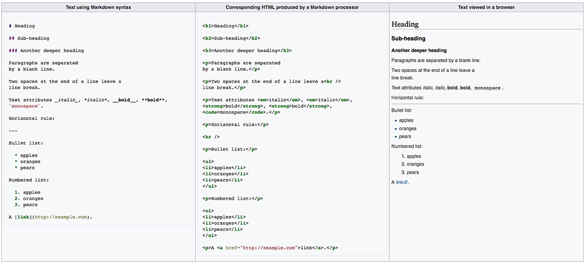

# Creative Coding I: Design & Communication

Prof. Dr. Lena Gieseke \| l.gieseke@filmuniversitaet.de \| Film University Babelsberg KONRAD WOLF

---

# Script 02: Setup

*Script Update History:*

| Date     | Change         |
| -------- | -------------- |
| 01-12-24 | Markdown, IDEs |

---

* [Creative Coding I: Design \& Communication](#creative-coding-i-design--communication)
* [Script 02: Setup](#script-02-setup)
    * [Markdown](#markdown)
    * [Development Environment](#development-environment)
        * [Editor](#editor)
        * [Visual Studio Code](#visual-studio-code)
            * [Markdown](#markdown-1)
            * [Summary](#summary)

## Markdown

Lecture scripts and assignments are written in [Markdown](https://en.wikipedia.org/wiki/Markdown) (.md). This setup let's you edit the lecture scripts in an editor, e.g. for making notes. You also have to submit markdown files in the assignments.

* Markdown is a popular markup language that converts text to html.
* Markdown allows you to use an easy-to-read, easy-to-write plain text format, then converts it to structurally valid XHTML (or HTML).
* Github can render markdown. Be aware though that there are different markdown parser ("converter") and what you can do e.g. with a Visual Studio Code plugin for setting and displaying formulas might not be the same as what GitHub can display.

  
[[wiki]](https://en.wikipedia.org/wiki/Markdown)

###### Resources

* [Markdown Guide](https://www.markdownguide.org/) 
* [Mastering Markdown](https://guides.github.com/features/mastering-markdown/)

## Development Environment

### Editor

You must have an editor with that you feel comfortable with for writing code and text (Word will not work 🙃). There are many, many options.

[[xkcd]](https://xkcd.com/378/)

Editors and IDEs ([Integrated Development Environment](https://en.wikipedia.org/wiki/Integrated_development_environment)) differ mainly on the spectrum of how general-purpose to specialized (e.g. for one specific language) they are, how customizable and whether they are freeware or not. Some popular choices are:

* Visual Studio Code
* JetBrains Editors
* Sublime
* Atom
* Notepad++
* Netbeans
* Visual Studio
* Eclipse
* XCode
* Emacs
* Vim

<!-- 
???
Who uses what? Who wants to use VSCode?

Session to set it up?
-->

### Visual Studio Code

My personal recommendation is [Visual Studio Code](https://code.visualstudio.com/) (in short VSCode). I like it because I can write different types of languages with it while still having many language specific features (e.g. through *extensions*). Also, I am totally addicted to customizing my working environments to exactly the way I like it and VSCode let's me do so in a convenient way (also mainly enabled through *extensions*). In summary, it is:

* Free
* Multi-purpose
* Extensively adjustable

*On a side note: For C++ I so far have only used XCode and Visual Studio (not the same to "Visual Studio Code"!) and I don't know yet how well you can setup Visual Studio Code for C++.*

You can ignore the following section if you work with a different development environments.

###### Resources

* [Getting started with Visual Studio Code](https://code.visualstudio.com/docs/introvideos/basics) 
* [Introductory Videos](https://code.visualstudio.com/docs/getstarted/introvideos)
* [How to use Visual Studio Code](https://flaviocopes.com/vscode/)

##### Workspace

VSCodes workspaces might be be confusing in the beginning.

You organize your work in VSCode with workspaces. Think of a workspace as a project. Under the hood it is nothing more than telling VSCode which folders to display together in your VSCode Explorer (the sidebar to the left). Also, you can create individual settings for each workspace (yay, colors! 😊). You can for example have a `cc1` workspace and add all files and folders that should be accessible through VSCodes explorer.

I am giving you an example workspace setup, including GitHub, in [Script 3: GitHub -  Working With the Class Repository](cc1_ws2324_03_github_script.md)

#### Markdown

For Visual Studio Code I recommend the extension [Markdown All in One](https://marketplace.visualstudio.com/items?itemName=yzhang.markdown-all-in-one).

Open the .md file in Visual Studio Code and edit it up to your liking. VSCode gives you the option of an interactive preview of the html rendering of the file:

* Open the command palette with `Shift + Option + p` or under `View -> Command Palette...`
* Start typing `Markdown: Open Preview` and select that command (I also have a hotkey for that because I use it so often).

###### Resources

* [Markdown and Visual Studio Code](https://code.visualstudio.com/Docs/languages/markdown)

##### GitHub

VSCode comes with all basic functionality to work with Git and GitHub integrated and there are also various plugins for it. For example, I am using the plugins [GitHistory](https://marketplace.visualstudio.com/items?itemName=donjayamanne.githistory) and [Markdown Preview GitHub Styling](https://marketplace.visualstudio.com/items?itemName=bierner.markdown-preview-github-styles) next to the functionality VSCode comes with. But I am sure that there are plenty of other great plugins, I simply do not know about.

Once again, please refer to [Script 3: GitHub -  Working With the Class Repository](cc1_ws2324_03_github_script.md) for in depth explanations.

###### Resources

* [Working with GitHub in VS Code](https://code.visualstudio.com/docs/editor/github)

#### Summary

When working with VSCode, I recommend that you know

* how to setup and work with a [workspace](https://stackoverflow.com/questions/44629890/what-is-a-workspace-in-visual-studio-code#:~:text=A%20Visual%20Studio%20Code%20workspace,and%20preferences%20of%20a%20workspace.),
* how to adjust [preferences](https://code.visualstudio.com/docs/getstarted/settings),
* how to install [extensions](https://code.visualstudio.com/docs/editor/extension-gallery), and
* how to work with the [command palette](https://code.visualstudio.com/docs/getstarted/userinterface#:~:text=Command%20Palette%23&text=The%20most%20important%20key%20combination,provides%20access%20to%20many%20commands.).

Optionally, depending on your workflow, know:

* how to work with [GitHub](https://code.visualstudio.com/docs/editor/github), and
* using the integrated [terminal](https://code.visualstudio.com/docs/editor/integrated-terminal) (see the following section)
 
within VSCode.

---

---

The End  

🛠 🧰 ⚙️
