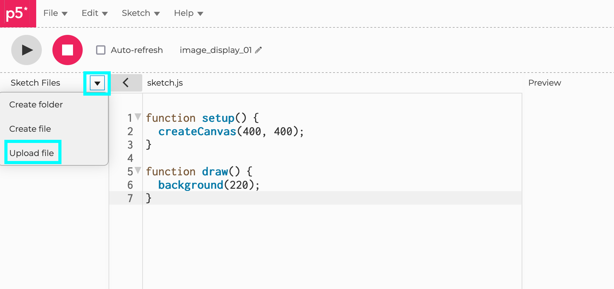
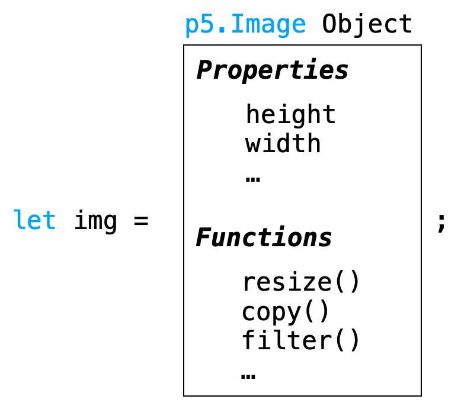
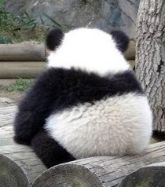
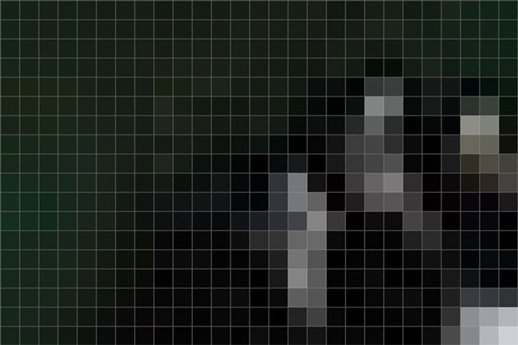
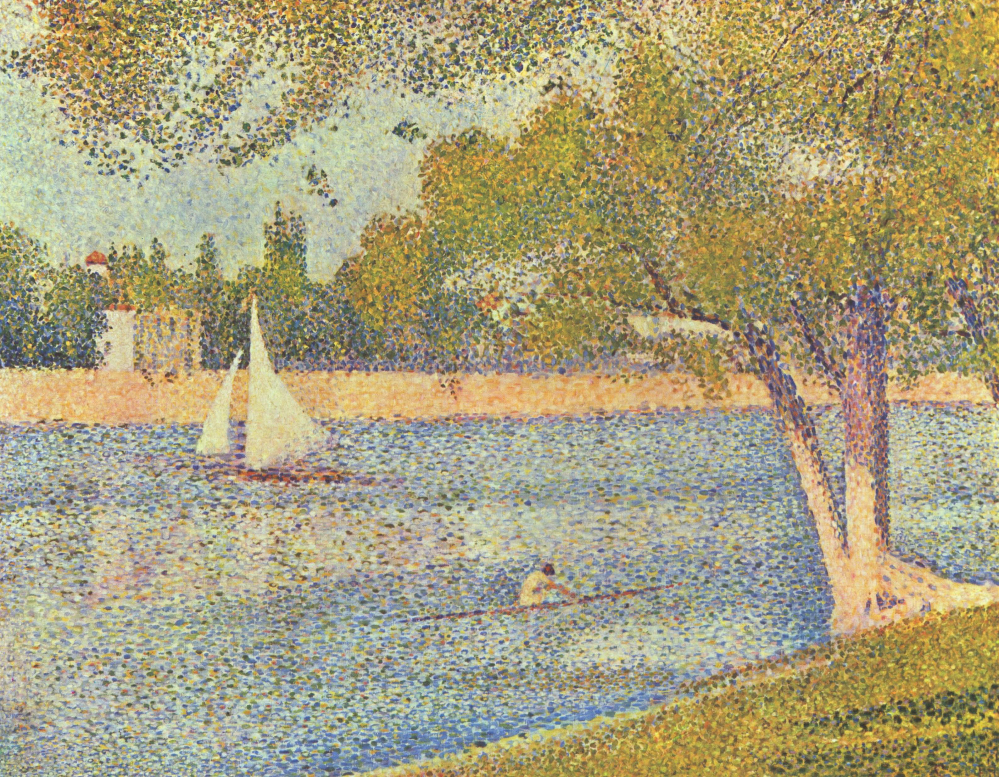
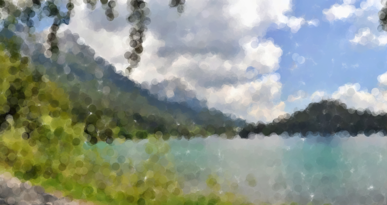
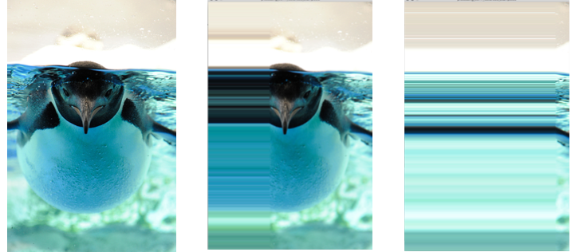
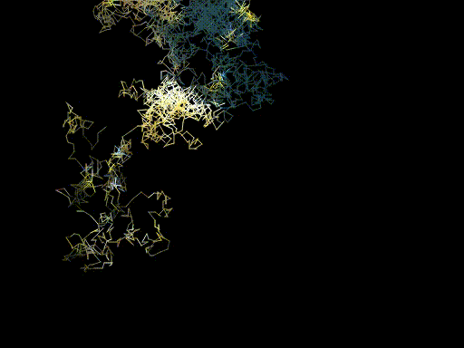
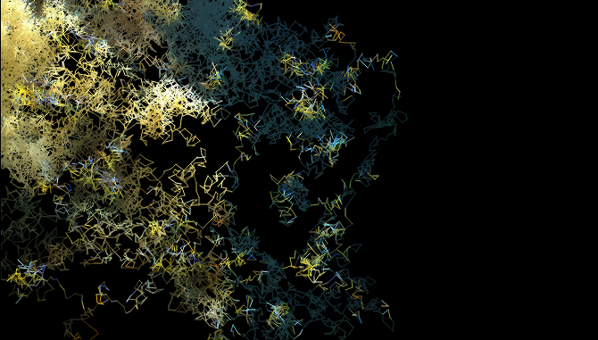

# Script 09 - Images

* [Script 09 - Images](#script-09---images)
    * [Learning Objectives](#learning-objectives)
    * [Images](#images)
    * [Loading and Displaying Images](#loading-and-displaying-images)
        * [Add An Image File To Your Project](#add-an-image-file-to-your-project)
        * [Load The Image File](#load-the-image-file)
        * [Display The Image](#display-the-image)
    * [Image Animation](#image-animation)
    * [Accessing the Image Object](#accessing-the-image-object)
        * [Modifying the Size](#modifying-the-size)
    * [Pixel Data](#pixel-data)
        * [Reading Pixel Data](#reading-pixel-data)
            * [Image Offset](#image-offset)
        * [Setting Pixel Data](#setting-pixel-data)
    * [Tinting Images](#tinting-images)
    * [Examples](#examples)
        * [Pointillism](#pointillism)
        * [Stretching](#stretching)
        * [Tiling](#tiling)
        * [Brownian Motion Lines](#brownian-motion-lines)
    * [Summary](#summary)

---


## Learning Objectives

With this script you

* know how to work with images,
* understand the concept of image animations, and
* understand how to manipulate images.


## Images

Now it's finally time to exchange our beloved circles with images.


## Loading and Displaying Images

The steps to display an image are as follows:

* Add an image file to your project
* Load that image in p5's preload() function and save the image in a global variable
* Display the image variable with the `image()` function call.


### Add An Image File To Your Project

Since we are working in the online p5 Editor, we need to upload our images before we can access them in our program. To do this we click at the arraow on the left to show all project files, then chose "Upload file" from the drop-down menu.

  


Next, we we create a variable to store the image in.

```js
let imgPanda;

function setup() {
    createCanvas(600, 600);
    background(255);
}

function draw() {}
```

### Load The Image File

As you already know the `setup()` function is called before our `draw()` loop starts. But Javascript is asynchronous, meaning that it allows multiple things to happen at the same time. So if we would load our image in `setup()`, it could happen that the image file is still not fully loaded before it's needed in another line of code. Therefore it's better to use another built-in function of p5: `preload()`.
  
The `loadImage()` function loads an image from the given path. Because we uploaded our file to the project, we can just use the filename "panda.jpg". We could also put in a URL to an image file here.

```js

let imgPanda;

function preload() {
    imgPanda = loadImage("panda.jpg");
}

function setup() {
    createCanvas(600, 600);
    background(255);
}

function draw() {
}
```

When we run our sketch, p5 calls preload() first, and then pauses execution until `loadImage` has finished loading our image file.

### Display The Image

Now we need display the image in our draw() function with the image command:

> image(img, x, y, [width], [height])

As input parameters we use:

* Image variable: panda
* Position on the x axis (upper-left corner): 50
* Position on the y axis (upper-left corner): 100
* Optional: width of the displayed image
* Optional: height of the displayed image

Note that the reference point for positioning the images is the upper-left corner (for ellipses it is the center). If you want to use the image's center as reference, you can enable that with the [`imageMode()`](https://p5js.org/reference/#/p5/imageMode) function.

Since we leave out width and height, the image is displayed in its full dimensions.

```js
// https://editor.p5js.org/legie/sketches/foUu9HUyH

let imgPanda;

function preload() {
    imgPanda = loadImage("panda.jpg");
}

function setup() {
    createCanvas(600, 600);
    background(255);
}

function draw() {
    image(imgPanda, 50, 100);
}
```

## Image Animation

The parameters of an images, e.g. its position coordinates, can be animated [in the same way as regular shapes.](https://editor.p5js.org/legie/sketches/NA8Sqzyis)

```js
//https://editor.p5js.org/legie/sketches/NA8Sqzyis

let imgPanda;
let positionX = 0;
let positionY = 0;
let speedX = 5;
let speedY = 5;

function preload() {
  imgPanda = loadImage("panda_face.jpg");
}

function setup() {
  createCanvas(windowWidth, windowHeight);
}

function draw() {

    background(255);
  
    // POSITION
    // Increasing the position values
    positionX = positionX + speedX;
    positionY = positionY + speedY;
  
    if(positionX < 0 | positionX > windowWidth - imgPanda.width) {
        speedX = speedX * -1;
    }
    
    if(positionY < 0 | positionY > windowHeight - imgPanda.height) {
        speedY = speedY * -1;
    }
  
    image(imgPanda, positionX, positionY);
}
```

Notice that we are using `windowWidth - imgPanda.width` and `windowHeight - imgPanda.height` to determine whether the image runs out of the canvas. Images have by default its upper-left corner as reference point. Hence, if we would just check the collision with, e.g., `windowWidth`, we would only detect the collision with the upper-left corner of the image and the image itself would already be out of the canvas.


## Accessing the Image Object

```js
let imgPanda = loadImage("panda.jpg");
```

`loadImage` gives us an [**image object**](https://p5js.org/reference/#/p5.Image). Objects have properties and functions that *belong to* them.



These properties and functions are accessed through the object with the `.` syntax:

```js
imgPanda.height
imgPanda.width

imgPanda.resize(100, 100);
```


### Modifying the Size

For example, to resize an image to a new width `w` and height `h`, use image object's function `resize(w, h)`.

To make the image scale proportionally, use 0 as the value for the width or height parameter.

```js
// Resize Image

let img;
img = loadImage('panda.jpg');

img.resize(200, 0); // Scales the image to a width of 200px, keeping its original proportions
```

```js
//https://editor.p5js.org/legie/sketches/SLLLmgMX_

let imgPanda;

function preload() {
    imgPanda = loadImage("pandas.jpg");
}

function setup() {
    createCanvas(600, 600);
    background(255);
}

function draw() {
    image(imgPanda, 0, 0);
}

function mousePressed() {

    imgPanda.resize(0, imgPanda.width * 0.5, imgPanda.height * 0.5);

}

function keyPressed() {

    imgPanda.resize(0, imgPanda.width * 2, imgPanda.height * 2);

}
```


## Pixel Data

You can imagine an image as a grid of color-values. Each pixel holds one color-value. We can access those color-values with a x,y-coordinate the same way we access the canvas with x,y-coordinats.

Image:  
  

Zoom-in to see the grid:  


### Reading Pixel Data


`get(x, y)` returns the color of the image at the specific pixel at the position x, y.

With the optional parameters w and h you can return a cutout of the image.

```js
imgPanda.get(x, y, w, h);
```

```js
//https://editor.p5js.org/legie/sketches/H6uqSnexq
let img;

function preload() {
    img = loadImage("kitty.jpg");
}

function setup() {
    createCanvas(img.width, img.height);
    background(240);
    stroke(1);
}

function draw() {
    image(img, 0, 0);

    let pixelColor = img.get(mouseX, mouseY);


  if(mouseX > 0 & mouseX < windowWidth &  
      mouseY > 0 & mouseY < windowHeight) {
    
        fill(pixelColor);
        rect(mouseX, mouseY, 50, 50);
  }
}
```

#### Image Offset

Be careful: You have to consider a possible offset of the image on the canvas, because `get()` always relates to positions within the image.

Using the mouseX and mouseY positions as the parameters for getting the color values we can make this interactive. Because the position parameter of get() is relative to the image coordinates and not the sketch itself, we specifically need to consider the offset.

```js
// https://editor.p5js.org/legie/sketches/4T4Mcfh0b

let img;

let offsetX = 50;
let offsetY = 10;

function preload() {
    img = loadImage("kitty.jpg");
}

function setup() {
    createCanvas(600, 475);
    background(240);
}

function draw() {
    image(img, offsetX, offsetY);

    let pixelColor = img.get(mouseX - offsetX, mouseY - offsetY);

    stroke(0);
    fill(pixelColor);
    rect(50, 360, 500, 100);
}
```


### Setting Pixel Data

`set(x, y, color)` sets the color of the pixel with the coordinate x, y.

Before we are able to set pixel data, we need to load the pixel data with `loadPixels()`. After manipulating update the images pixel data with `updatePixels()` to see the effect.

```js
let img;
img = loadImage('panda.jpg');

let pixelColor = color(255, 0, 0); // Define pixelColor as a red color value

img.loadPixels(); // Load the pixel data of the image
img.set(100, 200, pixelColor); // Set the pixel at coordinate 100, 200 to pixelColor
img.updatePixels(); // Update the pixel data of the image
```

Exactly like `get()`, `set()` also relates to the position within the image, so remember to consider a possible offset of the image on the canvas when for example also using the mouse position.

```js
//[ https://editor.p5js.org/legie/sketches/w_W_1n123](https://editor.p5js.org/legie/sketches/w_W_1n123)

let img;

let offsetX = 50;
let offsetY = 10;

function preload() {
    img = loadImage("nemo_small.jpg");
}

function setup() {
    createCanvas(img.width + 2*offsetX, img.height + 2*offsetY);
    background(240);
}

function draw() {
    image(img, offsetX, offsetY);

    let pixelColor = [255, 255, 0, 255];

    img.loadPixels();
    img.set(mouseX - offsetX, mouseY - offsetY, pixelColor);
    img.updatePixels();
}
```


## Tinting Images

Images can be tinted to specified colors or made transparent by using the `tint()` command.

```js
tint(v1, v2, v3, [alpha]);
```

The `tint` command does not belong to an image object but works as global change for all following images in the same way that, e.g., the `fill` command works.

Depending on the color mode (RGB or HSB) `v1`, `v2` and `v3` are values for red, green and blue or hue, saturation, brightness.

`tint()` can also be used for making the image transparent. To apply transparency to an image without affecting its color, use white as the tint color and specify an alpha value, from no transparency 0 to full transparency 255 in the default alpha range.

```js
tint(255, 128); // The image is 50% transparent
```

Use `noTint()` to remove the current fill value for displaying images and revert to displaying images with their original hues.

```js
// https://editor.p5js.org/legie/sketches/0Lf6iBsNT

let panda;

function preload() {
    panda = loadImage("panda.jpg");
}

function setup() {
    createCanvas(600, 600);
}

function draw() {
    image(panda, 0, 0);

    tint(0, 150, 200, 128);

    image(panda, 90, 90);
    image(panda, 100, 100);
    image(panda, 110, 110);

    noTint();

    image(panda, 200, 200);
}
```

## Examples

### Pointillism



It is actually quite easy to create a fake pointillism style in p5:



*Any ideas on how to do this?*

What do we see?

* Circles are placed on top of each other
* The circle's color is based on the loaded image
* The color is picked at the circle's location

Steps

* Pick a random point
* Look up the RGB color in the source image
* Draw a circle at the pixel’s position with the pixel’s color
* Repeat

We use the get() function to get the color value of the image at the random coordinates x, y and store them that value. Then we define a brushSize and use it as the size of the ellipses, which we draw at the coordinates x, y. 

To make our ellipses transparent, we need to extract the red, green and blue values of our color c and define our own alpha value of 100.

```js
// https://editor.p5js.org/legie/sketches/GN4wMPz4x

let img;

let brushSize = 16;

function preload() {
    img = loadImage("lake.png");
}

function setup() {
    createCanvas(img.width, img.height);
    background(255);
    noStroke();
}

function draw() {
    //image(img, 0, 0);
    
    let x = random(img.width);
    let y = random(img.height);
    
    let c = img.get(x, y);
    
    // Adjusting alpha
    //c[3] = 100;
    
    fill(c);
    ellipse(x, y, brushSize, brushSize);
    
    //print(c);

}
```

### Stretching

*Again, what do we see?*




What do we see?

* Horizontal lines for the full height of the image but in length only from left to the mouse position
* The colors of the vertical line at the mouse position are taken for horizontal lines


Steps

* Iterate through the column where the mouse is at
* Detect the pixel’s color with get()
* Draw a line from x = 0 to the column (mouseX) in the detected color

--
* Repeat

```js
// https://editor.p5js.org/legie/sketches/AYPVipmgS

let img;

function preload() {
    img = loadImage("penguin.jpg");
}

function setup() {
    createCanvas(img.width, img.height);

    // For some reason this is needed
    // to prevent transparency
    strokeWeight(2);
}

function draw() {

    image(img, 0, 0);


    // Go through all lines of the image from top to bottom
    for (let i = 0; i < img.height; i++) {

        let c = img.get(mouseX, i);

        // To define a line color
        // stroke() is used
        stroke(c);

        // Draw a line from the
        // left edge of the sketch window
        // up to the mouse x position
        line(0, i, mouseX, i);
        //circle(mouseX, i, 100);
    }

}
```


### Tiling


We can use the `get()` command to create a new image variable, that holds just a part (rectangle region) of our source image.

> let imgPart = img.get(x, y, w, h);

* x, y: coordinates of imgPart relative to img  
* w:        width of imgPart  
* h:        height of imgPart  

Using mouseX and mouseY we can interactively choose the displayed image region.

```js
// https://openprocessing.org/sketch/1257098
// Tiling - STEP 3

function draw() {

    let imgPart = img.get(mouseX, mouseY, 100, 100);

    // Draw the cut out square
    image(imgPart, 0, 0);

}
```

Now, we will tile that image region on a grid with a 2D loop:

```js
// https://editor.p5js.org/legie/sketches/9zvp40e9m

let img;

// Number of rows and columns
// for the grid
let numRows = 5;
let numCols = 5;

// Will be computed in reference to 
// window width and height
let gridStepX;
let gridStepY;

function preload() {
    img = loadImage("pup_party.jpg");

}

function setup() {
    createCanvas(408, 408);
    background(255);

    // Compute the size of a tile
    gridStepX = width / numRows;
    gridStepY = height / numCols;

}

function draw() {

    let imgPart = img.get(mouseX, mouseY, 100, 100);

    // Draw the cut out square
    image(imgPart, 0, 0);

    // "Walk" with the step size in x
    for (let x = 0; x < width; x += gridStepX) {
        // "Walk" with the step size in y
        for (let y = 0; y < width; y += gridStepY) {

            // Draw the cut out square
            image(imgPart, x, y);
        }
    }

}
```

We are having an issue with mouse positions as the right and bottom border of the image for coordinates for which we can not cut out a whole tile anymore. I leave this to the interested reader to find a solution 😁


### Brownian Motion Lines

Look at the following effect. Can you understand its underlying logic?





The idea is to draw with each draw() iteration a new line of a certain length with starts at the end of the previously drawn line and ends at a random point. For that we need to define some variables:

* `range` is the maximum range from one point to the next. In the end it defines the length of our lines.
* `lastX` and `lastY` are the variables that store the coordinates where the last line ended, thus where the new line begins.

With each call of our draw loop we draw one new line. Therefore we always need to define new coordinates where our current line should end: `nextX` and `nextY`. It is based on a random value between -range and range. After each draw call we need to set our lastX and lastY coordinates to nextX and nextY to start the next line where we ended the last.

```js
// https://editor.p5js.org/legie/sketches/WWsJj-V0D

function draw() {
    //image(img, 0, 0);

    // Compute new end value
    let nextX = lastX + random(-range, range);
    let nextY = lastY + random(-range, range);

    line(lastX, lastY, nextX, nextY);

    lastX = nextX;
    lastY = nextY;

}
```

Now we  need to draw the lines in the color of the pixels at the randomly generated coordinate. For this we use the get() command and store the pixel value as a new variable pix, which we then use as the stroke color.

```js
// https://editor.p5js.org/legie/sketches/WWsJj-V0D

function draw() {

    // Compute new end value
    let nextX = lastX + random(-range, range);
    let nextY = lastY + random(-range, range);

    let pix = img.get(nextX, nextY);
    stroke(pix);
    line(lastX, lastY, nextX, nextY);

    lastX = nextX;
    lastY = nextY;
}
```

To prevent our lines to the leave the sketch we need to use the [`constrain()`](https://p5js.org/reference/#/p5/constrain) command, which constrains a value between a minimum and maximum value. As minimum and maximum we set the borders of our sketch, 0 and width or height.


```js
// https://editor.p5js.org/legie/sketches/WWsJj-V0D

function draw() {
    //image(img, 0, 0);

    // Compute new end value
    let nextX = lastX + random(-range, range);
    let nextY = lastY + random(-range, range);

    // Constrain all points to borders of the sketch
    nextX = constrain(nextX, 0, width);
    nextY = constrain(nextY, 0, height);

    let pix = img.get(nextX, nextY);
    stroke(pix);
    line(lastX, lastY, nextX, nextY);

    lastX = nextX;
    lastY = nextY;
}
```


## Summary

- Use the `preload()` function to make sure your image files are fully loaded before working with them

```
let img;

function preload() {
    img = loadImage("myImage.jpg");
}
```

- By default images have their upper-left corner as reference point (`imageMode(CORNER)`), which you can change by calling

```
imageMode(CENTER);
```

- Images are objects that contain properties and functions, which you can access by the `.`-notation
```
img.widht;
img.resize(100, 200);
```

- Animate images e.g. by changing their position like any other shape
- Use `img.get(x, y)` and `img.set(x, y, color)` to return or set the color of the image at a specific pixel


Use the [reference](https://p5js.org/reference/) 🚒

---

The End

🏇 📷  🖼️