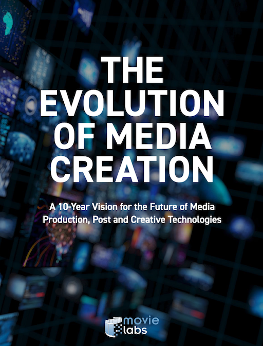
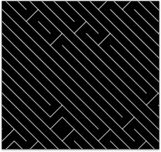

name: inverse
layout: true
class: center, middle, inverse
---


# Creative Coding I

### Prof. Dr. Lena Gieseke | l.gieseke@filmuniversitaet.de  

<br />
#### Film University Babelsberg KONRAD WOLF

---
layout: false

.center[[](https://owncloud.gwdg.de/index.php/s/ZtWMVcHEpmrknE3)]
    
.footnote[[Chris Milk. 2012. [*The Johnny Cash Project*](https://www.radicalmedia.com/work/the-johnny-cash-project/). Radical Media]]


???

* Animation spiegelt das Thema des Liedes über Sterblichkeit, Wiedergeburt und das ewige Leben.
* Was Ihr hier gesehen habt ist aber nicht nur eine Animation. 
* Es ist ein kollaboratives Projekt an dem bis heute über 250000 Menschen aus 172 Ländern teilgenommen haben.
*  Es ist ein online Projekt mit dem jeder einen einzelnen Frame des originalen Video interpretieren kann.
*  Darüber hinaus kann man auf der Webseite sich alle Frames einzeln anschauen, verschieden Konfigurationen des Video ansehen, Frames werden zum Bespiel nach Stil getackt. 
*  Des weiteren nimmt die Webseite den Prozess des Malens auf, so dass man sich hinterher anschauen kann, wie die einzelnen zu Ihrem Endergebnis gekommen sind.
*  Dazu hier ein Video in dem der Erschaffer der Seite, Medienkünstler Aaron Koblin, der die Benutzung der Webseite kurz erklärt…
  


---

.center[[](https://owncloud.gwdg.de/index.php/s/IVvTrSu2GL4gTvX)]
    
.footnote[[Chris Milk. 2012. [*The Johnny Cash Project*](https://www.radicalmedia.com/work/the-johnny-cash-project/). Radical Media]]


???

* Und durch diese mögliche Interaktion mit der Webseite, wird die Animation zu einer dynamischen sich kontinuierlich entwickelnden Datenbank an möglichen Outputs und die Website zu einem erzählenden und Menschen verbindenden Medium.
* Dazu hier noch mal ein kurzes Video, in dem Teilnehmer ihre Erfahrung kommentieren.

---
.center[[](https://owncloud.gwdg.de/index.php/s/LYx9pV3hPcUzChu)]
    
.footnote[[Chris Milk. 2012. [*The Johnny Cash Project*](https://www.radicalmedia.com/work/the-johnny-cash-project/). Radical Media]]


???

* Schlüsselaussage: die Webseite, also die Application erzeugt “A living, breathing memorial” an dem wir alle teilhaben können.
* Dieses Projekt zeigt wie durch den durchdachten und kreativen Einsatz von Technik, die Technik selbst eine ganz besondere Bedeutung bekommt und wie in diesem Fall nicht nur eine interessante Animation produziert sondern eine tiefergehende und gemeinschaftliche Erfahrung für den User oder das Publikum geschaffen wird.


---
template:inverse

## *How do you define creativity?*


---
template:inverse

## *How are you creative?*


---
template:inverse

## *How do you define coding?*

---
template:inverse

## *How do you code?*


---
template:inverse

# Creative Coding 🤩

---
template:inverse

### Lecture 1

# Topics

---
layout: false

## Topics

--
* Creative Coding

--
* Examples

--
* Learning Objectives

--
* Tools and Environments 

--
* Administration

--
* Emergence

--
* p5.js

---
template:inverse

# Creative Coding

Examples  
Learning Objectives  
Tools and Environments  
Administration  
Emergence  
p5.js  

---
.header[Introduction]

## Creative Coding

???

* There are actually no fixed definitions of what *creative coding* means. 
* Within CTech we understand creative coding as:

--

* Producing something expressive rather practical

--

* Software beyond its standard usage scenarios

--
* Tools that help others to be creative

???


The last aspect of developing tools is somewhat detached and not necessarily part of a common understanding of creative coding. However, to us it is and equally important topic. We would like to integrate tool development into our portfolio with the goal of developing tools beyond the obvious and beyond practicability. When thinking about tool development in the context of web technologies, collaborative work and sharing ideas, content, etc. in the virtual space are exciting directions to go.

---
.header[Introduction]

## Creative Coding


> Aesthetics, insight, joy, dialog, politics, collaboration, augmentation, emotion, perspectives, friendship,...

--

*How could you focus with a software project on one of the above mentioned terms?*

???

.task[ASK:]  

---
.header[Introduction | Creative Coding]

## Practical Approaches

???


Well, the above is still pretty vague. What does it mean specifically? The following aspects of content creation, data and media formats describe in more detail what can be considered as creative coding:

--
* Algorithms to create graphics and sound  

--
  
→  Procedural Generation and Simulation next term

---
.header[Introduction | Creative Coding]

## Practical Approaches

* Algorithms to create graphics and sound  
* Smart, meaningful or unusual data sources

--
    * Images, video, sound
    * Camera and microphone
    * Online resources such as Twitter, Instagram and ChatGPT
    * Mobile devices as sensors
    * ...

---
.header[Introduction | Creative Coding]

## Practical Approaches

* Algorithms to create graphics and sound  
* Smart, meaningful or unusual data sources
* Diverse output formats

--
    * Web
    * From large-scale such as buildings to small-scale such as smart watches
    * Multi-screen setups for example with mobile devices
    * ...

---
.header[Introduction | Creative Coding]

## Practical Approaches


???
For your creative work, I would like to encourage you to use the following as guidance:

--

> What do I have available and what can I do with that beyond the obvious?


---
template: inverse

## Design and Communication

---
.header[Introduction]


## Design and Communication


We read, experience, share and create with the potential community of all web users. 
  
  
--
  
  
> Who are all web users?

--

* We will focus on web-based programming environments


---
template:inverse

Creative Coding ✓

# Examples  
Learning Objectives  
Tools and Environments  
Administration  
Emergence  
p5.js  

---
.header[Introduction | Examples]

## Paper Planes

[  ](https://paperplanes.world/) [[Paper Planes]](https://paperplanes.world/)

<!-- [](https://paperplanes.world/)   -->
<!-- [[Paper Planes]](https://paperplanes.world/) -->


<!-- 
[](https://armsglobe.chromeexperiments.com/)  
[[Arms Globe]](https://armsglobe.chromeexperiments.com/)


[](https://deck.gl/showcases/wind/)  
[[deck.gl]](https://deck.gl/showcases/wind/)

-->

---
.header[Introduction | Examples]

## Landlines

[](https://lines.chromeexperiments.com/) [[Land Lines]](https://lines.chromeexperiments.com/)


???
* The website of Zach Lieberman lets you explore Google maps satellite images through gestures. With the draw option, you can find similar satellite images that match the line that you draw on the screen. With the drag option, you can draw an infinite landscape based on your mouse movement.

---
.header[Introduction | Examples]

## Cinemetrics

[](https://cinemetrics.site/) [[Cinemetrics]](https://cinemetrics.site/)

---
.header[Introduction | Examples]

## Unnumbered Sparks

[](https://www.youtube.com/watch?v=npjTmG-TBHQ&feature=emb_logo) [[Unnumbered Sparks]](http://www.aaronkoblin.com/project/unnumbered-sparks/)


???

.task[TASK:]  

* stop 1:25

---
template: inverse

## *What type of tools are possible through the web?*


???
* What type of tools are possible through the web?

---
.header[Introduction | Examples]

## Zoom

[](https://miro.com/)


---
.header[Introduction | Examples]

## Miro Board

[](https://miro.com/)

--

> How to make this system more fun or more interesting? Any ideas?
  

---
.header[Introduction | Examples]

## Live Coding

.left-even[
[Hydra](https://hydra.ojack.xyz/docs/#/)


]
.right-even[
* For audivisual performances
* Open-source
* All-levels
]

???

For example with [Hydra](https://hydra.ojack.xyz/docs/#/) you can live code in the browser for audiovisual performances. It is free and open-source and made for beginners and experts alike.


* https://hydra.ojack.xyz/?sketch_id=ritchse_3
* https://hydra.ojack.xyz/docs/#/
* https://cdm.link/2019/02/hydra-olivia-jack/


---
.header[Introduction | Examples]

## Cloud-Based Systems

 [[Movielabs]](https://movielabs.com/wp-content/uploads/2019/12/movielabs_evolution_media_creation_2.0.pdf)

???
.task[COMMENT:]


*The evolution of media creation - A 10-Year Vision for the Future of Media Production, Post and Creative Technologies* entnommen.  

Neben den gerade beschriebenen neuartigen Kollaborationsmöglichkeiten bringt uns diese Veröffentlichung auch schon zur zweiten Motivation für eine Arbeit mit Cloud-basierten Technologien.  

Der zweit Grund ist, dass wir tatsächlich schon mitten drin sind:  

Cloud-basierte Technologien und Prozess sind auf dem Vormarsch, nicht zu letzt weiter befeuert durch die Pandemie. Besagte Veröffentlichung beschreibt als erste von 10 Visionen für das Jahr 2030 folgendes: 
 
---
.header[Introduction | Examples]

## Cloud-Based Systems

> We can expect that media creation workflows will be cloud based with every file (from first script, to camera capture, VFX assest and audio tracks) stored in the cloud.


.footnote[[[The Evolution of Media Creation - A 10-Year Vision for the Future of Media Production, Post and Creative Technologies]](https://movielabs.com/)]

???
.task[COMMENT:]


Des weiteren wird gesagt dass sich alle Produktionsprozesse fundamental dahingehend verändern, dass Software zu den Daten kommt... und nicht genau umgekehrt wie es gerade ist.

Also, wir wissen nun das Cloud-basierte Prozesse eng mit Fragen nach Kollaborationsmöglichkeiten zusammenhängen und dass es sich hier grundsätzlich um ein *hot topic* handelt mit dem es gilt sich auseinanderzusetzen.  

---
.header[Introduction | Examples]

## Cloud-Based Systems

All assets are created or ingested straight into the cloud and do not need to be moved.

--

<br/>
### -> Applications come to the data!


---
template: inverse

### Do you know of any creative coding examples? 
## Please share!


---
template:inverse

Creative Coding ✓  
Examples ✓  
# Learning Objectives  
Tools and Environments  
Administration  
Emergence  
p5.js  


---

## Learning Objectives

???

* The individual learning objectives highly depend on the skill level you start with. 
* Assignments will be flexible and should be challenging for everybody. 
* Topic-wise, we are also somewhat flexible. 
* If you want to focus more on developing tools, not as a creative but for creatives, let's get into a conversation and see how to make it work (meaning, come and talk to me!).

--

With this course, you will 

--
* advance your ability to write code,

--
* advance your ability to conceptualize and design,

--
* acquire fundamental knowledge of web technologies,

--
* use software development in a creative context, and

--
* implement specific design goals.

---
## Student Work


???
* Here some impressions of student projects of the previous years:

---
.header[Introduction | Examples | Student Work]
.center[  
[by Phil Clausen]]


---
.header[Introduction | Examples | Student Work]
.center[  
[by Simon Detje]]  

---
.header[Introduction | Examples | Student Work]
.center[  
[by Simon Detje]]  

---
.header[Introduction | Examples | Student Work]
.center[  
[by Vi Schreiber] ]

---
.header[Introduction | Examples | Student Work]
.center[  
[by Mathias Fontain]]

---
.header[Introduction | Examples | Student Work]
.center[  
[by Markus Traber]]

---
.header[Introduction | Examples | Student Work]
.center[  
[by Markus Traber]]


---
.header[Introduction | Examples | Student Work]
.center[  
[by Lisa Passing]]

---
.header[Introduction | Examples | Student Work]
.center[  
[by Denise Bischof] ]

---
.header[Introduction | Examples | Student Work]
.center[  
[by Anna Eschenbacher & Zainab Tariq] ]

---
.header[Introduction | Examples | Student Work]
.center[  
[by Anna Eschenbacher & Zainab Tariq] ]

---
.header[Introduction | Examples | Student Work]
.center[  
[by Marta Pang] ]

---
.header[Introduction | Examples | Student Work]
.center[  
[by Tim Rumpf] ]


---
.header[Introduction | Examples | Student Work]
.center[  
[by Jonathan Ho] ]

---
template:inverse

Creative Coding ✓  
Examples ✓  
Learning Objectives ✓ 
# Tools and Environments  
Administration  
Emergence  
p5.js  

???

* As part of the introduction, I would like to give you an overview of possible languages, tools and environments for creative coding. I classify these aspects into:

---

## Tools and Environments

--
* Programming Languages and Frameworks

--
* Software

--
* Hardware

---
.header[Tools and Environments]

## Programming Languages

* JavaScript
* Python
* C++
* Java
* C#
* [Scala](https://scala-lang.org/)
* [Clojure](https://clojure.org/)
* [Rust](https://www.rust-lang.org/)
* [Kotlin](https://kotlinlang.org/)
* [Orca](https://github.com/hundredrabbits/Orca)


???
* [Scala](https://www.creativescala.org/), https://scala-lang.org/
* [Clojure](https://www.maria.cloud/) (online-environment + curriculum)
* https://www.rust-lang.org/
* https://clojure.org/
* https://kotlinlang.org/
* https://github.com/hundredrabbits/Orca

---
.header[Tools and Environments]

## Programming Languages

* **JavaScript**
* **Python**
* **C++**
* Java
* C#
* [Scala](https://scala-lang.org/)
* [Clojure](https://clojure.org/)
* [Rust](https://www.rust-lang.org/)
* [Kotlin](https://kotlinlang.org/)
* [Orca](https://github.com/hundredrabbits/Orca)


---
.header[Tools and Environments]

## Frameworks

--

> A software framework is a universal, reusable software environment that provides particular functionality as part of a larger software platform to facilitate development of software applications, products and solutions.

--

* A special case of software library
* Abstractions of code wrapped in a well-defined Application Programming Interface (API)


.footnote[[[Wikipedia: Software Framework](https://en.wikipedia.org/wiki/Software_framework), [Stack Overflow: What is a software framework](https://stackoverflow.com/questions/2964140/what-is-a-software-framework)]]


???
* Contain some key distinguishing features

Analogy
* A library is like a toolbox where you pick and use the tools you need.
* A framework is like a template or structure for a house; you build your application around its blueprint.

In short, a library gives you tools to use as you choose, while a framework provides a structure within which you work and defines much of the flow of your application.

---
.header[Tools and Environments | Frameworks]

## Processing & [p5](https://openprocessing.org/sketch/2467308)

--
* Frameworks and IDEs
    * Processing: Java-based and standalone
    * p5: Javascript wrapper for Processing and web-based

--
* Graphics, sound and interaction


???
* Holy grail for artists and creative coders
* https://openprocessing.org/sketch/1957050/#code

--

> Focus on simplicity for beginners but also suitable for prototyping for experts.


---

.header[Tools and Environments | Frameworks]

## JavaScript

* [p5.js](https://p5js.org/examples/)
* [three.js](https://threejs.org/)
* [sketch.js](http://soulwire.github.io/sketch.js/)
* [D3](https://d3js.org/)
* [PixiJS](http://www.pixijs.com/gallery)
* [Phaser](https://phaser.io/)
* [babylonjs](https://www.babylonjs.com/)
* [Tone.js](https://tonejs.github.io/)
* [tixy.land](https://tixy.land/)
* [Hydra](https://hydra.ojack.xyz/)
* [Quil](http://quil.info/)

???

JavaScript libraries directly relevant in the creative coding context (of course we will need base tools such as node.js as well):

* Any other suggestions?
* [Tone.js](https://tonejs.github.io/) for audio related creative coding
* [tixy.land](https://tixy.land/) — minimalist creative coding environment
* [Hydra](https://hydra.ojack.xyz/) — creative live coding
* [Quil](http://quil.info/) — processing + clojure


---

.header[Tools and Environments | Frameworks]

## JavaScript

* [**p5.js**](https://p5js.org/examples/)
* [**three.js**](https://threejs.org/)
* [sketch.js](http://soulwire.github.io/sketch.js/)
* [D3](https://d3js.org/)
* [PixiJS](http://www.pixijs.com/gallery)
* [Phaser](https://phaser.io/)
* [babylonjs](https://www.babylonjs.com/)
* [Tone.js](https://tonejs.github.io/)
* [tixy.land](https://tixy.land/)
* [Hydra](https://hydra.ojack.xyz/)
* [Quil](http://quil.info/)

???

* Any other suggestions?

---
.header[Tools and Environments | Frameworks]

## C++

* [OpenFrameworks](https://openframeworks.cc/)
* [Cinder](https://libcinder.org/gallery)  

---
.header[Tools and Environments | Frameworks]

## C++

* [**OpenFrameworks**](https://openframeworks.cc/)
* [Cinder](https://libcinder.org/gallery)  

--

  
→ Creative Coding II next term: OpenFrameworks

---
.header[Tools and Environments | Frameworks]

## Others

* [Nannou for Rust](https://nannou.cc/)
* [OpenRNDR for Kotlin](https://openrndr.org/)

---
.header[Tools and Environments]

## Software

* [Touch Designer](https://www.derivative.ca/), [vvvv / vvvv gamma](https://vvvv.org/), [Pure Data](https://puredata.info/), [Max/MSP](https://cycling74.com/)
* [MadMapper](https://madmapper.com/), [Millumin 2](https://www.millumin.com/v2/index.php), [VDMX](https://vidvox.net/), [Resolume](https://resolume.com/)
* [LUMOplay](https://www.lumoplay.com/)
* [Unity](https://unity3d.com), [Unreal](https://www.unrealengine.com)
* [Reaper](https://www.reaper.fm/), [Ableton](https://www.ableton.com)
* [Maya](https://www.autodesk.de/products/maya/overview), [Houdini](https://www.sidefx.com/), [3dsMax](https://www.autodesk.de/products/3ds-max/overview), [Cinema4D](https://www.maxon.net/de/produkte/cinema-4d/cinema-4d/), [ZBrush](https://pixologic.com/), [Allegorithmic](https://www.allegorithmic.com/)
* [Nuke](https://www.foundry.com/products/nuke), [After Effects](https://www.adobe.com/de/products/aftereffects.html), [Avid](https://www.avid.com/de/), [Premiere](https://www.adobe.com/products/premiere.html?promoid=PQ7SQBYQ&mv=other)
* [Flash](https://en.wikipedia.org/wiki/Adobe_Flash), [Director MX](https://en.wikipedia.org/wiki/Adobe_Director)
* [Photoshop](https://www.adobe.com/products/photoshop.html?promoid=PC1PQQ5T&mv=other), [Illustrator](https://www.adobe.com/products/illustrator.html?promoid=PGRQQLFS&mv=other), [InDesign](https://www.adobe.com/products/indesign.html)


???

* [**Touch Designer**](https://www.derivative.ca/), [vvvv / vvvv gamma](https://vvvv.org/), [Pure Data](https://puredata.info/), [**Max/MSP**](https://cycling74.com/)
* [MadMapper](https://madmapper.com/), [Millumin 2](https://www.millumin.com/v2/index.php), [VDMX](https://vidvox.net/), [Resolume](https://resolume.com/)
* [LUMOplay](https://www.lumoplay.com/)
* [**Unity**](https://unity3d.com), [**Unreal**](https://www.unrealengine.com)
* [Reaper](https://www.reaper.fm/), [Ableton](https://www.ableton.com)
* [Maya](https://www.autodesk.de/products/maya/overview), [**Houdini**](https://www.sidefx.com/), [3dsMax](https://www.autodesk.de/products/3ds-max/overview), [Cinema4D](https://www.maxon.net/de/produkte/cinema-4d/cinema-4d/), [ZBrush](https://pixologic.com/), [Allegorithmic](https://www.allegorithmic.com/)
* [Nuke](https://www.foundry.com/products/nuke), [After Effects](https://www.adobe.com/de/products/aftereffects.html), [Avid](https://www.avid.com/de/), [Premiere](https://www.adobe.com/products/premiere.html?promoid=PQ7SQBYQ&mv=other)
* [Flash](https://en.wikipedia.org/wiki/Adobe_Flash), [Director MX](https://en.wikipedia.org/wiki/Adobe_Director)
* [Photoshop](https://www.adobe.com/products/photoshop.html?promoid=PC1PQQ5T&mv=other), [Illustrator](https://www.adobe.com/products/illustrator.html?promoid=PGRQQLFS&mv=other), [InDesign](https://www.adobe.com/products/indesign.html)

... 

---
.header[Tools and Environments]

## Hardware

.left-even[
* Micro controllers
* Sensors, e.g. depth
* Projectors
* VR, AR, MR devices
* Displays
* Drone
* Eye, brain tracker  
]

???

* **Micro controllers**
* **Sensors**, e.g. depth
* **Projectors**
* **VR**, AR, MR devices
* Displays
* Drone
* Eye, brain tracker  

--

.right-even[

<br />
→ Technology Introductions and Creative Technologies this term
]
---
.header[Tools and Environments]

## Tools and Environments 

Please refer to the [learning list about software](https://github.com/ctechfilmuniversity/ctech_resources/tree/master/learning) in the [ctech_resources](https://github.com/ctechfilmuniversity/ctech_resources) repo (and add to it if you know of something that is not included in the list)!

--

> This repo hasn't been updated in a while...

---
template:inverse

## Programming in this Class

---

## Programming in this Class

> The focus of this class is not "learn how to program", however it is the goal that you all learn how to program with this class. 
  
  
### 😁  


???

* With this I mean that overall we do not cover language specifics in too much detail. 
* Hopefully you build your programming skills through the practical assignments and looking into the details that you need for your assignment individually, making progress on your level.
* The web development specifics I will cover as part of the class though such as:
    * Web server, asynchrone execution, ... 
    * (Functional vs. Object Oriented programming)

---
## Programming in this Class
  
* Weekly programming assignments

--
* Assignments are open-ended and are related to the session's topic (and tech)

--
* Each assignment is evaluated on three levels
    * Concept
    * Form
    * Implementation


---
template: inverse

# Introduction Summary

???

As summary to this short introduction to creative coding, I like the following advertisements from Mercedes a lot. To me they represent us - Creative Technologists - very well.

---

.center[  
[[I believe in ad]](http://www.ibelieveinadv.com/commons2/mercedes-benz-left-brain-right-brain-einstein.jpg)]

???
*On A Side Note*: Please keep in mind though that the theories of the sides of our brains having the above characteristics are simply wrong. Our brains are much more complex and there is no scientific evidence for tests such as "are you a left or right brain person"?


---
template: inverse

Creative Coding ✓  
Examples ✓  
Learning Objectives ✓  
Tools and Environments ✓  
# Administration  
Emergence  
p5.js  


???
* [Go through the readme](https://ctechfilmuniversity.github.io/lecture_ws2324_creative_coding_1/)


## Resources

[[1] Awesome Creative Coding](https://github.com/terkelg/awesome-creative-coding)  
[[2] Research essay: The History of Processing](https://maxoffsky.com/research/research-essay-the-history-of-processing/)  
[[3] A History of Creative Coding](https://medium.com/@laserpilot/a-history-of-creative-coding-8771524b9775)  


---
template: inverse

Creative Coding ✓  
Examples ✓  
Learning Objectives ✓   
Tools and Environments ✓   
Administration ✓  
# Emergence  
p5.js  


---

.center[]

???

.task[TASK:]  

* What do we see? Can you find the underlying algorithm? (If you already know it please don't answer)

---


The original BASIC program for the Commodore 64:

```bash
10 PRINT CHR$(205.5+RND(1)); : GOTO 10
```
<!-- ??? BASIC had its own character indices (not ASCII) -->

---


Bash:

```bash
f="╱╲";while :;do print -n ${f[(RANDOM % 2) + 1]};done
```

???
.task[TASK:]  

* Show terminal version

---

## 10 PRINT

.left-even[

* Considered a phenomenon of creative coding through its simplicity and visual appeal
]

--

.right-even[

* There is a dedicated [book](http://10print.org/)
* Representing the history of creative coding
* Author talk on [youtube](https://www.youtube.com/watch?v=34CXQr5OLas)
]

---

## 10 PRINT

.left-even[


*How to modify?*

]


---

## 10 PRINT

.left-even[


*Which parameters could we define?*

]

--

.right-even[
* The spacing and size of the elements
* The probability for an element
]

---
.header[10 PRINT | Parametrization]

## The Spacing


---
.header[10 PRINT | Parametrization]

## The Probability




E.g., 90% probability for a backslash

---
template: inverse


## What Is Emergence?

???

* Wikipedia: emergence occurs when an entity is observed to have properties its parts do not have on their own, properties or behaviors which emerge only when the parts interact in a wider whole

---
## Emergence

> In philosophy, systems theory, science, and art, emergence occurs when a complex entity has properties or behaviors that its parts do not have on their own, and emerge only when they interact in a wider whole. 
  

.footnote[[Wikipedia. 2023. [*Emergence*](https://en.wikipedia.org/wiki/Emergence).]]


???

* For instance, the phenomenon of life as studied in biology is an emergent property of chemistry.
* In philosophy: An emergent property of a system, in this context, is one that is not a property of any component of that system, but is still a feature of the system as a whole. Nicolai Hartmann (1882–1950), one of the first modern philosophers to write on emergence, termed this a categorial novum (new category). 

---
## Emergence

> In philosophy, systems theory, science, and art, emergence occurs when a complex entity has properties or behaviors that its parts do not have on their own, and emerge only when they interact in a wider whole. 
  
<br >
> The remarkable simplicity of complexity...


.footnote[[Wikipedia. 2023. [*Emergence*](https://en.wikipedia.org/wiki/Emergence). | A. Martin and K. Helmerson. 2014. [*Emergence: the remarkable simplicity of complexity*](https://theconversation.com/emergence-the-remarkable-simplicity-of-complexity-30973). The Conversation.]]


---
.header[Emergence]

## Snowflakes


.footnote[[Wikipedia. 2023. [*Emergence*](https://en.wikipedia.org/wiki/Emergence).]]


???

* The formation of complex symmetrical and fractal patterns in snowflakes exemplifies emergence in a physical system.
* Water droplets freeze to form ice molecules (also crystals) in the upper reaches of Earth’s atmosphere, which act as aggregates for crystallization. As the crystals grow in size, they gain mass and begin falling through the atmosphere. The differing temperatures and pressures acting on the crystal structure as it falls causes new patterns to emerge systematically that exhibit near-perfect radial symmetry. https://discover.hubpages.com/education/Self-Organization-in-Natural-Systems
* A snowflake is a single ice crystal that has achieved a sufficient size, and may have amalgamated with others, which falls through the Earth's atmosphere as snow.[1][2][3] Each flake nucleates around a tiny particle in supersaturated air masses by attracting supercooled cloud water droplets, which freeze and accrete in crystal form. Complex shapes emerge as the flake moves through differing temperature and humidity zones in the atmosphere, such that individual snowflakes differ in detail from one another, but may be categorized in eight broad classifications and at least 80 individual variants. The main constituent shapes for ice crystals, from which combinations may occur, are needle, column, plate, and rime. Snow appears white in color despite being made of clear ice. This is due to diffuse reflection of the whole spectrum of light by the small crystal facets of the snowflakes.[4]

---
.header[Emergence]

## Snowflakes

  
.caption[An early classification of snowflakes by Israel Perkins Warren.]

.footnote[[Wikipedia. 2023. [*Snowflake*](https://en.wikipedia.org/wiki/Snowflake).]]


---
.header[Emergence]

## Termites

  


.footnote[[Wikipedia. 2023. [*Emergence*](https://en.wikipedia.org/wiki/Emergence).]]


???

* A termite "cathedral" mound produced by a termite colony offers a classic example of emergence in nature.

---
.header[Emergence]

## Birds

  


.footnote[[B. Yirka. 2015. [*Researchers use wave theories to understand flocks of birds*](https://www.sott.net/article/297335-Researchers-use-wave-theories-to-understand-flocks-of-birds). Sign of the times.]]


---
template: inverse

## What Does Emergence Mean in the Context of Creative Coding?

---

.center[]


---

## Emergence


[Casey Reas - On Emergence ](https://www.youtube.com/watch?v=_8DMEHxOLQE)
  


???

[Generative Art - Generative Art Summer School at School of Architecture, Southeast University, 2019 ](https://www.youtube.com/watch?v=qtPi0JvmWbs)


---
.header[Emergence]

## Implementation


*What do we need to implement a visual pattern such as the 10 PRINT pattern?*
  
--
  
→ Graphical output
  


???


p5.js 🥳

* whenever I say Processing in the following, the term is pretty much interchangeable with p5


---
template: inverse

Creative Coding ✓  
Examples ✓  
Learning Objectives ✓   
Tools and Environments ✓   
Administration ✓  
Emergence ✓  
# p5.js  

---
## Processing & p5

* [p5](https://p5js.org/) is a library for JavaScript
    * You write JavaScript code but you have additional commands from p5
--
* p5 is based on the Java framework Processing
    * Processing came first
    * p5 is Processing running in a webbrowser
    * p5 and Processing are very similar


???
.task[COMMENT:]  

Processing

* 2001 developed in the research group Aesthetics and Computation of the Technology Media Labs at the Massachusetts Institute of Technology by the students Ben Fry and Casey Reas.
* 2012 the Processing Foundation (a non-profit corporation) was established


>Our mission is to promote software literacy within the visual arts, and visual literacy within technology-related fields — and to make these fields accessible to diverse communities. Our goal is to empower people of all interests and backgrounds to learn how to program and make creative work with code, especially those who might not otherwise have access to these tools and resources.

---
## Processing & p5

> Our mission is to promote software literacy within the visual arts, and visual literacy within technology-related fields, and to make these fields accessible to diverse communities. Our goal is to empower people of all interests and backgrounds to learn how to program and make creative work with code, especially those who might not otherwise have access to these tools and resources.

.footnote[[[The Processing Foundation](https://processing.org/), [Crouch, M. (2019). 6 ways to get into creative coding. Creative Bloq.](https://www.creativebloq.com/features/6-ways-to-get-into-creative-coding)]]

???

* Processing came first and still a bit better documented but to me it feels like as if the Processing Foundation is moving away from Processing and solely focus on p5 now. In this class we will only work with p5. You should chose between using Processing and p5 depending on the type of project, you are doing.

* When is it more suitable to use Processing, when p5?
* Who has worked with Processing before?

---
.header[p5.js]

## Resources & Community

* [p5 Reference](https://p5js.org/reference/)
* [Open Processing](https://www.openprocessing.org)
* [Happy Coding](https://happycoding.io)
* [Generative Gestaltung](http://www.generative-gestaltung.de)
* [Creative Applications](https://www.creativeapplications.net/category/processing/)
* The fairest of them all: [Daniel Shiffmann](https://thecodingtrain.com/) 🤴🏻
    * [The Coding Train Intro](https://www.youtube.com/watch?v=_t0ZBAk72K8)


???
.task[COMMENT:]  

* One of the aspects that made Processing, and now p5, so popular is its community and the vast amount of resources.
* Show coding train intro
* [procssing.org](https://processing.org)

---
.header[p5.js]

## Editor

--
p5 comes with a programming environment the [p5.js Editor](https://editor.p5js.org/):

  
<br >

[](https://editor.p5js.org/)


???
.task[COMMENT:]  

* The environment enables you to write and to execute code  
* For this week, we are going to do all coding in the online editor 
* This is where you’ll be writing your code. Similar to how Microsoft Word and Google Docs help you edit text, code editors like this help you write code. The p5.js editor includes some handy features like syntax highlighting (coloring the text) to make it easier to read your code, and a play button (the triangular button in the upper-left corner) to make it easier to run your code. https://happycoding.io/tutorials/p5js/welcome-to-coding


* Normally, you would need to some installation and setup steps before you can do any coding.

https://editor.p5js.org

Go over the following aspects in the editor together:

* The environment
* Working with sketches
* Errors
* Saving
* Sharing

---

## p5.js

--

<iframe src="https://editor.p5js.org/legie/full/0lByVe-mH" width="500" height="520" ></iframe>  
  
--
  
<iframe src="https://editor.p5js.org/legie/full/LyTHREIeS" width="500" height="520" ></iframe>


---
template: inverse

### p5.js
# The System Loop


---
.header[p5.js]

## System Loop

.left-even[

```javascript
function setup() {

    [HERE YOU WRITE YOUR CODE]
}

function draw() {

    [HERE YOU WRITE YOUR CODE]
}
```
]

???

.task[COMMENT:]  

* In p5 a sketch **must** include the following base structure:

---
.header[p5.js]

## System Loop

.left-even[

```javascript
function setup() {

    [HERE YOU WRITE YOUR CODE]
}

function draw() {

    [HERE YOU WRITE YOUR CODE]
}
```
]

.right-even[
`setup()`

* Executed once when the program is started
]
--

.right-even[
`draw()`

* Executed as soon as setup() is done
* Executed again and again until the execution is stopped
* By default 60 frames in a second
]

???

.task[COMMENT:]  

* You have to accept the structure as given from the p5 gods for now. You must not change it and use it exactly as is, with all words and parenthesis.

---
.header[p5.js]

## System Loop

.left-even[

```javascript
function setup() {

    [HERE YOU WRITE YOUR CODE]
}

function draw() {

    [HERE YOU WRITE YOUR CODE]
}
```
]

.right-even[
> Use this structure in every sketch!  
]


---
template: inverse

### p5.js
# Drawing

---
.header[p5.js | Drawing]

## Create Canvas

.left-even[
```javascript
function setup() {

    createCanvas(100, 100);

}

function draw() {

}
```
]

???
.task[COMMENT:]  

* The values change the size of the canvas.
* You can use the variables `windowWidth` and `windowHeight` for automatically detecting the current size of the display window.

* For being able to display something, you have to create a canvas. You must do that inside the {} of `setup()`:

--
.right-even[


]


???
.task[COMMENT:]  

* The canvas is a grid of small rectangles that combined make up the image. These rectangles are called pixel (picture element). To create an image you have to assign a color to each pixel.


Thankfully, p5 give us many convenient drawing functions so that we don't have to color each pixel individually.

---
.header[p5.js | Drawing | Canvas]

## Coordinate (x,y)

.center[]


???
.task[COMMENT:]  

* A point on the canvas is identified by a (x, y) coordinate based on the following coordinate system


### Coordinate (x,y)

> Where is the following point drawn?

```js
function setup() {

    createCanvas(300, 300);
}

function draw() {

    point(100, 200);
}
```

.center[]

---
.header[p5.js | Drawing]

## Drawing Function Calls

<script type="text/p5" data-p5-version="1.6.0" data-height="400" data-preview-width="400" >
function setup() {

    createCanvas(300, 300);
}

function draw() {

    ellipse(110, 250, 200, 50);
}
</script>


???
.task[COMMENT:]  

CODE!

---
.header[p5.js | Drawing]

## Drawing Function Calls

A typical drawing function call could look for example as follows:

<br >


**The order of the parameters is fixed and must be followed!**


---
.header[p5.js | Drawing]

## Triangle

.left-even[

```js
triangle(x1, y1, x2, y2, x3, y3)
```

Arguments:

1. corner `(x1, y1)`
2. corner `(x2, y2)`
3. corner `(x3, y3)`
]
.right-even[

]

---
.header[p5.js | Drawing]

## Triangle

<script type="text/p5" data-p5-version="1.6.0" data-height="400" data-preview-width="400" >
function setup() {

    createCanvas(300, 300);
}

function draw() {

    triangle(50, 50, 250, 250, 50, 250);
}
</script>

???
.task[COMMENT:]  

CODE!


---
.header[p5.js | Drawing]

## 2D Primitives


* `arc()`
* `ellipse()`
* `circle()`
* `line()`
* `point()`
* `quad()`
* `rect()`
* `square()`
* `triangle()`


---
.header[p5.js | Drawing]

## Polygon

A number of given vertices are connected with a line:

.center[]


???
.task[COMMENT:]  

CODE!  
  
A number of given vertices are connected with a line:

.center[]

* `beginShape` tells Processing that we are giving vertices for a polygon now
* Corners are added with the `vertex` command
* `endShape` ends the definition
    * `CLOSE` tells Processing to close the shape
    * If not given the last and first vertices of the poly are not connected


A number of given vertices are connected with a line:

.center[]

---
.header[p5.js | Drawing]

## Polygon

<script type="text/p5" data-p5-version="1.6.0" data-autoplay data-height="400" data-preview-width="360" >
function setup() {
    createCanvas(300, 300);
}

function draw() {

    beginShape();

    vertex(270, 10);
    vertex(20, 150);
    vertex(240, 280);
    vertex(290, 240);

    endShape();
}
</script>


---
template: inverse

# Colors

???

.task[ASK:]  

* What is a color system?

---
.header[Colors]

## RGB

--

.left-even[
By default Processing uses RGBA-color space with

* red, green, blue, alpha
* 0 … 255
* 0 = no color, 255 = full saturation
]
--
.right-even[
[⬀](http://cdn.tutsplus.com/active/uploads/legacy/tuts/076_rgbShift/Tutorial/1.jpg)
]

???
.task[COMMENT:]  

* 1 byte = 8 bits = 2^8 = 256 values
* `0,0,0` is black, `255, 255, 255` white


---
.header[Colors | RGBA]

## Alpha

.left-even[
Alpha describes the transparency of the, e.g., filling:

* red, green, blue, **alpha**
* 0 … 255
* 0 = fully transparent
* 255 = fully opaque
]

.right-even[
[⬀](http://cdn.tutsplus.com/active/uploads/legacy/tuts/076_rgbShift/Tutorial/1.jpg)
]

---
.header[Colors]

## Color Function Calls

Setting the background color:

```js
background(r, g, b);
```

--
<script type="text/p5" data-p5-version="1.6.0" data-autoplay data-height="300" data-preview-width="360" >
function setup() {
    createCanvas(200, 200);
}

function draw() {
    background(0, 255, 0);
}
</script>


???
.task[COMMENT:]  

CODE!


---
.header[Colors]

## Color Function Calls

Changing attributes of the drawing commands:

```js
fill(r, g, b);
stroke(r, g, b);
strokeWeight(w);
```


???
.task[COMMENT:]  

function setup() {
    createCanvas(300, 300);
}

function draw() {
    background(0, 255, 0);

    fill(0, 0, 255);
    stroke(255, 0, 0);
    strokeWeight(5);

    circle(150, 150, 150);
}


--

```js
noFill(); 
noStroke();
```


???
.task[COMMENT:]  


function setup() {
    createCanvas(300, 400);
    // Background color of the canvas
    background(0, 0, 0);
}

function draw() {
    // Rectangle left
    fill(0, 0, 255); 
    noStroke();
    rect(10, 10, 150, 200);

    // Ellipse
    fill(255, 0, 0);
    stroke(255, 255, 255);
    strokeWeight(10);
    ellipse(150, 150, 150, 200);

    // Rectangle right
    fill(255,168,233);
    strokeWeight(20);
    rect(150, 150, 120, 200);
}

---
.header[Colors]

## Example

<script type="text/p5" data-p5-version="1.6.0" data-autoplay data-height="500" data-preview-width="380" >
function setup() {
    createCanvas(300, 400);
    // Background color of the canvas
    background(255, 200, 10);
}

function draw() {
    // Ellipse
    fill(255, 150, 0);
    noStroke();
    ellipse(150, 240, 200, 200);

    // Rectangle ground
    fill(255, 255, 0); 
    rect(0, 250, 500, 250);
}
</script>

???
.task[COMMENT:]  

CODE!

---
.header[Colors]

## Example

<script type="text/p5" data-p5-version="1.6.0" data-autoplay data-height="500" data-preview-width="380" >

// https://happycoding.io/tutorials/p5js/calling-functions/rainbow

function setup() {
    createCanvas(400, 420);
    noStroke();
}

function draw() {
    // red
    fill(255, 0, 0);
    rect(0, 0, 400, 60);

    // orange
    fill(255, 165, 0);
    rect(0, 60, 400, 60);

    // yellow
    fill(255, 255, 0);
    rect(0, 120, 400, 60);

    // green
    fill(0, 255, 0);
    rect(0, 180, 400, 60);

    // blue
    fill(0, 0, 255);
    rect(0, 240, 400, 60);

    // indigo
    fill(75, 0, 130);
    rect(0, 300, 400, 60);

    // violet
    fill(148, 0, 211);
    rect(0, 360, 400, 60);
}
</script>

???
.task[COMMENT:]  

CODE!


---
template:inverse

## *How is one supposed to remember this?*

---
.header[The Reference]

## Getting Help 🚒

Look it up in the reference: https://p5js.org/reference/

* The reference is like a dictionary of the programming language.  
* Learning to work with the reference is as important as learning the programming syntax.
* I recommend to bookmark this page as you will come back to is many, many times.

---
.header[Emergence]

## Implementation


*What do we need to implement a visual pattern such as the 10 PRINT pattern?*
  
--
  

## p5.js 🥳

---
.header[Emergence]

## Implementation

.left-even[]

.right-even[

Algorithm

* Go row by row
* Place a `/` or a `\`...
* ...randomly
]

---
.header[Emergence]

## Implementation

.left-even[]

.right-even[

Algorithm

* Go row by row?
* Place a `/` or a `\` ✓ 
* Randomly?
]


---
.header[Emergence | Implementation | 10 PRINT]

## Place a `/` or a `\`

```js
line(x, y, x + SPACING, y + SPACING);
// OR
line(x, y + SPACING, x + SPACING, y);
```

--

.center[]


---
.header[Emergence | Implementation | 10 PRINT]

## Go Row by Row


--
> Repeatedly place a circle...

---
.header[Emergence | Implementation | 10 PRINT]

## Repeatedly Do...

```js
for(let i = 0; i < numberOfTimes; i++)
{

    // code

}
```


???

.task[COMMENT:]  

* You can chose any variable name as iterator
    * `i` as short for iterator is just typical
* You can chose any start value
    * Most times it will be `0` though
* You can chose any end value `numberOfTimes`
    * This can be a direct value or a variable
* `i++` is a shortcut for `i=i+1` and represents the step size, meaning how the value of the iterator changes from iteration to iteration
    * You can chose any step size you want, e.g. `i+=12`


--

```js
for(let i = 0; i < 3; i++){
    print('wow');
}
```


???
.task[COMMENT:]  

Show: https://editor.p5js.org/legie/sketches/98D_XyBFp

## *On a Side Note...*

What is the scope of the iteration variable?  
  

<br >
  
The scope is **local** within the loop code block, meaning it is only visible inside the loop:

```js
// Pseudo Code

for(let i = 0; i < numberOfTimes; i++)
{

    // i only exists here

}
print(i); //gives an error
```


---
.header[Emergence | Implementation | 10 PRINT]

## Go Row by Row


--

→ 2D Loops


???
.task[COMMENT:]  

As we are working on a 2D canvas in x and y, often times a 2D loop is used to fill a space, for example the canvas. You can imagine this as the filling of a grid.

---
.header[Emergence | Implementation | 10 PRINT]

## 2D Loops

**For every row, look at every element…**

--

  

---
.header[Emergence | Implementation | 10 PRINT]

## 2D Loops

**For every row, look at every element…**

  

---
.header[Emergence | Implementation | 10 PRINT]

## 2D Loops

**For every row, look at every element…**

  

---
.header[Emergence | Implementation | 10 PRINT]


## 2D Loops

**For every row, look at every element…**

  

---
.header[Emergence | Implementation | 10 PRINT]


## 2D Loops

**For every row, look at every element…**

  

---
.header[Emergence | Implementation | 10 PRINT]

## 2D Loops

For implementing this, we **nest** two loop as follows

```js
// Pseudo Code

For every row {
    For every column {

    }
}
```

???
.task[COMMENT:]  

* https://editor.p5js.org/legie/sketches/Me8yU-bYb
* Change to circles
* Show smilies


---
.header[Emergence]

## Implementation


.left-even[]

.right-even[

Algorithm

* Go row by row  **✓** 
* Place a `/` or a `\` **✓** 
* Randomly?
]


---
.header[Emergence | Implementation | 10 PRINT]

## 50-50 Decision Maker?

--

* `random(1);` → gives random numbers between 0..0.99
* `let probability = 0.5;`

--

```js
let probability = 0.5;

if (random(1) < probability) { //all random numbers between 0..0.49

    //...
}
else { //all random numbers between 0.5..0.99

    //...
}
```

---
.header[Emergence]

## Implementation

.left-even[]

.right-even[

Algorithm

* Go row by row  **✓** 
* Place a `/` or a `\` **✓** 
* Randomly  **✓** 
]

---
```javascript
// https://editor.p5js.org/legie/sketches/VDfxWIEAL

function draw() {

    // Go row by row
    for (let y = 0; y < width; y += SPACING) {

        for (let x = 0; x < height; x += SPACING) {

            // Switch which "character"
            if (random(1) < PROBABILITY) {

                line(x, y, x + SPACING, y + SPACING);
            }
            else {
                
                line(x, y + SPACING, x + SPACING, y);
            }
        }
    }
}
```

---
.header[Emergence]

## Implementation

.left-even[]

.right-even[

Algorithm

* Go row by row  **✓** 
* Place a `/` or a `\` **✓** 
* Randomly  **✓** 
]


---

## Topics

.left-even[
* Creative Coding
* Examples
* Learning Objectives
* Tools and Environments 
* Administration
* Emergence
* p5.js
]
--

.right-even[

<br/><br/><br/>

# 🤯
]

---

## Next

More p5...

.todo[TODO:] Add Ritas Christmas sketch / an exemplary Christmas card

---
template: inverse

# The End
# 🚀
