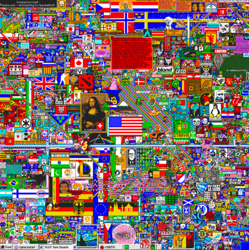
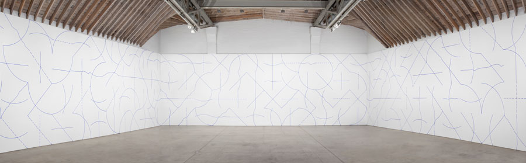
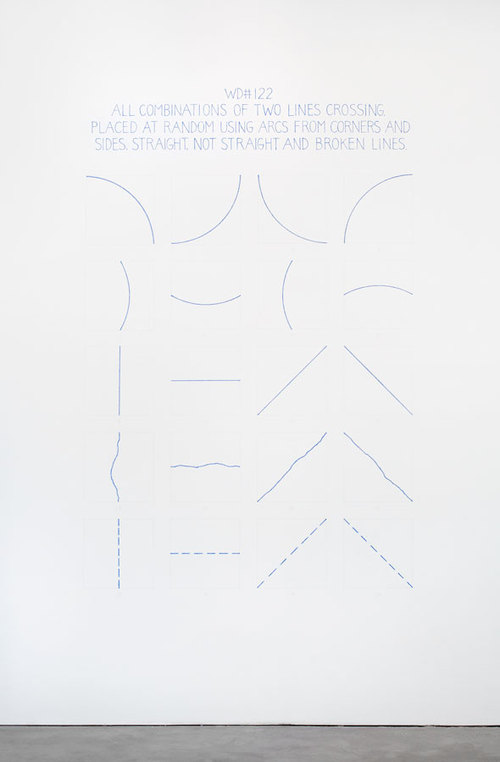
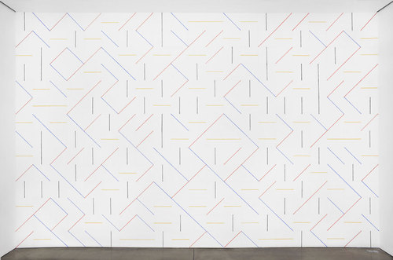
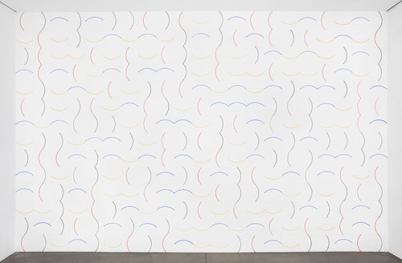
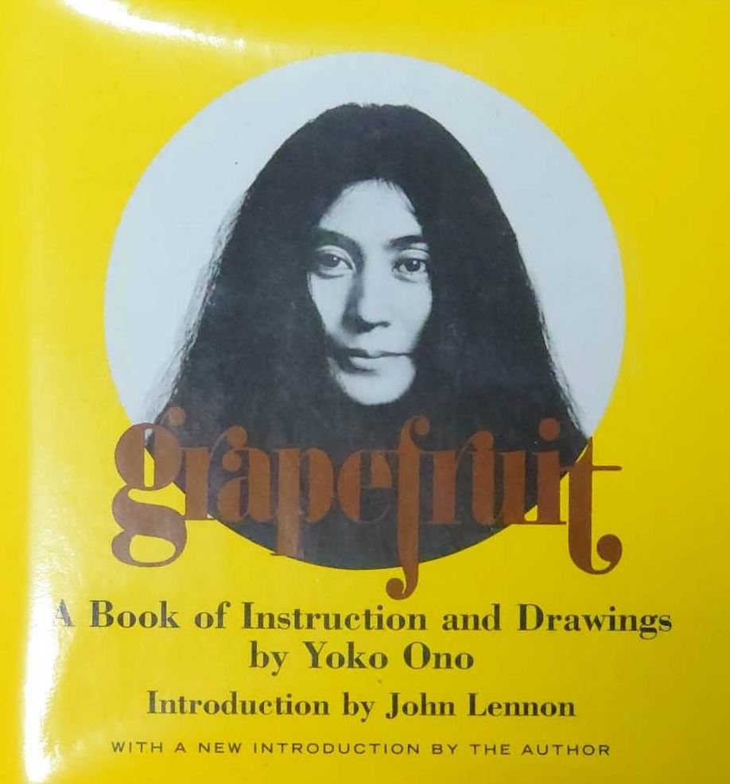

name: inverse
layout: true
class: center, middle, inverse
---

# Creative Coding I

### Prof. Dr. Lena Gieseke | l.gieseke@filmuniversitaet.de  

<br />
#### Film University Babelsberg KONRAD WOLF

---

# Last Session

---
layout: false

.header[Last Week]

## Emergence

--

> In philosophy, systems theory, science, and art, emergence occurs when a complex entity has properties or behaviors that its parts do not have on their own, and emerge only when they interact in a wider whole. 
  
<br >
> The remarkable simplicity of complexity...


.footnote[[Wikipedia. 2023. [*Emergence*](https://en.wikipedia.org/wiki/Emergence). | A. Martin and K. Helmerson. 2014. [*Emergence: the remarkable simplicity of complexity*](https://theconversation.com/emergence-the-remarkable-simplicity-of-complexity-30973). The Conversation.]]


???
.task[COMMENT:]  

* For instance, the phenomenon of life as studied in biology is an emergent property of chemistry.
* In philosophy: An emergent property of a system, in this context, is one that is not a property of any component of that system, but is still a feature of the system as a whole. Nicolai Hartmann (1882–1950), one of the first modern philosophers to write on emergence, termed this a categorial novum (new category). 

---

.header[Last Week]

## Emergence

  


.footnote[[B. Yirka. 2015. [*Researchers use wave theories to understand flocks of birds*](https://www.sott.net/article/297335-Researchers-use-wave-theories-to-understand-flocks-of-birds). Sign of the times.]]


---


.header[Last Week]

## Emergence


---
.header[Last Week | Emergence]

## Reddit’s r/place

--


.left-even[
>There is an empty canvas. You may place a tile upon it, but you must wait to place another. Individually you can create something. Together you can create something more.

.footnote[[J. Ho. 2022. *Our Place: On the Emergence of Visual Artifacts in Collaborative Art in Reddit’s r/place*. Academic Conference Simulation at FUB 2022.]]
]


???
.task[COMMENT:]  

* https://en.wikipedia.org/wiki/The_Million_Dollar_Homepage
* 

--
.right-even[]


---
.header[Last Week | Emergence]

## Reddit’s r/place

> The communal co-creation of an artistic artifact.
  
.footnote[[J. Ho. 2022. *Our Place: On the Emergence of Visual Artifacts in Collaborative Art in Reddit’s r/place*. Academic Conference Simulation at FUB 2022.]]

  
--
* 72-hour social experiment, 2017 & 2022
  
???
.task[COMMENT:]  

* In the original 72-hour pe- riod, 16.4 million tiles were placed. In 2022, that number increased almost 10x, to 160.4 million tiles (Fig. 3).
At its peak, the 2017 experiment saw nearly 128k active hourly participants (placed at least 1 tile during an hour). In 2022, that number grew to 1.7 million participants an hour (Fig. 4).
  
--
* 1000 x 1000-pixel canvas
  
--
* Set the color of a single pixel, every 5 to 20 minutes


???
.task[COMMENT:]  

* This collaborative composi- tion of flags, memes, icons, logos and recreations of famous paint- ings seemed like a snapshot of collective internet culture in 2017 [Lor]. The rules of the experiment were simple: during the 3-day event, anyone with an anonymous Reddit account could place a single, colored pixel on the canvas every 5 minutes [sim], even on previously colored pixels. At times, the engineering team extended the cooldown period to 20 minutes to mitigate technical issues on the backend [sim]. Users were given a palette of 16 colors from which to choose.

---
.header[Last Week | Emergence]

## Reddit’s r/place

<video controls autoplay width="450">
  <source src="../02_scripts/img/emergence/r_place_2017_trimmed.mp4" type="video/mp4" />
</video>

.right-even[
.footnote[[J. Ho. 2022. *Our Place: On the Emergence of Visual Artifacts in Collaborative Art in Reddit’s r/place*. Academic Conference Simulation at FUB 2022.]]]


---
.header[Last Week | Emergence]

## Reddit’s r/place


* Users had to collaborate to create larger artifacts
    * Subreddits, interest-based subforums on Reddit
    * Discord channels

???
.task[COMMENT:]  

* Over 100?
--
* On-going battles and coalition-forming regarding space


.footnote[[J. Ho. 2022. *Our Place: On the Emergence of Visual Artifacts in Collaborative Art in Reddit’s r/place*. Academic Conference Simulation at FUB 2022.]]


???
.task[COMMENT:]  

* On several Subreddits, or interest-based subforums on Reddit, groups of users began to co- ordinate and construct larger artworks. Given a 5-minute cooldown period, a single user could at most place an artwork of only 864 pixels, or 36 x 24 pixels, which forced users to collaborate to create any larger artifacts. When Reddit locked the ability to place tiles around hour 72, the resulting artwork was frozen in place, locking in the last pixel that had been placed (Fig. 2).

---
.header[Last Week | Emergence]

## Reddit’s r/place


.footnote[[J. Ho. 2022. *Our Place: On the Emergence of Visual Artifacts in Collaborative Art in Reddit’s r/place*. Academic Conference Simulation at FUB 2022.]]

???
.task[COMMENT:]  

* SFU and /r/UBC, University of Victoria
* Members of Staropa joined the Spelunky Discord server

---
.header[Last Week | Emergence]

## Reddit’s r/place


.footnote[[J. Ho. 2022. *Our Place: On the Emergence of Visual Artifacts in Collaborative Art in Reddit’s r/place*. Academic Conference Simulation at FUB 2022.]]


???
.task[COMMENT:]  

* Streamers Attack
* 4.04.22 07:20 GMT: a Spanish speaking streamer named SkyshockTV instructed his viewers to attack the area.


---
.header[Last Week | Emergence]

## Reddit’s r/place


.footnote[[J. Ho. 2022. *Our Place: On the Emergence of Visual Artifacts in Collaborative Art in Reddit’s r/place*. Academic Conference Simulation at FUB 2022.]]


???
.task[COMMENT:]  

* 4.04.22 07:45 GMT: after an alliance member donated to the stream, the attack is called off

---
.header[Last Week | Emergence]

## Reddit’s r/place


???
.task[COMMENT:]  

* Several academic research projects about r/place

--

> What were the driving forces behind the creation of coherent artworks and visual artifacts?
  

.footnote[[K.T. Litherland and A. I. Mørch. 2021. [*Instruction vs. emergence on r/place: Understanding the growth and control of evolving artifacts in mass collaboration*](https://linkinghub.elsevier.com/retrieve/pii/S0747563221001680). Computers in Human Behavior][J. Ho. 2022. *Our Place: On the Emergence of Visual Artifacts in Collaborative Art in Reddit’s r/place*. Academic Conference Simulation at FUB 2022.]]

--

<br/>
K.T. Litherland and A. I. Mørch:

### Instructions (top down) vs. Emergence (bottom up)


???
.task[COMMENT:]  

* We examined in detail one visual artifact (Mona Lisa painting with the Swiss flag) and its related discussion board and suggest a conceptual framework for the analysis of the evolution. The framework takes inspiration from two metaphors of human intervention in natural evolution (plant growth and a disturbed anthill). At the end, we apply the framework to other objects on the canvas and discuss the tradeoff between instruction and emergence.


---


  

.footnote[[K.T. Litherland and A. I. Mørch. 2021. [*Instruction vs. emergence on r/place: Understanding the growth and control of evolving artifacts in mass collaboration*](https://linkinghub.elsevier.com/retrieve/pii/S0747563221001680). Computers in Human Behavior][J. Ho. 2022. *Our Place: On the Emergence of Visual Artifacts in Collaborative Art in Reddit’s r/place*. Academic Conference Simulation at FUB 2022.]]

---
.header[Last Week]

## Emergence


[Casey Reas - On Creative Coding and Emergence ⬀](https://www.youtube.com/watch?v=_8DMEHxOLQE)


---
.header[Last Week]

## Creative Coding

--

> What do I have available and what can I do with that beyond the obvious?
  
  

--
   
* Producing something expressive rather than focussing on a practical use
* Developing software beyond its standard usage scenarios
* Developing tools that help others to be creative


---
.header[Creative Coding]

## Practical Approaches

???


Still pretty vague. What does it mean specifically? The following aspects of content creation, data and media formats describe in more detail what can be considered as creative coding:

--
* Algorithms to create graphics and audio  

--
  
→ TBAG, Procedural Generation and Simulation

---
.header[Creative Coding]

## Practical Approaches

* Algorithms to create graphics and audio  
* Smart, meaningful or unusual data sources

--
    * Images, video, audio
    * Camera and microphone
    * Online resources such as Twitter, Instagram and ChatGPT
    * Mobile devices as sensors
    * ...

---
.header[Creative Coding]

## Practical Approaches

* Algorithms to create graphics and audio  
* Smart, meaningful or unusual data sources
* Diverse output formats

--
    * Web
    * From large-scale such as buildings to small-scale such as smart watches
    * Multi-screen setups for example with mobile devices
    * ...

---
template:inverse

# Homework

---
template:inverse

# Instructions

---
## Today

--
* Tools and Environments

--
* Algorithmic Thinking

--
* Instructions

  
---
template:inverse

# Tools and Environments
Algorithmic Thinking  
Artistic Interpretation  


---

## Tools and Environments

--
* Programming Languages, Frameworks, Libraries

--
* Software

--
* Hardware


---
template:inverse

## *What Are Programming Languages?*

---
.header[Tools and Environments | Programming Languages]

## Wikipedia says…

*A programming language is a **formal language**, which comprises a set of instructions that produce various kinds of output.*  
  
--
<br >

*Programming languages are used in computer programming to implement **algorithms.***
  
--
  
<br >

*A programming language's surface form is known as its **syntax.***


???
.task[COMMENT:]  

*[…] the syntax of a computer language is the set of rules that defines the **combinations of symbols** that are considered to be a **correctly structured** document or fragment in that language.*


* There are hundreds of programming languages

---
.header[Tools and Environments | Programming Languages]

## Programming

You have to learn

--

1. The formal language
2. Algorithm


---
.header[Tools and Environments | Programming Languages | Programming]

## Examples

--


```js
function draw() {

    for (let y = 0; y < height; y+=cellSize) {
        for (let x = 0; x < width; x+=cellSize) {

            fill(255);
            rect(x, y, cellSize, cellSize);
        }
    }
}
```


???
.task[COMMENT:]  

* https://editor.p5js.org/legie/sketches/-WvKYxepm

---
.header[Tools and Environments | Programming Languages | Programming]

## Examples

> How do you need to control the fill command to create the following examples?

---
.header[Tools and Environments | Programming Languages | Programming]

## Examples

.left-even[

]

---
.header[Tools and Environments | Programming Languages | Programming]

## Examples

.left-quarter[

]

.right-quarter[
```js
// https://editor.p5js.org/legie/sketches/lWJGIhhtI
// Grid Examples

...

    fill(255);
    // Fill only the cell
    // on the diagonal
    if ( y == x) {
        fill(0);
    }

    rect(x, y, cellSize, cellSize);

```
]
---
.header[Tools and Environments | Programming Languages | Programming]

## Examples

.left-even[

]


---
.header[Tools and Environments | Programming Languages | Programming]

## Examples

.left-quarter[

]

.right-quarter[
```js
// https://editor.p5js.org/legie/sketches/5x1bAs66K
// Grid Examples

...
    stroke(0);
    fill(255);

    if (x > y) {
        stroke(255);
        fill(0);
    }

    rect(x, y, cellSize, cellSize);

```
]

---
.header[Tools and Environments | Programming Languages | Programming]

## Examples

.left-even[

]


---
.header[Tools and Environments | Programming Languages | Programming]

## Examples

.left-quarter[

]


???
.task[COMMENT:]  

* The overall logic to create a checkerboard is to fill every other cell black and to shift that every other row. 

* You could also say that in the even rows (meaning the 0., 2., 4. row...), the even columns (meaning the 0., 2., 4. column...) should be black, and in the uneven rows, the uneven cells should be black.

* You can identify even numbers with the modulo operator.


---
.header[Tools and Environments | Programming Languages | Programming]

## Examples

.left-quarter[

]


.right-quarter[
```js
// https://editor.p5js.org/legie/sketches/_NHk4arDR
// Grid Examples


if ((row % 2 == 0) && (column % 2 == 0)) {
    fill(0);
} 
else if ((row % 2 != 0) && (column % 2 != 0)) {
    fill(0);
}
```
]

---
.header[Tools and Environments | Programming Languages | Programming]

## The Modulo Operator

--

The [modulo](https://www.computerhope.com/jargon/m/modulo.htm) operator returns for a division with a whole number the rest of that division:

```js
// Pseudo Code

5 / 2 is 2 (the quotient) with rest 1
7 / 5 is 1 with rest 2

x / y is quotient q with rest r
x = q * y + r
```

---
.header[Tools and Environments | Programming Languages | Programming]

## The Modulo Operator


This comes in handy when testing for even numbers:

```js
if (number % 2 == 0) 
{
    print("even");
}
```


---
.header[Tools and Environments | Programming Languages | Programming]

## Examples

.left-quarter[

]


.right-quarter[
```js
// https://editor.p5js.org/legie/sketches/_NHk4arDR
// Grid Examples


    if ((row + column) % 2 == 0) {
        fill(0);
    } 
```
]


???
.task[COMMENT:]  

* odd + odd is even

---
.header[Tools and Environments | Programming Languages | Programming]

## Examples

.left-quarter[

]

.right-quarter[
```js
if ((row + column) % 2 == 0) {
    fill(0);
} 
```
* number sequence: a, b, c, d
* b and d are odd
* a is the even number before b
* c is the even number before d 

`b + d = (a+1) + (c+1) = a + c + 2`

]


???
* CHECK: 

---
.header[Tools and Environments | Programming Languages]

## Programming

You have to learn

1. The formal language
2. Algorithm

--

> Why should you learn programming?


---
.header[Tools and Environments | Programming Languages | Why Programming?]

## Computers Can Do It Better 🤖

--

* Task automatization / improvements

--
    * E.g., navigation

--

* Novel tasks

--
    * E.g., the internet

--

* For many tasks, software…
    * …thinks faster and is not getting tired
    * …has a better memory
    * …is better in multitasking

???

.task[ASK:]  

* How would you define creativity?


---
.header[Tools and Environments | Programming Languages | Why Programming?]

## A Creative Process


???
.task[COMMENT:]  

* How would you define creativity?
* Programming is (often) a creative process

--

.left-even[
* You can create anything out of nothing
]

---
.header[Tools and Environments | Programming Languages | Why Programming?]

## A Creative Process

.left-even[
* You can create anything out of nothing
* Freedom of choice for a solution, many options
]


---
.header[Tools and Environments | Programming Languages | Why Programming?]

## A Creative Process

.left-even[
* You can create anything out of nothing
* Freedom of choice for a solution, many options
    * A bit like lego…


]

.right-even[


]

---
.header[Tools and Environments | Programming Languages | Why Programming?]

## A Creative Process

.left-even[
* You can create anything out of nothing
* Freedom of choice for a solution, many options
    * A bit like lego…
]

.right-even[
* Results are easily shared
]


---
.header[Tools and Environments | Programming Languages | Why Programming?]

## A Creative Process

.left-even[
* You can create anything out of nothing
* Freedom of choice for a solution, many options
    * A bit like lego…
]

.right-even[
* Results are easily shared
* Collaborative
]


---
.header[Tools and Environments | Programming Languages | Why Programming?]

## Become a Better You 😀

--

* Practice a systematic approach to problem solving

--

    * …reflect and come up with a plan
    * …break apart and reduce **(Divide and conquer)**
    * …reformulate
    * …working with the unknown
    * …build a healthy frustration tolerance and trust the process

---
.header[Why Programming?]

## Become a Better You 😀

.left-even[Be gentle with yourself.]

.right-even[ ] 
.footnote[[[tattly]](https://tattly.com/products/love-yourself)]

---
.header[Tools and Environments | Programming Languages | Why Programming?]

## I Hate Maths… 😳

--
* Programming in itself has nothing to do with maths  
    * Many programmers never use any maths at all
    * Maths is needed for graphics and sound!
--
* Programming is more like Sudoku
    * Solving one step at a time
    * Each step give hints for the next one
--
* **Divide a problem into manageable sub-steps**

---
.header[Tools and Environments]

## Programming Languages

--

.left-even[
* JavaScript
* Python
* C++
* Java
* C#
* GLSL
]
.right-even[
* [Scala](https://scala-lang.org/)
* [Clojure](https://clojure.org/)
* [Rust](https://www.rust-lang.org/)
* [Kotlin](https://kotlinlang.org/)
* [Orca](https://github.com/hundredrabbits/Orca)
* Software specific, e.g., VEX
]

???
* [Scala](https://www.creativescala.org/), https://scala-lang.org/
* [Clojure](https://www.maria.cloud/) (online-environment + curriculum)
* https://www.rust-lang.org/
* https://clojure.org/
* https://kotlinlang.org/
* https://github.com/hundredrabbits/Orca


---
.header[Tools and Environments]

## Programming Languages

.left-even[
* JavaScript
* Python
* C++
* Java
* C#
* GLSL

> [567 Hello World programs](http://helloworldcollection.de)

]
.right-even[
* [Scala](https://scala-lang.org/)
* [Clojure](https://clojure.org/)
* [Rust](https://www.rust-lang.org/)
* [Kotlin](https://kotlinlang.org/)
* [Orca](https://github.com/hundredrabbits/Orca)
* Software specific, e.g., VEX
]

???
* [Scala](https://www.creativescala.org/), https://scala-lang.org/
* [Clojure](https://www.maria.cloud/) (online-environment + curriculum)
* https://www.rust-lang.org/
* https://clojure.org/
* https://kotlinlang.org/
* https://github.com/hundredrabbits/Orca


---
.header[Tools and Environments]

## Programming Languages

.left-even[
* **JavaScript**
* **Python**
* **C++**
* Java
* C#
* **GLSL**
]
.right-even[
* [Scala](https://scala-lang.org/)
* [Clojure](https://clojure.org/)
* [Rust](https://www.rust-lang.org/)
* [Kotlin](https://kotlinlang.org/)
* [Orca](https://github.com/hundredrabbits/Orca)
* Software specific, e.g., VEX
]


---
.header[Ingredients For A Webpage]

## JavaScript

--
* Interpreted programming language

.footnote[[[ramotion](https://www.ramotion.com/blog/dynamic-web-application-development/)]]


???

* interpreted programming language means it runs as is and you don't need to compile it to execute your code

--
* Dominant choice for *non-static* content as all major web browsers have a dedicated JavaScript engine


???

* All major web browsers have a dedicated JavaScript engine to execute it
* As a multi-paradigm language, JavaScript supports event-driven, functional, object-oriented and prototype-based programming styles (we will come back to programming paradigms later). Although there are strong outward similarities between JavaScript and Java, including language name, syntax, and respective standard libraries, they are two distinct languages are and differ greatly in design.
* Every time a web page does more than just sit there and display static information for you to look at — displaying timely content updates, interactive maps, animated 2D/3D graphics, scrolling video jukeboxes, etc. — you can bet that JavaScript is probably involved. 

> *Dynamic* refers here to an application that can change its content, appearance, and functionality in response to user input, system or external events, and information, e.g., from a databases.

--
* Multi-paradigm language


???

* As a multi-paradigm language, JavaScript supports event-driven, functional, object-oriented and prototype-based programming styles


---
.header[Tools and Environments | Programming Languages]


## Shouldn’t We Rather Learn ___?

--
* The friend of my friend of my friend says…

--
* Choices also depend on what you are used to

???

* The choice of a programming language is also somewhat of a religion and highly depends on what you are used to

--
* There is always the next *hot topic*

--
* The one programming language to learn doesn’t exists
    * They all have advantages and disadvantages
    * It depends on specific application scenarios


???
* p5.js is a good introduction
    * Especially for designer, artists, etc.
    * Everything you learn with p5.js, you can transfer to another programming language


---
.header[Tools and Environments]

## Frameworks

--

> A software framework is a universal, reusable software environment that provides particular functionality as part of a larger software platform to facilitate development of software applications, products and solutions.

--

* A special case of software library
* Abstractions of code wrapped in a well-defined Application Programming Interface (API)


.footnote[[[Wikipedia: Software Framework](https://en.wikipedia.org/wiki/Software_framework), [Stack Overflow: What is a software framework](https://stackoverflow.com/questions/2964140/what-is-a-software-framework)]]


???
* Contain some key distinguishing features

Analogy
* A library is like a toolbox where you pick and use the tools you need.
* A framework is like a template or structure for a house; you build your application around its blueprint.

In short, a library gives you tools to use as you choose, while a framework provides a structure within which you work and defines much of the flow of your application.


A library performs specific, well-defined operations.

A framework is a skeleton where the application defines the "meat" of the operation by filling out the skeleton. The skeleton still has code to link up the parts but the most important work is done by the application.

Examples of libraries: Network protocols, compression, image manipulation, string utilities, regular expression evaluation, math. Operations are self-contained.

Examples of frameworks: Web application system, Plug-in manager, GUI system. The framework defines the concept but the application defines the fundamental functionality that end-users care about.
https://stackoverflow.com/questions/148747/what-is-the-difference-between-a-framework-and-a-library


* A library is essentially a set of functions that you can call, these days usually organized into classes. Each call does some work and returns control to the client.
* A framework embodies some abstract design, with more behavior built in. In order to use it you need to insert your behavior into various places in the framework either by subclassing or by plugging in your own classes. The framework's code then calls your code at these points.


---

.header[Tools and Environments | Library & Frameworks]

## JavaScript


.left-even[
* [p5.js](https://p5js.org/examples/)
* [three.js](https://threejs.org/)
* [sketch.js](http://soulwire.github.io/sketch.js/)
* [D3](https://d3js.org/)
* [PixiJS](http://www.pixijs.com/gallery)
* [Phaser](https://phaser.io/)
]
.right-even[
* [babylonjs](https://www.babylonjs.com/)
* [Tone.js](https://tonejs.github.io/)
* [tixy.land](https://tixy.land/)
* [Hydra](https://hydra.ojack.xyz/)
* [Quil](http://quil.info/)
]


???

JavaScript libraries directly relevant in the creative coding context (of course we will need base tools such as node.js as well):

* Any other suggestions?
* [Tone.js](https://tonejs.github.io/) for audio related creative coding
* [tixy.land](https://tixy.land/) — minimalist creative coding environment
* [Hydra](https://hydra.ojack.xyz/) — creative live coding
* [Quil](http://quil.info/) — processing + clojure


---

.header[Tools and Environments | Library & Frameworks]

## JavaScript

.left-even[
* [**p5.js**](https://p5js.org/examples/)
* [**three.js**](https://threejs.org/)
* [sketch.js](http://soulwire.github.io/sketch.js/)
* [D3](https://d3js.org/)
* [PixiJS](http://www.pixijs.com/gallery)
* [Phaser](https://phaser.io/)
]
.right-even[
* [babylonjs](https://www.babylonjs.com/)
* [Tone.js](https://tonejs.github.io/)
* [tixy.land](https://tixy.land/)
* [Hydra](https://hydra.ojack.xyz/)
* [Quil](http://quil.info/)
]


???

* Any other suggestions?

TODO: Add JavaScript Slides

---
.header[Tools and Environments | Library & Frameworks]

## Processing & p5

* [p5](https://p5js.org/) is a library for JavaScript
    * You write JavaScript code but you have additional commands from p5
* p5 is based on the Java framework Processing
    * Processing came first
    * p5 is Processing running in a webbrowser
    * p5 and Processing are very similar


???


Processing

* 2001 developed in the research group Aesthetics and Computation of the Technology Media Labs at the Massachusetts Institute of Technology by the students Ben Fry and Casey Reas.
* 2012 the Processing Foundation (a non-profit corporation) was established


>Our mission is to promote software literacy within the visual arts, and visual literacy within technology-related fields — and to make these fields accessible to diverse communities. Our goal is to empower people of all interests and backgrounds to learn how to program and make creative work with code, especially those who might not otherwise have access to these tools and resources.

---
.header[Tools and Environments | Library & Frameworks]
## Processing & p5

> Our mission is to promote software literacy within the visual arts, and visual literacy within technology-related fields, and to make these fields accessible to diverse communities. Our goal is to empower people of all interests and backgrounds to learn how to program and make creative work with code, especially those who might not otherwise have access to these tools and resources.

.footnote[[[The Processing Foundation](https://processing.org/), [Crouch, M. (2019). 6 ways to get into creative coding. Creative Bloq.](https://www.creativebloq.com/features/6-ways-to-get-into-creative-coding)]]

???

* Processing came first and still a bit better documented but to me it feels like as if the Processing Foundation is moving away from Processing and solely focus on p5 now. In this class we will only work with p5. You should chose between using Processing and p5 depending on the type of project, you are doing.

* When is it more suitable to use Processing, when p5?
* Who has worked with Processing before?

---
.header[Tools and Environments | Library & Frameworks]

## Resources & Community

* [p5 Reference](https://p5js.org/reference/)
* [Open Processing](https://www.openprocessing.org)
* [Happy Coding](https://happycoding.io)
* [Generative Gestaltung](http://www.generative-gestaltung.de)
* [Creative Applications](https://www.creativeapplications.net/category/processing/)
* The fairest of them all: [Daniel Shiffmann](https://thecodingtrain.com/) 🤴🏻
    * [The Coding Train Intro](https://www.youtube.com/watch?v=_t0ZBAk72K8)


???


* One of the aspects that made Processing, and now p5, so popular is its community and the vast amount of resources.
* Show coding train intro
* [procssing.org](https://processing.org)


---
.header[Tools and Environments | Library & Frameworks]
## Libraries

* p5 extends JavaScript
* Additional libraries extend p5, e.g., for sound

???
.task[COMMENT:]  

* The same way p5 is written to extend the base functionality of JavaScript, we can write code that further extends p5.  


* A library is code in regard to a certain topic, e.g. sound, that is somewhat generalized and of use in various contexts.
* Libraries should be compact and also as small as possible. That is one of the reasons why additional libraries are not simply added to p5 itself. 
 
--
* Written by different people


???
.task[COMMENT:]  

* Libraries are mostly written by other people or teams and it is easier to manage to keep the development of an additional library separated.


---
.header[Tools and Environments | Library & Frameworks]
## Library Example

Use the [ml5](https://docs.ml5js.org/#/) for machine learning in an accessible and easy way.

.center[[[ml5]](https://learn.ml5js.org)]

---
.header[Tools and Environments | Library & Frameworks]
## Library Example

A library to create a [scribble effect](https://github.com/generative-light/p5.scribble.js):

.center[ [[p5.scribble]](https://github.com/generative-light/p5.scribble.js)]


???
.task[COMMENT:]  

* https://editor.p5js.org/legie/sketches/PtoiQsgKr


---
.header[Tools and Environments | Library & Frameworks]
## Library Example

A library to create a [a touch gui](https://github.com/L05/p5.touchgui):

.center[]  [[p5.touchgui]](https://github.com/L05/p5.touchgui)

---
.header[Tools and Environments | Library & Frameworks]
## Library Example

You can find a list of the currently supported p5 libraries [on the p5 website](https://p5js.org/libraries/).

--

> Depending on your tasks, using a library can make your life much easier.

--

Keep in mind 

* The quality of the code and its documentation might vary

--
* If a library is listed on the official p5 website, it is probably ok

---
.header[Tools and Environments | Library & Frameworks]
## Library Example

For loading libraries we have to take a look behind the scenes...


---
.header[Tools and Environments | Library & Frameworks]

## C++

.left-even[
* [OpenFrameworks](https://openframeworks.cc/)
* [Cinder](https://libcinder.org/gallery)  
]

--
.right-even[
* [STL](https://en.wikipedia.org/wiki/Standard_Template_Library)
* [Boost](https://www.boost.org/)
* [OpenCV](https://opencv.org/)
* [Qt](https://www.qt.io/)
* [TensorFlow](https://www.tensorflow.org/api_docs/cc)
* [Eigen](https://eigen.tuxfamily.org/index.php?title=Main_Page)
]

???
1-STL

The STL is a collection of template classes and functions that provide common data structures (like vectors, lists, queues, and stacks) and algorithms (such as sorting and searching). It is an integral part of C++ and is widely used for its generic programming capabilities.

2-Boost

Boost is a set of high-quality, peer-reviewed libraries that extend the functionality of C++. These libraries cover a wide range of areas, including smart pointers, regular expressions, multithreading, networking, and more. Many Boost libraries have been proposed for standardization and some are already part of the C++ Standard Library.

4-Qt

Qt is a cross-platform application framework that simplifies GUI (Graphical User Interface) development. It provides a set of libraries and tools for creating desktop, mobile, and embedded applications. Qt is known for its ease of use and flexibility.

6-OpenCV

OpenCV is a computer vision library that provides a wide range of tools and algorithms for image and video processing. It’s widely used in computer vision applications, robotics, and machine learning.

7-TensorFlow

TensorFlow is an open-source machine learning (ML) library developed by the Google Brain team. It is designed to facilitate the development and deployment of machine learning models, particularly for deep learning applications. TensorFlow provides a comprehensive ecosystem of tools, libraries, and community resources, making it one of the most widely used frameworks in the field of artificial intelligence

10-Eigen:

Eigen is a C++ template library for linear algebra. It provides classes and functions for handling matrices, vectors, and numerical operations. Eigen is known for its performance and ease of integration with other libraries.

---
.header[Tools and Environments | Library & Frameworks]

## C++

.left-even[
* [**OpenFrameworks**](https://openframeworks.cc/)
* [Cinder](https://libcinder.org/gallery)  
  
→ Creative Coding II next term: OpenFrameworks
]

.right-even[
* [STL](https://en.wikipedia.org/wiki/Standard_Template_Library)
* [Boost](https://www.boost.org/)
* [OpenCV](https://opencv.org/)
* [Qt](https://www.qt.io/)
* [TensorFlow](https://www.tensorflow.org/api_docs/cc)
* [Eigen](https://eigen.tuxfamily.org/index.php?title=Main_Page)
]

  


---
.header[Tools and Environments | Library & Frameworks]

## Others

* [Nannou for Rust](https://nannou.cc/)
* [OpenRNDR for Kotlin](https://openrndr.org/)

---
.header[Tools and Environments]

## Software

--

* [Touch Designer](https://www.derivative.ca/), [vvvv / vvvv gamma](https://vvvv.org/), [Pure Data](https://puredata.info/), [Max/MSP](https://cycling74.com/)
* [MadMapper](https://madmapper.com/), [Millumin 2](https://www.millumin.com/v2/index.php), [VDMX](https://vidvox.net/), [Resolume](https://resolume.com/)
* [LUMOplay](https://www.lumoplay.com/)
* [Unity](https://unity3d.com), [Unreal](https://www.unrealengine.com)
* [Reaper](https://www.reaper.fm/), [Ableton](https://www.ableton.com)
* [Maya](https://www.autodesk.de/products/maya/overview), [Houdini](https://www.sidefx.com/), [3dsMax](https://www.autodesk.de/products/3ds-max/overview), [Cinema4D](https://www.maxon.net/de/produkte/cinema-4d/cinema-4d/), [ZBrush](https://pixologic.com/), [Allegorithmic](https://www.allegorithmic.com/)
* [Nuke](https://www.foundry.com/products/nuke), [After Effects](https://www.adobe.com/de/products/aftereffects.html), [Avid](https://www.avid.com/de/), [Premiere](https://www.adobe.com/products/premiere.html?promoid=PQ7SQBYQ&mv=other)
* [Flash](https://en.wikipedia.org/wiki/Adobe_Flash), [Director MX](https://en.wikipedia.org/wiki/Adobe_Director)
* [Photoshop](https://www.adobe.com/products/photoshop.html?promoid=PC1PQQ5T&mv=other), [Illustrator](https://www.adobe.com/products/illustrator.html?promoid=PGRQQLFS&mv=other), [InDesign](https://www.adobe.com/products/indesign.html)


???

* [**Touch Designer**](https://www.derivative.ca/), [vvvv / vvvv gamma](https://vvvv.org/), [Pure Data](https://puredata.info/), [**Max/MSP**](https://cycling74.com/)
* [MadMapper](https://madmapper.com/), [Millumin 2](https://www.millumin.com/v2/index.php), [VDMX](https://vidvox.net/), [Resolume](https://resolume.com/)
* [LUMOplay](https://www.lumoplay.com/)
* [**Unity**](https://unity3d.com), [**Unreal**](https://www.unrealengine.com)
* [Reaper](https://www.reaper.fm/), [Ableton](https://www.ableton.com)
* [Maya](https://www.autodesk.de/products/maya/overview), [**Houdini**](https://www.sidefx.com/), [3dsMax](https://www.autodesk.de/products/3ds-max/overview), [Cinema4D](https://www.maxon.net/de/produkte/cinema-4d/cinema-4d/), [ZBrush](https://pixologic.com/), [Allegorithmic](https://www.allegorithmic.com/)
* [Nuke](https://www.foundry.com/products/nuke), [After Effects](https://www.adobe.com/de/products/aftereffects.html), [Avid](https://www.avid.com/de/), [Premiere](https://www.adobe.com/products/premiere.html?promoid=PQ7SQBYQ&mv=other)
* [Flash](https://en.wikipedia.org/wiki/Adobe_Flash), [Director MX](https://en.wikipedia.org/wiki/Adobe_Director)
* [Photoshop](https://www.adobe.com/products/photoshop.html?promoid=PC1PQQ5T&mv=other), [Illustrator](https://www.adobe.com/products/illustrator.html?promoid=PGRQQLFS&mv=other), [InDesign](https://www.adobe.com/products/indesign.html)

... 

---
.header[Tools and Environments]

## Hardware

.left-even[
* Micro controllers
* Sensors, e.g. depth
* Projectors
* VR, AR, MR devices
* Displays
* Drone
* Eye, brain tracker  
]

???

* **Micro controllers**
* **Sensors**, e.g. depth
* **Projectors**
* **VR**, AR, MR devices
* Displays
* Drone
* Eye, brain tracker  

--

.right-even[

<br />
→ Technology Introductions and Creative Technologies this term
]
---
.header[Tools and Environments]

## Tools and Environments 

Please refer to the [learning list about software](https://github.com/ctechfilmuniversity/ctech_resources/tree/master/learning) in the [ctech_resources](https://github.com/ctechfilmuniversity/ctech_resources) repo (and add to it if you know of something that is not included in the list)!

--

<br />

> This repo hasn't been updated in a while...


---
.header[Last Week | Lecture 1: Introduction]

## Technical Setup CC1

--

* Visual Studio Code
    * [Know about workspaces and extensions](../02_scripts/cc1_ws2425_02_setup_script.md#visual-studio-code)


--


* Markdown

???
.task[COMMENT:]  

* What is Markdown and how do you work with it?
    * Markdown is a popular markup language that converts text to html.
    * Markdown allows you to use an easy-to-read, easy-to-write plain text format, then converts it to structurally valid XHTML (or HTML).
    * Github can render markdown. Be aware though that there are different markdown parser ("converter") and what you can do e.g. with a Visual Studio Code plugin for setting and displaying formulas might not be the same as what GitHub can display.

--
* Git & GitHub

???
.task[COMMENT:]  

* GitHub
    * What is Git and what is GitHub?
    * How do you work with Git? 

The *most basic* git workflow for versioning your files locally looks like the following:
* `Initialize` a directory as git directory (this needs to be done only once)
* Work on files...
* `Add` the files that you want to commit to the stage
* `Commit` the staged files to the repository
* Work on files...


    * How do you work with GitHub

#### Pull

When your local repository is connected to an online one on GitHub, you *pull* the recent version from the online repository into your local one.

#### Push

When your local repository is connected to an online one on GitHub, you *push* your recent commits from your local repository into the online one.


--

<br/>

> Which environments are you going to use?


--
Further Questions? 🤔

---
template:inverse

Tools and Environments ✓  
# Algorithmic Thinking  
Artistic Interpretation  


---
.header[Algorithmic Thinking]

## Algorithm


???
* What is an algorithm?

--


*[…] an algorithm is a set of instructions, **typically to solve a class of problems** or perform a computation.*

--

<br >

*Algorithms are **unambiguous** specifications for performing calculation, data processing, automated reasoning, and other tasks.*

---
.header[Algorithmic Thinking]

## Algorithm

.left-even[
*Give instructions for cleaning the dishes.*
]


---
.header[Algorithmic Thinking]

## Algorithm

.left-even[
*Give instructions for cleaning the dishes.*
  
<br >
  
 [⬀](https://www.montessoriprivateacademy.com/wp-content/uploads/2015/11/montessori-washing-dishes.png)

]

--

.right-even[
* With what are we working?
    * Inputs, data
    * Given functions

  
* What is the process?
]

???
.task[COMMENT:]  

* (plate, sponge, water, tap, soap, dirt)

---
.header[Algorithmic Thinking]

## Algorithm

.left-even[
*Give instructions for cleaning the dishes.*
  
<br >
  
 [⬀](https://bocghewasu.github.io/post/smart-cartoon-characters-male/)

]

???
.task[COMMENT:]  

* (plate, sponge, water, tap, soap, dirt)

---
.header[Algorithmic Thinking]

## Algorithm

> With what are we working?

* Different programming languages have different prerequisites and capabilities...

--
* ...and with that also heavily the code we are writing


---
.header[Algorithmic Thinking]

## Divide and Conquer

--
  
Into which parts can we subdivide the problem?

--
1. What do we see?

--
2. Which sub-problems can we derive?

--
3. How can we implement each sub-problem?


???
.task[COMMENT:]  

* Go from the easiest to the hardest 

---
.header[Algorithmic Thinking]

<iframe src="https://editor.p5js.org/legie/full/-HB6nto44" width="1100" height="550" ></iframe>


???
.task[COMMENT:]  
* What do we see?
* https://editor.p5js.org/legie/full/-HB6nto44

---
.header[Algorithm | What do we see?]

## Lines

.left-quarter[
<iframe src="https://editor.p5js.org/legie/full/-HB6nto44" width="300" height="300" ></iframe>
]
--
.right-quarter[
* In equal time steps a line is drawn
]

---
.header[Algorithm | What do we see?]

## Lines

.left-quarter[
<iframe src="https://editor.p5js.org/legie/full/-HB6nto44" width="300" height="300" ></iframe>
]

.right-quarter[
* In equal time steps a line is drawn
* The first line is randomly placed
]

---
.header[Algorithm | What do we see?]

## Lines

.left-quarter[
<iframe src="https://editor.p5js.org/legie/full/-HB6nto44" width="300" height="300" ></iframe>
]

.right-quarter[
* In equal time steps a line is drawn
* The first line is randomly placed
* The next start and end points are random but "close" (in a certain range) to the ones of the previous line and follow a direction
]

---
.header[Algorithm | What do we see?]

## Lines

.left-quarter[
<iframe src="https://editor.p5js.org/legie/full/-HB6nto44" width="300" height="300" ></iframe>
]

.right-quarter[
* In equal time steps a line is drawn
* The first line is randomly placed
* The next start and end points are random but "close" (in a certain range) to the ones of the previous line and follow a direction
* Start and end points remain within the canvas
]

---
.header[Algorithm | What do we see?]

## Lines

.left-quarter[
<iframe src="https://editor.p5js.org/legie/full/-HB6nto44" width="300" height="300" ></iframe>
]

.right-quarter[
* In equal time steps a line is drawn
* The first line is randomly placed
* The next start and end points are random but "close" (in a certain range) to the ones of the previous line and follow a direction
* Start and end points remain within the canvas
* If the start or end point hits the border of the canvas, it changes direction
]

---
.header[Algorithm | What do we see?]

## Color

--
.left-quarter[
<iframe src="https://editor.p5js.org/legie/full/-HB6nto44" width="300" height="300" ></iframe>
]
.right-quarter[
* The start color is randomly chosen
]

---
.header[Algorithm | What do we see?]

## Color

.left-quarter[
<iframe src="https://editor.p5js.org/legie/full/-HB6nto44" width="300" height="300" ></iframe>
]
.right-quarter[
* The start color is randomly chosen
* The start color is slowly changed over time
]

---
.header[Algorithm]

## Sub-Problems

--
1. *Line Drawing*: Each frame, draw a line with start and end points in a certain range to the previous ones.

--
2. *Movement*: The placement of the new start and end points each follows a fixed direction.

--
3. *Border collision*: Change the direction if a start or end point hits a border.

--
4. *Color*: Slowly change the line's color over time.


???
.task[COMMENT:]  

A. https://editor.p5js.org/legie/sketches/PwBLEu8pn7  
B. https://editor.p5js.org/legie/sketches/9i2kF3Be6  
C. https://editor.p5js.org/legie/sketches/H-2RPs_jN  
D. https://editor.p5js.org/legie/sketches/LjBZTapQa  


---
template:inverse

Tools and Environments ✓  
Algorithmic Thinking ✓  
# Artistic Interpretation  

---
.header[Artistic Interpretation]

## Instructions


???
.task[COMMENT:]  

* Which algorithms in the analog world can you think of?
* Cooking, Knitting, Sawing

-> A system of rules to convert information from one form into another one.
R. Eperjesi. 2023. Decode - A friendly introduction to creative coding.


--

> We can also explore creatively the imprecision of algorithms - or the space between precision and imprecision.


---
.header[Artistic Interpretation]

## Instructions

> Draw a line, pick a new color, move a bit...
  
---
.header[Artistic Interpretation]
  
<iframe src="https://editor.p5js.org/legie/full/-HB6nto44" width="540" height="540" ></iframe> 
<iframe src="https://editor.p5js.org/legie/full/WWsJj-V0D" width="540" height="540" ></iframe>


???
* https://editor.p5js.org/legie/sketches/WWsJj-V0D
* 

---
.header[Artistic Interpretation]

## Sol LeWitt - Wall Drawing #122, 1972

> ...all combinations of two lines crossing, placed at random, using arcs from corners and sides, straight, not straight and broken lines.
  
.footnote[[R. Eperjesi. 2023. Decode - A friendly introduction to creative coding.]]


---
.header[Artistic Interpretation]

## Sol LeWitt - Wall Drawing #122, 1972

.center[]


.footnote[[A. Adler. 2017. [*Sol LeWitt: 'Arcs and Lines' At Paula Cooper Gallery, NYC.*](https://www.huffpost.com/entry/sol-lewitt-arcs-and-lines_b_870641). Huffpost.]]


???
.task[COMMENT:]  

https://www.youtube.com/watch?v=VnSMIgsPj5M
https://www.huffpost.com/entry/sol-lewitt-arcs-and-lines_b_870641
https://www.youtube.com/watch?v=fyxIfw_VZWA

* https://www.ecosia.org/images?q=lewitt%20Wall%20Drawing%20%23122,&addon=firefox&addonversion=4.1.0
* Solomon "Sol" LeWitt (September 9, 1928 – April 8, 2007) was an American artist linked to various movements, including conceptual art and minimalism.[1] 
* In Wall Drawing #122, first installed in 1972 at the Massachusetts Institute of Technology in Cambridge, the work contains "all combinations of two lines crossing, placed at random, using arcs from corners and sides, straight, not straight and broken lines" resulting in 150 unique pairings that unfold on the gallery walls. LeWitt further expanded on this theme, creating variations such as Wall Drawing #260 at the Museum of Modern Art, New York, which systematically runs through all possible two-part combinations of arcs and lines.[23] Conceived in 1995, Wall Drawing #792: Black rectangles and squares underscores LeWitt's early interest in the intersections between art and architecture. Spanning the two floors of the Barbara Gladstone Gallery, Brussels, this work consists of varying combinations of black rectangles, creating an irregular grid-like pattern.[24]

---
.header[Artistic Interpretation | Sol LeWitt - Wall Drawing #122, 1972]

.center[]

.footnote[[A. Adler. 2017. [*Sol LeWitt: 'Arcs and Lines' At Paula Cooper Gallery, NYC.*](https://www.huffpost.com/entry/sol-lewitt-arcs-and-lines_b_870641). Huffpost.]]

---
.header[Artistic Interpretation | Sol LeWitt - Wall Drawing #122, 1972]

.center[]

.footnote[[A. Adler. 2017. [*Sol LeWitt: 'Arcs and Lines' At Paula Cooper Gallery, NYC.*](https://www.huffpost.com/entry/sol-lewitt-arcs-and-lines_b_870641). Huffpost.]]

---
.header[Artistic Interpretation | Sol LeWitt - Wall Drawing #122, 1972]

.center[]

.footnote[[A. Adler. 2017. [*Sol LeWitt: 'Arcs and Lines' At Paula Cooper Gallery, NYC.*](https://www.huffpost.com/entry/sol-lewitt-arcs-and-lines_b_870641). Huffpost.]]

---
.header[Artistic Interpretation | Sol LeWitt]

<br >
.center[<iframe width="860" height="550" src="https://www.youtube.com/embed/fyxIfw_VZWA?si=Z94BwAnC0cli_3mi" title="YouTube video player" frameborder="0" allow="accelerometer; autoplay; clipboard-write; encrypted-media; gyroscope; picture-in-picture; web-share" allowfullscreen></iframe>]

---
.header[Artistic Interpretation]

## Yoko Ono - Grapefruit, 1964

> ...an early example of conceptual art, containing a series of "event scores" that replace the physical work of art – the traditional stock-in-trade of artists – with instructions that an individual may, or may not, wish to enact. 
  
.footnote[[Wikipedia. 2023. [*Grapefruit (book)*](https://en.wikipedia.org/wiki/Grapefruit_(book)).]]
  
---
.header[Artistic Interpretation]

## Yoko Ono - Grapefruit, 1964

.left-even[]

--
.right-even[
> Grapefruit is one of the monuments of conceptual art of the early 1960s. She has a lyrical, poetic dimension that sets her apart from the other conceptual artists.
  
— David Bourdon
]
.footnote[[Wikipedia. 2023. [*Grapefruit (book)*](https://en.wikipedia.org/wiki/Grapefruit_(book)), Kozy Feeling]]
  
---
.header[Artistic Interpretation | Yoko Ono - Grapefruit, 1964]

## Painting To Be Constructed In Your Head

> Go on transforming a square canvas in your head until it becomes a circle. Pick out any shape in the process and pin up or place on the canvas an object, a smell, a sound or a colour that came to your mind in association with the shape. 
  
  
— 1962 Spring Sogetsu

  
.footnote[[Wikipedia. 2023. [*Grapefruit (book)*](https://en.wikipedia.org/wiki/Grapefruit_(book)).]]
  
---
.header[Artistic Interpretation | Yoko Ono - Grapefruit, 1964]

## Cloud Piece

>Imagine the clouds dripping.
> Dig a hole in your garden to
> put them in.

  
— 1963 Spring

  
.footnote[[Wikipedia. 2023. [*Grapefruit (book)*](https://en.wikipedia.org/wiki/Grapefruit_(book)).]]
  
---
.header[Artistic Interpretation | Yoko Ono - Grapefruit, 1964]

## Snow Piece

>Think that snow is falling. Think that snow is falling everywhere all the time. When you talk with a person, think that snow is falling between you and on the person. Stop conversing when you think the person is covered by snow. 

  
— 1963

  
.footnote[[Wikipedia. 2023. [*Grapefruit (book)*](https://en.wikipedia.org/wiki/Grapefruit_(book)).]]
  
---
.header[Artistic Interpretation | Yoko Ono - Grapefruit, 1964]

## Tuna Sandwich Piece

>Imagine one thousand suns in the sky at the same time. Let them shine for one hour. Then, let them gradually melt into the sky. Make one tunafish sandwich and eat. 

  
— 1964 Spring

.footnote[[Wikipedia. 2023. [*Grapefruit (book)*](https://en.wikipedia.org/wiki/Grapefruit_(book)).]]
  


---

## Next

--
.left-even[
> And are we online yet...?  
  
➝ html, css, js, webserver
]

.right-even[  
.imgref[[[Extreme Tech]](https://www.extremetech.com/extreme/172099-beautiful-internet-maps-visualize-the-striking-interconnectedness-of-the-web)]]


---
template: inverse

## The End  

‍🎨 💥 💻 


