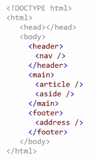
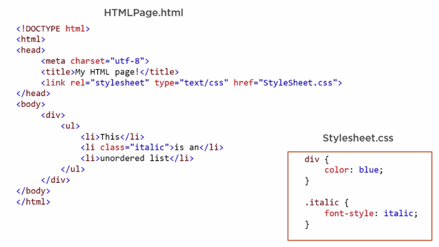
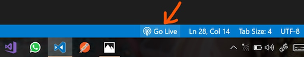

name: inverse
layout: true
class: center, middle, inverse
---


# Creative Coding I

### Prof. Dr. Lena Gieseke | l.gieseke@filmuniversitaet.de  

<br />
#### Film University Babelsberg KONRAD WOLF


---
layout:false

## Algorithmic Thinking


--
The goal is an **algorithm**, which can also be understood as defining a list of steps to finish a task.

.footnote[[[code.org]](https://code.org/curriculum/course3/1/Teacher)]

  
--
Algorithmic thinking applies:

--
  
* **Decomposition**: Breaking a large problem into smaller, manageable parts to make it easier to solve.

--
* **Pattern Matching**:  Identifying similarities in problems to reuse solutions or processes.

--
* **Abstraction**: Simplifying a problem by focusing on important details and ignoring specifics.


---
.header[Algorithmic Thinking]

## Example

--
> How to play this game?
  
--


???
.task[COMMENT:]  

* Using pattern matching and abstraction!


---
.header[Algorithmic Thinking]

## Example

> Which parts are matching and which differ from player to player? 
  


---
.header[Algorithmic Thinking]

## Example

> Using pattern matching and abstraction!


---
.header[Algorithmic Thinking]

## Example


  
Color:
1) Red
2) Blue
3) Yellow
4) Green
5) Pink
6) Black
  
Items:
1) Cell Phone
2) Pineapple
3) Book
4) Cupcake
5) Tentacle
6) Bow
  
Bodypart:
1) Head
2) Tail
3) Foot
4) Belly
5) Nose
6) Back


???
.task[COMMENT:]  

Figure out how to play this game by looking at the players’ phrases below. Circle the matching parts and underline words that are different from player to player. The first matching section has been circled for you.

* What kind of cloth do you put on in the morning?


---
.header[Algorithmic Thinking]

## Example

Develop a to-do list application.

* Decomposition
* Pattern Matching
* Abstraction


???

Concept	Example from To-Do List App Development
Decomposition	Breaking down app features into smaller tasks
Pattern Matching	Recognizing that add, edit, and delete follow a similar pattern
Abstraction	Creating a generic function to handle different actions


---
.header[Algorithmic Thinking | Example]

## To-do List App

**Decomposition**

* Design the user interface
* Create a backend to store tasks
* Implement functionality to add, delete, and edit tasks
* Handle user authentication
* Ensure the app works on mobile and desktop

---
.header[Algorithmic Thinking | Example]

## To-do List App

**Pattern Matching**  

E.g., the processes for adding, editing, and deleting tasks are very similar.


???
* They all involve interacting with a task object and updating the task list.

--

Pattern:
* Add Task: Create a new task object and append it to the list
* Edit Task: Find the task in the list and modify its properties
* Delete Task: Find the task in the list and remove it


???
* Identifying reusable logic across different tasks

You recognize this pattern and reuse the same logic for each action instead of writing unique code for each operation.

---
.header[Algorithmic Thinking | Example]

## To-do List App

**Abstraction**

Instead of separate functions for adding, editing, and deleting tasks, create a generic function that updates the task list based on an action type:

--

```python
def update_task_list(task_list, task, action):
    if action == 'add':
        task_list.append(task)
    elif action == 'edit':
        for t in task_list:
            if t['id'] == task['id']:
                t.update(task)
    elif action == 'delete':
        task_list = [t for t in task_list if t['id'] != task['id']]
    return task_list
```

???
* Creating general, reusable components

To make your code more efficient, you abstract away the details and create general functions that can handle different tasks without rewriting code:  


---
.header[Algorithmic Thinking]

## Example

> Sum up all numbers between 1-200. 

---
.header[Algorithmic Thinking | Example]

## Sum Up All Numbers Between 1-200 

**Decomposition**

--

.left-even[
Let's start at the two ends:

* 1 + 200
* 2 + 199
* 3 + 198
* 4 + 197
* ...
]


---
.header[Algorithmic Thinking | Example]

## Sum Up All Numbers Between 1-200 

**Decomposition**


.left-even[
Let's start at the two ends:

* 1 + 200
* 2 + 199
* 3 + 198
* 4 + 197
* ...
  

**Pattern matching:** Each pair results in the sum of 201!
]


  
--
.right-even[
How many of these pairs will we have? 
]

---
.header[Algorithmic Thinking | Example]

## Sum Up All Numbers Between 1-200 

**Decomposition**


.left-even[
Let's start at the two ends:

* 1 + 200
* 2 + 199
* 3 + 198
* 4 + 197
* ...
  

Each pair results in the sum of 201!
]

.right-even[
How many of these pairs will we have? 

* The last pair, we can create is 100 + 101

]

---
.header[Algorithmic Thinking | Example]

## Sum Up All Numbers Between 1-200 

**Decomposition**


.left-even[
Let's start at the two ends:

* 1 + 200
* 2 + 199
* 3 + 198
* 4 + 197
* ...
  

Each pair results in the sum of 201!
]

.right-even[
How many of these pairs will we have? 

* The last pair, we can create is 100 + 101
* We have **100 pairs in total**

]


---
.header[Algorithmic Thinking | Example]

## Sum Up All Numbers Between 1-200 

**Solution**

--
* We have 100 pairs
* Each pair's sum is 201
  
--
  
> **100 * 201 = 20.100**

---
.header[Algorithmic Thinking | Example]

## Sum Up All Numbers Between 1-200 

**100 * 201 = 20.100**
  
--
  
.blockquote[
> How about the sum of all numbers between 1-20.000?  
]
  
--
  
> Or rather between 1-n?

---
.header[Algorithmic Thinking | Example]

## Sum Up All Numbers Between 1-n 

**Abstraction**

--
  
*Solution n=200*:  ** 100 * 201 = 20.100**   

--
*Solution n=20.000*:** 10.000 * 20.001 = 200.010.000**   

--
*Solution n=10*:** 5 * 11 = 55**   
  
  
--
<br >
  
*Solution n*: **(n \* 0.5) \* (n + 1)**  

  
???
.task[COMMENT:]  

---
.header[Algorithmic Thinking | Example]

## Sum Up All Numbers Between 1-n 

If you want to practice your algorithmic thinking, have a look at the different [Techniques for Adding the Numbers 1 to 100](https://betterexplained.com/articles/techniques-for-adding-the-numbers-1-to-100/).


---
template:inverse

Tools and Environments ✓  
Algorithmic Thinking ✓  
# Artistic Interpretation  

---
.header[Artistic Interpretation]

## Instructions


???
.task[COMMENT:]  

* Which algorithms in the analog world can you think of?
* Cooking, Knitting, Sawing

-> A system of rules to convert information from one form into another one.
R. Eperjesi. 2023. Decode - A friendly introduction to creative coding.


--

> We can also explore creatively the imprecision of algorithms - or the space between precision and imprecision.


---
.header[Artistic Interpretation]

## Instructions

> Draw a line, pick a new color, move a bit...
  
---
.header[Artistic Interpretation]
  
<iframe src="https://editor.p5js.org/legie/full/-HB6nto44" width="540" height="540" ></iframe> 
<iframe src="https://editor.p5js.org/legie/full/WWsJj-V0D" width="540" height="540" ></iframe>


???
* https://editor.p5js.org/legie/sketches/WWsJj-V0D
* 

---
.header[Artistic Interpretation]

## Sol LeWitt - Wall Drawing #122, 1972

> ...all combinations of two lines crossing, placed at random, using arcs from corners and sides, straight, not straight and broken lines.
  
.footnote[[R. Eperjesi. 2023. Decode - A friendly introduction to creative coding.]]


---
.header[Artistic Interpretation]

## Sol LeWitt - Wall Drawing #122, 1972

.center[]


.footnote[[A. Adler. 2017. [*Sol LeWitt: 'Arcs and Lines' At Paula Cooper Gallery, NYC.*](https://www.huffpost.com/entry/sol-lewitt-arcs-and-lines_b_870641). Huffpost.]]


???
.task[COMMENT:]  

https://www.youtube.com/watch?v=VnSMIgsPj5M
https://www.huffpost.com/entry/sol-lewitt-arcs-and-lines_b_870641
https://www.youtube.com/watch?v=fyxIfw_VZWA

* https://www.ecosia.org/images?q=lewitt%20Wall%20Drawing%20%23122,&addon=firefox&addonversion=4.1.0
* Solomon "Sol" LeWitt (September 9, 1928 – April 8, 2007) was an American artist linked to various movements, including conceptual art and minimalism.[1] 
* In Wall Drawing #122, first installed in 1972 at the Massachusetts Institute of Technology in Cambridge, the work contains "all combinations of two lines crossing, placed at random, using arcs from corners and sides, straight, not straight and broken lines" resulting in 150 unique pairings that unfold on the gallery walls. LeWitt further expanded on this theme, creating variations such as Wall Drawing #260 at the Museum of Modern Art, New York, which systematically runs through all possible two-part combinations of arcs and lines.[23] Conceived in 1995, Wall Drawing #792: Black rectangles and squares underscores LeWitt's early interest in the intersections between art and architecture. Spanning the two floors of the Barbara Gladstone Gallery, Brussels, this work consists of varying combinations of black rectangles, creating an irregular grid-like pattern.[24]

---
.header[Artistic Interpretation | Sol LeWitt - Wall Drawing #122, 1972]

.center[]

.footnote[[A. Adler. 2017. [*Sol LeWitt: 'Arcs and Lines' At Paula Cooper Gallery, NYC.*](https://www.huffpost.com/entry/sol-lewitt-arcs-and-lines_b_870641). Huffpost.]]

---
.header[Artistic Interpretation | Sol LeWitt - Wall Drawing #122, 1972]

.center[]

.footnote[[A. Adler. 2017. [*Sol LeWitt: 'Arcs and Lines' At Paula Cooper Gallery, NYC.*](https://www.huffpost.com/entry/sol-lewitt-arcs-and-lines_b_870641). Huffpost.]]

---
.header[Artistic Interpretation | Sol LeWitt - Wall Drawing #122, 1972]

.center[]

.footnote[[A. Adler. 2017. [*Sol LeWitt: 'Arcs and Lines' At Paula Cooper Gallery, NYC.*](https://www.huffpost.com/entry/sol-lewitt-arcs-and-lines_b_870641). Huffpost.]]

---
.header[Artistic Interpretation | Sol LeWitt]

<br >
.center[<iframe width="860" height="550" src="https://www.youtube.com/embed/fyxIfw_VZWA?si=Z94BwAnC0cli_3mi" title="YouTube video player" frameborder="0" allow="accelerometer; autoplay; clipboard-write; encrypted-media; gyroscope; picture-in-picture; web-share" allowfullscreen></iframe>]

---
.header[Artistic Interpretation]

## Yoko Ono - Grapefruit, 1964

> ...an early example of conceptual art, containing a series of "event scores" that replace the physical work of art – the traditional stock-in-trade of artists – with instructions that an individual may, or may not, wish to enact. 
  
.footnote[[Wikipedia. 2023. [*Grapefruit (book)*](https://en.wikipedia.org/wiki/Grapefruit_(book)).]]
  
---
.header[Artistic Interpretation]

## Yoko Ono - Grapefruit, 1964

.left-even[]

--
.right-even[
> Grapefruit is one of the monuments of conceptual art of the early 1960s. She has a lyrical, poetic dimension that sets her apart from the other conceptual artists.
  
— David Bourdon
]
.footnote[[Wikipedia. 2023. [*Grapefruit (book)*](https://en.wikipedia.org/wiki/Grapefruit_(book)), Kozy Feeling]]
  
---
.header[Artistic Interpretation | Yoko Ono - Grapefruit, 1964]

## Painting To Be Constructed In Your Head

> Go on transforming a square canvas in your head until it becomes a circle. Pick out any shape in the process and pin up or place on the canvas an object, a smell, a sound or a colour that came to your mind in association with the shape. 
  
  
— 1962 Spring Sogetsu

  
.footnote[[Wikipedia. 2023. [*Grapefruit (book)*](https://en.wikipedia.org/wiki/Grapefruit_(book)).]]
  
---
.header[Artistic Interpretation | Yoko Ono - Grapefruit, 1964]

## Cloud Piece

>Imagine the clouds dripping.
> Dig a hole in your garden to
> put them in.

  
— 1963 Spring

  
.footnote[[Wikipedia. 2023. [*Grapefruit (book)*](https://en.wikipedia.org/wiki/Grapefruit_(book)).]]
  
---
.header[Artistic Interpretation | Yoko Ono - Grapefruit, 1964]

## Snow Piece

>Think that snow is falling. Think that snow is falling everywhere all the time. When you talk with a person, think that snow is falling between you and on the person. Stop conversing when you think the person is covered by snow. 

  
— 1963

  
.footnote[[Wikipedia. 2023. [*Grapefruit (book)*](https://en.wikipedia.org/wiki/Grapefruit_(book)).]]
  
---
.header[Artistic Interpretation | Yoko Ono - Grapefruit, 1964]

## Tuna Sandwich Piece

>Imagine one thousand suns in the sky at the same time. Let them shine for one hour. Then, let them gradually melt into the sky. Make one tunafish sandwich and eat. 

  
— 1964 Spring

.footnote[[Wikipedia. 2023. [*Grapefruit (book)*](https://en.wikipedia.org/wiki/Grapefruit_(book)).]]
  


---
template: inverse


# Connection


---
layout: false

## Today

--
* The Web

--
* A Local Web

<br/>


--

### Learning Objectives

With this session you

--
* understand how content is rendered and accessed on a web page, and

--
* have a working local setup for developing a dynamic webpage.


???
.task[COMMENT:]  

* have an understanding of working with web page elements,
* have some practical experiences setting up a responsive website.


---
template:inverse

# The Web   
A Local Web  


???
.task[ASK:]  

* How would you explain to an alien what the internet is?
* How would you explain to an alien what the internet technically is?


---

## The Web

The World Wide Web is 

--
* a set of protocols and files that 

--
* allow us to visit web pages in a browser. 

--

The *web* part in the name refers to the fact that such **pages can easily link to each other**, thus connecting into a huge mesh that users can move through.

???


--
  
<br >
  
The internet is the underlying networking infrastructure, a massive network of networks.


???
.task[COMMENT:]  

* When we talk about the Internet, we are talking about the hardware, the computers, the routers, cables, etc. that make up this network. In the physical world, different protocols are used to distribute a sea of information around the world.

https://www.differkinome.com/articles/internet/difference-between-www-world-wide-web-and-internet.html

--

The World Wide Web is not to be confused with the Internet as a whole. 


???
.task[COMMENT:]  

'www' is a way of accessing the information available on the Internet. It is a model for the exchange of information on the Internet. The World Wide Web (www) uses the HTTP protocol, one of the languages used to transmit information over the network. The web uses browsers such as Chrome, Internet Explorer and Firefox to access millions of web pages. These pages are connected in amazing ways via hyperlinks. It's not just text. Web pages are full of graphics, images and videos.

Web or www is just one of the many ways information is distributed on the Internet. It is the Internet and not the web that people use to send and receive emails. These emails depend on the SMTP, Instant Messaging, FTP and Usenet message groups.

It is therefore clear that the Web is only a subset of the Internet and not a synonym for the Internet. Although the two are closely related, the two terms cannot be used interchangeably.

https://www.differkinome.com/articles/internet/difference-between-www-world-wide-web-and-internet.html
  

---

## The Web

Based on this functionalities the www became a mysterious place, almost beyond our capabilities of comprehension.

--
  
<br >
  
*Remember emergence?*


---
template:inverse

## Portraits of The Web

---

.center[  
[[Extreme Tech]](https://www.extremetech.com/extreme/172099-beautiful-internet-maps-visualize-the-striking-interconnectedness-of-the-web)]

---

## Portraits of The Web

> If Google were an artist, what would it paint?  
  
--
  
The Google eye view of the world would be of a vast landscape of connections; in the words of William Gibson in [Neuromancer](https://en.wikipedia.org/wiki/Neuromancer), a world of:

--

> Cyberspace: A consensual hallucination experienced daily by billions of legitimate operators, in every nation, by children being taught mathematical concepts...A graphical representation of data abstracted from the banks of every computer in the human system. Unthinkable complexity. Lines of light ranged in the non-space of the mind, clusters and constellations of data. Like city lights, receding...
  

???
.task[COMMENT:]  

Cyberspace: A consensual hallucination experienced daily by billions of legitimate operators, in every nation, by children being taught mathematical concepts...A graphical representation of data abstracted from the banks of every computer in the human system. Unthinkable complexity. Lines of light ranged in the non-space of the mind, clusters and constellations of data. Like city lights, receding...
  	 
William Gibson, Neuromancer (New York: Berkley Publishing Group, 1989), pp. 128.
  
---

## Portraits of The Web

> The world wide web is a world we never see other than in fleeting glimpses through the narrow portal of our web browser's window...until now.

[[Data Portraits]](http://www.dataportraits.co.uk/)

---
.center[  
[[wired]](https://www.wired.co.uk/article/internet-artworks)]


---
.center[  
[[Extreme Tech]](https://www.extremetech.com/extreme/172099-beautiful-internet-maps-visualize-the-striking-interconnectedness-of-the-web)]


???
.task[COMMENT:]  

* https://www.wired.co.uk/article/internet-artworks

---

## Portraits of The Web

A research project “that sort of went wrong”...

--
* Created by Martin Dade-Robertson

--
* Intended to explore how various resources on a website are linked together
  
--
  
* The end result turned out to be of little scientific use — but, as luck would have it, incredibly beautiful

.footnote[[[Sebastian Anthony - Beautiful internet maps [...]]](https://www.extremetech.com/extreme/172099-beautiful-internet-maps-visualize-the-striking-interconnectedness-of-the-web)]

---

## Portraits of The Web

* Special software analyzes a single web page
    * It sounds like a text parser combined with a web crawler
    * Scans a web page for the various resources contained therein (text, images, JavaScript), and also for links out to other pages/resources

.footnote[[[Sebastian Anthony - Beautiful internet maps [...]]](https://www.extremetech.com/extreme/172099-beautiful-internet-maps-visualize-the-striking-interconnectedness-of-the-web)]


--
* Links between various elements on a page, and to external resources, are then visualized

--
* Details are secret


???

The exact details of how the maps area drawn — where the dots are placed relative to each other — is somewhat secret. Dade-Robertson says that pages that are linked together tend to be closer together, with relatively unrelated pages finding their way to the edge of the map.

---
.center[  
[[Extreme Tech]](https://www.extremetech.com/extreme/172099-beautiful-internet-maps-visualize-the-striking-interconnectedness-of-the-web)]

---
.center[  
[[Extreme Tech]](https://www.extremetech.com/extreme/172099-beautiful-internet-maps-visualize-the-striking-interconnectedness-of-the-web)]

---

## The Map of The Internet

---
.center[  
[[Internet Map]](http://internet-map.net/)]

---

## The Map of The Internet

In [The Map of the Internet](http://internet-map.net/) every site is a circle on the map, and its size is determined by website traffic, the larger the amount of traffic, the bigger the circle.  

<br >

Users’ switching between websites forms links, and the stronger the link, the closer the websites tend to arrange themselves to each other.

---
.center[  
[[Internet Map]](http://internet-map.net/)]

---

.center[  
[[Internet Map]](http://internet-map.net/)]

---
## The Opte Internet Map

.center[  
[[Nab amplify](https://amplify.nabshow.com/articles/a-trippy-visualization-charts-the-internets-growth-since-1997-source-wired/), [Opte](https://www.opte.org/)]]

???
.task[COMMENT:]  

* a visualization of the web that used his proprietary network mapping tool to map the entire internet.
* working full time as a penetration tester — a hacker companies hire to find weaknesses in their own digital systems

---
## The Opte Internet Map

<iframe width="860" height="512" src="https://www.youtube.com/embed/-L1Zs_1VPXA?si=hGSt8RnbUFdd5qch" title="YouTube video player" frameborder="0" allow="accelerometer; autoplay; clipboard-write; encrypted-media; gyroscope; picture-in-picture; web-share" allowfullscreen></iframe> [[Opte]](https://www.opte.org/)

---
## The Opte Internet Map

<iframe width="860" height="512" src="https://www.youtube.com/embed/BUtlP1kVo-4?si=o0wJNu7AulAGsKPb" title="YouTube video player" frameborder="0" allow="accelerometer; autoplay; clipboard-write; encrypted-media; gyroscope; picture-in-picture; web-share" allowfullscreen></iframe> [[Opte]](https://www.opte.org/)

---
## The Opte Internet Map

<iframe width="860" height="512" src="https://www.youtube.com/embed/DdaElt6oP6w?si=ftyF4TON9EQjLMqz" title="YouTube video player" frameborder="0" allow="accelerometer; autoplay; clipboard-write; encrypted-media; gyroscope; picture-in-picture; web-share" allowfullscreen></iframe> [[Opte]](https://www.opte.org/)


---
template:inverse

### *How did the world wide web change us?*


???
.task[COMMENT:]  

* E.g., how we think, feel and live, and society?


---
template:inverse


### The Web   
# Ingredients For The Web

---

## Ingredients For The Web


 

.footnote[[B. Luijbregts. 2020. [*HTML, CSS, and JavaScript: The Big Picture*](https://www.pluralsight.com/courses/html-css-javascript-big-picture). Pluralsight]]


???

* Resources, like HTML documents, images, or other files are the content that we want to use, websites that we want to browse, images to look at, files that we want to share.
* At the most basic level, whenever a browser needs a file that is hosted on a web server, the browser requests the file via HTTP. HTTP is basically a set of rules for transferring files (text, graphic images, sound, video, and other multimedia files) within the world wide web. When the request reaches the correct (hardware) web server, the (software) HTTP server accepts the request, finds the requested document, and sends it back to the browser, also through HTTP. (If the server doesn't find the requested document, it returns a 404 response instead.)

---
.header[Ingredients For The Web]

## URL (Uniform Resource Locator)

--

Unique identification of the resources, used by the browser to access files:


???
.task[COMMENT:]  

URLs uniquely identify the resources so that your web browser can show them to you or download them. Every resource on the web has a unique URL.  

--
<br >
  


.footnote[[M. Haverbeke. 2018. [*HTTP and Forms*](https://eloquentjavascript.net/18_http.html). Eloquent Javascript.]]

???

* If you type this URL into your browser’s address bar, the browser will try to retrieve and display the document at that URL. 


---
.header[Ingredients For The Web]

## URL (Uniform Resource Locator)


.footnote[[M. Haverbeke. 2018. [*HTTP and Forms*](https://eloquentjavascript.net/18_http.html). Eloquent Javascript.]]

--

The browser

--
1. Identifies the server address and converts the URL into a request message

--
2. Makes a connection, using the HTTP protocol, to the server at that address 

--
3. Ask for the resource `13_browser.html`  

--
4. Displays the document, the server has responded with (if all goes well)


???

* Machines connected to the Internet get an IP address, which is a number that can be used to send messages to that machine, and looks something like 149.210.142.219 or 2001:4860:4860::8888. But lists of more or less random numbers are hard to remember and awkward to type, so you can instead register a domain name for a specific address or set of addresses.  

---
.header[Ingredients For The Web]

## HTTP

* For the world wide web a set of rules for transferring files, e.g., text, graphic images, sound, video, and other multimedia files

???

.task[COMMENT:]  

* The Hypertext Transfer Protocol, or HTTP, is the magic that can retrieve documents and communicate them to your web browser.
* I'm not going to go into HTTP in this course, you just need to know what it is for.


The HTTP protocol is basically a set of rules for transferring files (text, graphic images, sound, video, and other multimedia files) within the world wide web.

--


---
.header[Ingredients For The Web]

## Server


???
.task[COMMENT:]  

* What is a server?

--

> A server is a computer program or device that provides a service to another computer program and its user, also known as the client.
  

.footnote[[[techtarget](https://www.techtarget.com/whatis/definition/server)]]
  
???
.task[COMMENT:]  

* In the client/server programming model, a server program awaits and fulfills requests from client programs, which might be running in the same, or other computers

  
  
--

* Client/server programming model

???
.task[COMMENT:]  

* In the client/server programming model, a server program awaits and fulfills requests from client programs, which might be running in the same, or other computers
* The term server can refer to a physical machine, a virtual machine or to software that is performing server services. The way that a server works varies considerably depending on how the word server is being used. 

--
* Can refer to a physical machine, a virtual machine or to software that is performing server services

???
.task[COMMENT:]  

* The term server can refer to a physical machine, a virtual machine or to software that is performing server services. The way that a server works varies considerably depending on how the word server is being used. 


One more time, a server is a computer program or device that provides a service to another computer program and its user, also known as the client. In a data center, the physical computer that a server program runs on is also frequently referred to as a server. That machine might be a dedicated server or it might be used for other purposes.

In the client/server programming model, a server program awaits and fulfills requests from client programs, which might be running in the same, or other computers. A given application in a computer might function as a client with requests for services from other programs and as a server of requests from other programs.

The term server can refer to a physical machine, a virtual machine or to software that is performing server services. The way that a server works varies considerably depending on how the word server is being used.  

---
.header[Ingredients For The Web]

## Webserver

A server that serves up the HTML documents and other resources upon request from a browser.

--

* Hardware: a computer that stores web server software and a website's component files


???
.task[COMMENT:]  

* Hardware: a computer that stores web server software and a website's component files (for example, HTML documents, images, CSS stylesheets, and JavaScript files). A web server connects to the Internet and supports physical data interchange with other devices connected to the web.

--
* Software: controls how web users access hosted files; at a minimum, this is an HTTP server


???
.task[COMMENT:]  
* Software: control how web users access hosted files. At a minimum, this is an HTTP server. An HTTP server is software that understands URLs (web addresses) and HTTP (the protocol your browser uses to view webpages). An HTTP server can be accessed through the domain names of the websites it stores, and it delivers the content of these hosted websites to the end user's device.


---
.header[Ingredients For The Web]

## Webserver


.center[[[⬀]](https://developer.mozilla.org/en-US/docs/Learn/Common_questions/What_is_a_web_server)]

???
.task[COMMENT:]  


At the most basic level, whenever a browser needs a file that is hosted on a web server, the browser requests the file via HTTP. HTTP is basically a set of rules for transferring files (text, graphic images, sound, video, and other multimedia files) within the world wide web. When the request reaches the correct (hardware) web server, the (software) HTTP server accepts the request, finds the requested document, and sends it back to the browser, also through HTTP. (If the server doesn't find the requested document, it returns a 404 response instead.)

[[7]](https://developer.mozilla.org/en-US/docs/Learn/Common_questions/What_is_a_web_server)

--

<br >

Each webserver has an unique address on the internet, a URL.


???


 

.footnote[[B. Luijbregts. 2020. [*HTML, CSS, and JavaScript: The Big Picture*](https://www.pluralsight.com/courses/html-css-javascript-big-picture). Pluralsight]]


* Resources, like HTML documents, images, or other files are the content that we want to use, websites that we want to browse, images to look at, files that we want to share.


---
template:inverse


### The Web   
# Ingredients For The Webpage


---

## Ingredients For A Webpage

### Document Types

???

.task[ASK:]  


What are the three main components of the web?

--
* *Displaying* with HTML

--
* *Styling* with CSS

--
* *Interacting* with JavaScript

---
.header[Ingredients For A Webpage]

## HTML

--

* A standard markup language for creating web pages
* Controls the structure of the pages  

???

.task[COMMENT:]  

* a markup language is a system for annotating a document in a way that is syntactically distinguishable from the text
* The things that you see in websites and web applications are rendered by the web browser from HTML documents.
* These are documents with the HTM or HTML extension that are served by web servers on unique URLs.

--

> Certain HTML elements can be understood by all web browsers.
  
--
  
<br />
References for the following slides: B. Luijbregts. 2020. [*HTML, CSS, and JavaScript: The Big Picture*](https://www.pluralsight.com/courses/html-css-javascript-big-picture). Pluralsight, M. Haverbeke. 2018. [*HTTP and Forms*](https://eloquentjavascript.net/18_http.html). Eloquent Javascript.


 
???


---
.header[Ingredients For A Webpage | HTML]

## Document Structure

.left-even[
```html
<!doctype html>
<html>
    <head>
        <title>My home page</title>
    </head>
    <body>
        <h1>My home page</h1>
        <p>Hello, I am Marijn and this is my home page.</p>
        <p>I also wrote a book! Read it
            <a href="http://eloquentjavascript.net">here</a>.
        </p>
    </body>
</html>
```

<!-- .footnote[[B. Luijbregts. 2020. [*HTML, CSS, and JavaScript: The Big Picture*](https://www.pluralsight.com/courses/html-css-javascript-big-picture). Pluralsight] [M. Haverbeke. 2018. [*HTTP and Forms*](https://eloquentjavascript.net/18_http.html). Eloquent Javascript.]] -->
]


???

* The first element in any HTML document is the DOCTYPE element. This is strictly not an element that is part of the HTML standard, but it does tell the browser that this is an HTML document and tells it which version of HTML it is written in. The DOCTYPE element here is for HTML5.
* Next are the HTML elements. Every element has an open and a close element. This tells the browser that everything in here is HTML.
  * Then there is the head element. This can include a title for the document, scripts, styles, metainformation, and more.
  * And finally, there is the body element that contains everything that you want to be displayed on the screen.
  * These are all the elements that are necessary in an HTML document. All web browsers understand these elements and use them to display content on the screen.

You can imagine an HTML document as a nested set of boxes. Tags such as `<body>` and `</body>` enclose other tags, which in turn contain other tags or text:

--
.right-even[
Imagine an HTML document as a nested set of boxes:
* Tags such as `<body>` and `</body>` enclose other tags, which in turn contain other tags or text...
]

---
.header[Ingredients For A Webpage | HTML]

## Document Structure


.left-even[
```html
<!doctype html>
<html>
    <head>
        <title>My home page</title>
    </head>
    <body>
        <h1>My home page</h1>
        <p>Hello, I am Marijn and this is my home page.</p>
        <p>I also wrote a book! Read it
            <a href="http://eloquentjavascript.net">here</a>.
        </p>
    </body>
</html>
```
]

.right-even[

]


---
.header[Ingredients For A Webpage | HTML]

## Document Object Model

--

* Created by the browser, when a web page is loaded
* DOM for short

> For each box, there is an object, which we can interact with. 

???
.task[COMMENT:]  

* When a web page is loaded, the browser creates a ***Document Object Model*** of the page, or DOM for short.


---
.header[Ingredients For A Webpage | HTML]

## Document Object Model


.left-even[
```html
<!doctype html>
<html>
    <head>
        <title>My home page</title>
    </head>
    <body>
        <h1>My home page</h1>
        <p>Hello, I am Marijn and this is my home page.</p>
        <p>I also wrote a book! Read it
            <a href="http://eloquentjavascript.net">here</a>.
        </p>
    </body>
</html>
```
<!-- .footnote[[B. Luijbregts. 2020. [*HTML, CSS, and JavaScript: The Big Picture*](https://www.pluralsight.com/courses/html-css-javascript-big-picture). Pluralsight] [M. Haverbeke. 2018. [*HTTP and Forms*](https://eloquentjavascript.net/18_http.html). Eloquent Javascript.]] -->
]

.right-even[

]

---
.header[Ingredients For A Webpage | HTML]

## Document Object Model


.left-even[
```html
<!doctype html>
<html>
    <head>
        <title>My home page</title>
    </head>
    <body>
        <h1>My home page</h1>
        <p>Hello, I am Marijn and this is my home page.</p>
        <p>I also wrote a book! Read it
            <a href="http://eloquentjavascript.net">here</a>.
        </p>
    </body>
</html>
```
<!-- .footnote[[B. Luijbregts. 2020. [*HTML, CSS, and JavaScript: The Big Picture*](https://www.pluralsight.com/courses/html-css-javascript-big-picture). Pluralsight] [M. Haverbeke. 2018. [*HTTP and Forms*](https://eloquentjavascript.net/18_http.html). Eloquent Javascript.]] -->
]

.right-even[

]


???

.task[ASK:]  

* What is a tree structure

* We call this data structure a tree as it has a branching structure, has no cycles (a node may not contain itself, directly or indirectly), and has a single, well-defined root. 
* Yes, moving through the tree and finding elements can be cumbersome...
* The global binding `document` gives us access to these objects through `documentElement` properties. This means that `document.documentElement` is the root of the above tree. Its `documentElement` property refers to the object representing the `<html>` tag.  
* The nodes have properties such as parentNode and childNodes, which can be used to navigate through this tree.


---
.header[Ingredients For A Webpage | HTML]

## HTML5

--

.left-even[
* A new version of HTML with new elements
* Elements have become much more expressive 

.footnote[[B. Luijbregts. 2020. [*HTML, CSS, and JavaScript: The Big Picture*](https://www.pluralsight.com/courses/html-css-javascript-big-picture). Pluralsight] [M. Haverbeke. 2018. [*HTTP and Forms*](https://eloquentjavascript.net/18_http.html). Eloquent Javascript.]]
]

???

.task[COMMENT:]   

* HTML5 elements explain what they are used for so that the browser can understand them better and search engines know better which parts of the document are actual data and which parts are metainformation. 


--

.right-even[
    
]

.footnote[]

???
.task[COMMENT:]  

* A header element, which represents a container for introductory content or a set of navigational links. This can contain a nav tag that defines a set of navigation links. 
* There is the main tag that specifies the main content of a document, and inside the main tag you can find things like an article tag that specifies independent, self-contained content, and an aside tag that defines some content aside from the content it is placed in. 
* And finally, just like there is a header element, there is also a footer tag that contains things like copyright or the address of your company. 
* These types of tags are geared towards providing more nuance to the HTML markup language.  
 

---
.header[Ingredients For A Webpage ]

## CSS

--

* Describes the presentation of a HTML document

???

* Displaying text and images on the web is nice, but we need to be able to style the content so that it is readable and useable.

--

* Enables the separation of content and style

???

* Using CSS like this in external style sheet files provides maximum maintainability and reusability. 

--

* In the html file, we indicate with css file to use (which must also be hosted by the webserver)


???
.task[COMMENT:]  

* To work with CSS, we need to indicate in the HTML which CSS or .css file to use (and also host that CSS document on a web server)

---
.header[Ingredients For A Webpage]
  
## CSS




???
.task[COMMENT:]  

* To work with CSS, all we need to do is to indicate in the HTML which CSS file to use and to host that file on a web server. 


---
.header[Ingredients For A Webpage | CSS]
  
.center[]

???

* Styling HTML in a web browser is still difficult
* It is important to keep in mind is that it is the web browser that does all the work when it styles HTML! It takes the HTML file, interprets it, and applies the styles to it that are described in the CSS document. 


---
.header[Ingredients For A Webpage]
  
## CSS

> Keep in mind is that it is the web browser that does all the work when it styles HTML!  

--

The browser

* interprets the HTML file
* applies the styles that are described in the CSS document


---
.header[Ingredients For A Webpage | CSS]
  
## Syntax Selectors

--

* Indicate to what html elements a property should be applied to
* There are different types of selectors 

---
.header[Ingredients For A Webpage | CSS]
  
## Syntax Selectors

.center[]


???
.task[COMMENT:]  

* You can find all possible selector in this [CSS Selector Reference](https://www.w3schools.com/cssref/css_selectors.php). However, we are only going to have a look at the most common selectors to get started.


## Priorities


* CSS is called cascading, as in Cascading Style Sheets
* Properties are applied in a specific order based on priorities


* CSS is called cascading, as in Cascading Style Sheets, because properties are applied in a specific order based on priority.


This is the ascending order of priorities:

* Element selectors
* Class attributes
* ID attributes
* The important tag


.left-even[]


How will the following look like?

* Element selectors
* Class attributes
* ID attributes
* The important tag


<br >
    
]

<!-- 
---
.header[Ingredients For A Webpage]

## JavaScript

--

* Interpreted programming language

???

* interpreted programming language means it runs as is and you don't need to compile it to execute your code

--
* Needed for anything beyond the structure and style of a web page
* Can manipulate HTML, CSS and talk to servers

???

* Every time a web page does more than just sit there and display static information for you to look at — displaying timely content updates, interactive maps, animated 2D/3D graphics, scrolling video jukeboxes, etc. — you can bet that JavaScript is probably involved. 

--
* Dominant choice for *non-static* content as all major web browsers have a dedicated JavaScript engine

???

* All major web browsers have a dedicated JavaScript engine to execute it
* As a multi-paradigm language, JavaScript supports event-driven, functional, object-oriented and prototype-based programming styles (we will come back to programming paradigms later). Although there are strong outward similarities between JavaScript and Java, including language name, syntax, and respective standard libraries, they are two distinct languages are and differ greatly in design.

--


> *Dynamic* refers here to an application that can change its content, appearance, and functionality in response to user input, system or external events, and information, e.g., from a databases.

.footnote[[[ramotion](https://www.ramotion.com/blog/dynamic-web-application-development/)]]

???
.task[COMMENT:]  

* As a multi-paradigm language, JavaScript supports event-driven, functional, object-oriented and prototype-based programming styles -->


---
.header[Ingredients For A Webpage]

## JavaScript


.center[]  
[[W3 Schools]](https://www.w3schools.com/Js/tryit.asp?filename=tryjs_intro_inner_html)

???

.task[COMMENT:]  

* **Go to link**
* JavaScript is used here to select an HTML element and alter one of its properties.
* When you click the button, the onclick event will execute, and that executes this line of code, which is JavaScript.
    * This is inline JavaScript. You can basically write it anywhere in HTML, just like you can have inline CSS.
* This particular JavaScript code first selects an element with the ID of demo, and that is this paragraph element here, and it then sets the innerHTML property of that element to the given new value.

---

## Ingredients For The Web


.center[] 

.footnote[[B. Luijbregts. 2020. [*HTML, CSS, and JavaScript: The Big Picture*](https://www.pluralsight.com/courses/html-css-javascript-big-picture). Pluralsight]]


---

## Ingredients For A Webpage

.center[] 

.footnote[[B. Luijbregts. 2020. [*HTML, CSS, and JavaScript: The Big Picture*](https://www.pluralsight.com/courses/html-css-javascript-big-picture). Pluralsight]]


???

* Show p5 setup https://editor.p5js.org/
  
* Any web page or application consists out of three main documents, HTML that contains content like text and images, CSS to style the HTML, and JavaScript to make it interactive. 


* These documents are hosted on a web server that exposes them to the internet using unique URLs.
* Then, web browsers that are used from client computers can access these documents through the HTTP, or Hypertext Transfer Protocol.
* As a frontend developer, you just need to worry about creating the documents and putting them on the web server. Once the documents are on the client machine, the web browser interprets them and styles the HTML with CSS and loads the JavaScript to be executed.


---
template:inverse

The Web ✓  
#  A Local Web  


---
## Local Setup

For imitating the www locally you need:
  
--
* `.html`, `.css` and `.js` file(s), and
  
--
* any JavaScript library files you want to use (p5, three.js, etc.), 
  
--
* a webserver.


???
.task[COMMENT:]  

* Create html, css, js

```html
<!DOCTYPE html>
<html>
    <head>
        <meta charset="UTF-8">
        <title>Hello World!</title>
    </head>

    <body>
        <!-- Html Elements... -->

        <script src="./sketch.js"></script>
    </body>
</html>
```

```css
body {
    background-color: blue;
}

h1 {
    color: aquamarine;
}
```

<link rel="stylesheet" type="text/css" href="style.css">

```js
// sketch.js

function setup() {
  createCanvas(400, 400);
  background(255);
  fill(255, 0, 255, 40);
  noStroke();
}


function draw() {
        
        let randX = random(0, windowWidth);
        let randY = random(0, windowHeight);
     
        circle(randX, randY, 40);

}
```

<script src="./sketch.js"></script>


---
.header[Local Setup]

## Library Files

--

* Local
* Online


---
.header[Local Setup]

## Local Library Files

--

* Download the [`p5.js`](https://p5js.org/download/) library file

--

.right-even[
```js
- projects
    - lib
        - p5.js
    - proj1
        - index.html
        - sketch.js
    - proj2
        - index.html
        - sketch.js
    - ...
```
]

--
.left-even[

```js
- projects
    - proj1
        - lib
            - p5.js
        - index.html
        - sketch.js
    - proj2
        - lib
            - p5.js
        - index.html
        - sketch.js
    - ...
```
]


???
.task[COMMENT:]  

Ultimately this is up to personal requirements and taste. By now I personally prefer the second folder layout.


*Follow along:* Create a `p5` folder and inside that folder, the folders `lib` and `helloworld`. Download and save the [p5.js](https://p5js.org/download/) library file in the `lib` folder.

---
.header[Local Setup]

## Local Library Files

```html
<!DOCTYPE html>
<html>
    <head>
        <meta charset="UTF-8">
        <link rel="stylesheet" type="text/css" href="style.css">
        <title>Hello World!</title>
    </head>

    <body>
        <!-- Html Elements... -->

        <script src="../lib/p5.js"></script>
        <script src="./sketch.js"></script>
    </body>
</html>
```

---
template:inverse

### Quick Detour

## Paths to Resources

---
.header[Local Setup]

## Paths to Resources

You can link to a resource such as a library or images with *absolute* or *relative* paths.

---
.header[Local Setup]

## Paths to Resources


An absolute path is built starting from the system root, e.g.  

--

```html
`
```
  
```bash
/Users/legie/projects/myproject/kitten.png
```

--
When pointing to online resources, which are not hosted by you on your webserver you need absolute paths.

---
.header[Local Setup]

## Paths to Resources

Relative path are in reference to a given location:


???
.task[COMMENT:]  

(what this is can differ)

However, if it is your own resource locally and maybe belonging to a specific project, you should always use relative paths in relation to your project. How to specify paths is relevant for all assets and library files. Relative path take as reference for example a working directory or a project root. If you are working with a webserver, the location where you start the server will be root for the relative paths, however if you access files from other files, e.g. the `index.html`, your must create a path in relation to that file.

--
* relative to the file that contains the reference

--
* relative to the server root

---
.header[Local Setup | Paths to Resources]

## Relative To The Referencing File

```html

```
--

* `/Users/legie/projects/myproject/index.html`
* `/Users/legie/projects/myproject/kitten.png`

--

```html

```

--

* `./` means that it is the same folder


---
.header[Local Setup | Paths to Resources]

## Relative To The Referencing File

```html

```

--

* `../` means to go up one folder


???
.task[COMMENT:]  

* The image file is inside an 'img' folder one folder higher than the file containing this line of code.

--

* `/Users/legie/projects/myproject/index.html`
* `/Users/legie/projects/img/kitten.png`


---
.header[Local Setup | Paths to Resources]

## Relative To The Referencing File

With a webserver you can never go higher or out of the root of your webserver.


???
.task[COMMENT:]  

Also, it is important to understand that whenever you use a webserver, the server will be the root of a webpage and you can never go further up than where you started the local webserver.
  
--
  
* You have the projects   
  `/Users/legie/projects/myproject1/`  
  `/Users/legie/projects/myproject2/`
* You started the webserver under  
  `/Users/legie/projects/myproject1/`

--
* Within that connection you will not be able to access  
  `/Users/legie/projects/myproject2/` 


???
.task[COMMENT:]  

You can only access what is under `/Users/legie/projects/myproject1/`.

I recommend that you come up with a file structure once and stick with it.

Please keep in mind that for the actual deployment of a real-world website a slightly different folder and file structure will be needed. This is not relevant as this point but be already aware of it. For a project, which should be deployed online, you will probably have a structure as the following:


---
.header[Local Setup]

## Local Library Files

--


.left-even[
```html
<!DOCTYPE html>
<html>
    <head>
        <meta charset="UTF-8">
        <link rel="stylesheet" type="text/css" href="style.css">
        <title>Hello World!</title>
    </head>

    <body>
        <!-- Html Elements... -->

        <script src="../lib/p5.js"></script>
        <script src="./sketch.js"></script>
    </body>
</html>
```
]
.right-even[
```js
- projects
    - lib
        - p5.js
        - p5.min.js
        - p5.sound.js
    - img
        - kitten.png
    - proj1
        - index.html
        - sketch.js
    - ...
```
]


---
.header[Local Setup]

## Online Library Files

You can also link to an online version of the library in your `.html`


???
.task[COMMENT:]  

If you chose an online file, obviously you have to be online when working on the project.

--
* https://cdnjs.com/libraries/p5.js 

---
.header[Local Setup]

## Online Library Files

```html
<!DOCTYPE html>
<html>
    <head>
        <meta charset="UTF-8">
        <link rel="stylesheet" type="text/css" href="style.css">
        <title>Hello World!</title>
    </head>

    <body>
        <!-- Html Elements... -->

        <script src="https://cdnjs.cloudflare.com/ajax/libs/p5.js/1.1.9/p5.js"></script>
        <script src="./sketch.js"></script>
    </body>
</html>
```

---
.header[Local Setup | JavaScript | p5.js | Online Library Files]

## Minified Library Files

--
Most JavaScript libraries have a minified version `.min.js`.

--
* Same functionally but the file size is smaller and make it faster to load

--
* All unnecessary characters are removed


???
.task[COMMENT:]  

* For javascript libraries you usually also have a minified version `.min.js`. For p5 it is `p5.min.js`. It has absolutely the same functionality as `p5.js` but it is minified, meaning it is made smaller. Minified versions have all unnecessary characters removed in order to reduce the file size and make it faster to load. It is recommended to use this compressed version in a production environment.

--

If you are still developing your site, work with the non-minified version, as you can read the source code when necessary.


---
.header[Local Setup | JavaScript | p5.js ]

## The `.html` File

.left-even[
    
```html
<!DOCTYPE html>
<html>
    <head>
        <meta charset="UTF-8">
        <link rel="stylesheet" type="text/css" href="style.css">
        <title>Hello World!</title>
    </head>
    <body>
        <!-- Html Elements... -->
        
        <script src="../lib/p5.js"></script>
        <script src="../lib/p5.sound.min.js"></script>

        <script src="./sketch.js"></script>
    </body>
</html>
```
]
.right-even[
    Here you also link additional libraries, e.g. from the p5 cosmos.
]


???
.task[COMMENT:]  

You can link to the library files with a relative path to any location of your liking.

*On a Side Note:* It is best practice to load JavaScript script files after the html content in the body. The script files might take longer to load and if you put them below the html, the html elements will be displayed first and the user sees already a website even if the scripts are still loading. In my examples I might forget about this order once in a while though, and might have the scripts in the header. Also "on the internet" you will see the lading of the script files in the header a lot.


---
.header[Local Setup]

## Webservers

VSCode's extension [Live Server](https://github.com/ritwickdey/vscode-live-server) or [Live Server (Five Server)](https://marketplace.visualstudio.com/items?itemName=yandeu.five-server)!

???
.task[COMMENT:]  

* Luckily, VSCode make this super simple for us. We can just install a suitable extension and that's it. The extension let's us run a webserver locally. For that install the [Live Server](https://github.com/ritwickdey/vscode-live-server) extension.

--
* Adds a "Go Live" button to your VSCode interface

--
  
[[vscode-live-server]](https://github.com/ritwickdey/vscode-live-server)

--
* Hitting that button opens automatically a live server at the root of your workspace

--
* Navigate to your project folder
* The sketch is automatically displayed


???
.task[COMMENT:]  

* Show p5 example

* Please read through the package's documentation for more explanations.
* Once you know about node and npm, there are more options to start a local webserver, see [More On Webservers](#more-on-webservers).

[[whatis]](https://whatis.techtarget.com/definition/Web-server) [maketecheasier](https://www.maketecheasier.com/setup-local-web-server-all-platforms/)


* The main job of a web server is to display website content through storing, processing and delivering webpages to users. A web server is a computer with special web server software. This software controls how a user accesses files that the web server hosts. All computers that host websites must have web server software. 

When developing a website, we want to be able to see dynamic content of a webpage the same way the end user would, while still working on it locally without hosting it online. For that we must imitate the behavior of a web server on our computer. This is called a local webserver.  


Pushing the button will open a browser, navigated to the folder that is the root of your VSCode workspace. From there navigate to the `helloworld` folder (containing the `index.html`) and your sktech should be displayed automatically.


#### Terminal

Now you can start the `live-server`, with the terminal navigated to the `p5` folder. This will open a browser window with the root as the `p5` folder in which you can navigate to you `helloworld` folder. The `index.html` will be automatically loaded in your default browser at port 8080 (some form of address, not that relevant for us at this point).

---
.header[Local Setup | JavaScript | p5.js | Run a Local Server]

## Localhost


The URL that is started locally is set to the `localhost`, which is `http://127.0.0.1` usually.


???
.task[COMMENT:]  

* when the app is not hosted with, e.g., an external service,
`localhost` is the name given to the local machine that you are working on. Usually its Internet protocol (IP) address is `127.0.0.1`. However you can define your IP to be anything, so it might be a different address. The address is used to establish an connection to the same machine or computer being used by the client.  

--
  
<br >

`127.0.0.1` and `localhost` are the same thing. You can imagine these addresses as meaning *this computer*.  

--
  
<br >

You add a port number by adding a `:` followed by the number, e.g., `localhost:3000`.

---
.header[Local Setup | JavaScript | p5.js | Run a Local Server | Localhost]

## Ports

Ports are communication endpoints on a particular IP address (in the case of localhost - 127.0.0.1). 


???
.task[COMMENT:]  

* The :3000 part is the [TCP](https://en.wikipedia.org/wiki/Transmission_Control_Protocol) port. 

--
  
<br >

Ports enable you to run several servers from the same machine (one single IP address).


???
.task[COMMENT:]  

Ports enable you to run several servers (for example for different purposes such as file sharing, web serving, printing, etc) from the same machine (one single IP address).

--

> You can imagine it as the following: In an apartment building, there is one address for multiple apartments. The address is a host, e.g. the localhost. Each apartment has its own mailbox, hence each mailbox is a port.

[[5]](#5-stackoverflow-whats-the-whole-point-of-localhost-hosts-and-ports-at-all)


---
.header[Local Setup]

## Workflow

* Work on the source code, e.g., in the `sketch.js` file, in VSCode

???
.task[COMMENT:]  

With the above setup in place you can now work on the source code, e.g. in the `sketch.js` file, in VSCode, which is much more comfortable. To see your results make sure that your webserver is running and take a look at the open page in the browser (you might need to refresh the page, but usually that is done automatically).

--
* Make sure the webserver is running

--
* See the result in the browser

---
.header[Local Setup]

## Static vs. Interactive Mode

* Do not use the `Open File...` command in your browser


???
.task[COMMENT:]  

If you would open the `index.html` file with the `Open File...` command in your browser, you will see exactly the same page for this example as there is no complex interaction (the files are static). However this file loading is very different from working with an actual web server (which is ultimately the goal), which enables sending data back and forth between server and browser. This will become apparent in more sophisticated examples. In general, for best results, ensure that your development environment matches your deployment environment. That means doing your development using a web server process rather than simply opening static files.

[[Steck Overflow: Difference between Localhost and opening html file]](https://stackoverflow.com/questions/40204913/difference-between-localhost-and-opening-html-file)

--
* It might look the same but it is not! 

--
* No data is going back and forth between server and browser

???
.task[COMMENT:]  

* When you retrieve a file from a web server, the process of determine what encoding the data is in is different from opening a local file.
* Cross-Origin Resource Sharing (CORS), deutsch: "Ursprungsübergreifende Ressourcenfreigabe", ist ein Mechanismus, der Webbrowsern oder auch anderen Webclients Cross-Origin-Requests ermöglicht.[1] Zugriffe dieser Art sind normalerweise durch die Same-Origin-Policy (SOP) untersagt. CORS ist ein Kompromiss zugunsten größerer Flexibilität im Internet unter Berücksichtigung möglichst hoher Sicherheitsmaßnahmen. 
* Die Same-Origin-Policy (SOP; deutsch „Gleiche-Herkunft-Richtlinie“) ist ein Sicherheitskonzept, das clientseitigen Skriptsprachen wie JavaScript und ActionScript, aber auch Cascading Style Sheets untersagt, auf Objekte (zum Beispiel Grafiken) zuzugreifen, die von einer anderen Webseite stammen oder deren Speicherort nicht der Origin entspricht. Sie stellt ein wesentliches Sicherheitselement in allen modernen Browsern und Webanwendungen zum Schutz vor Angriffen dar. 

TODO: Build in an error in sketch.js
* Where do we see errors?


---
template: inverse

## The End  

💻  🔗  📚


