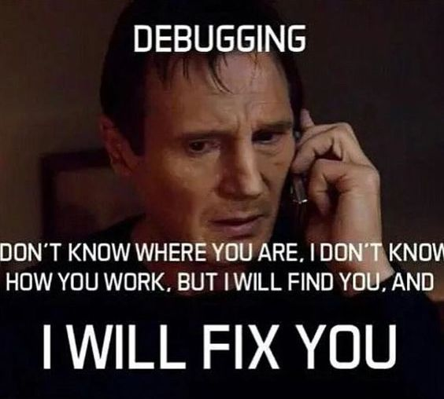
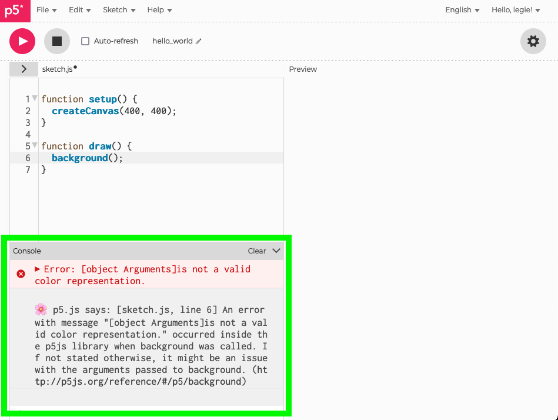
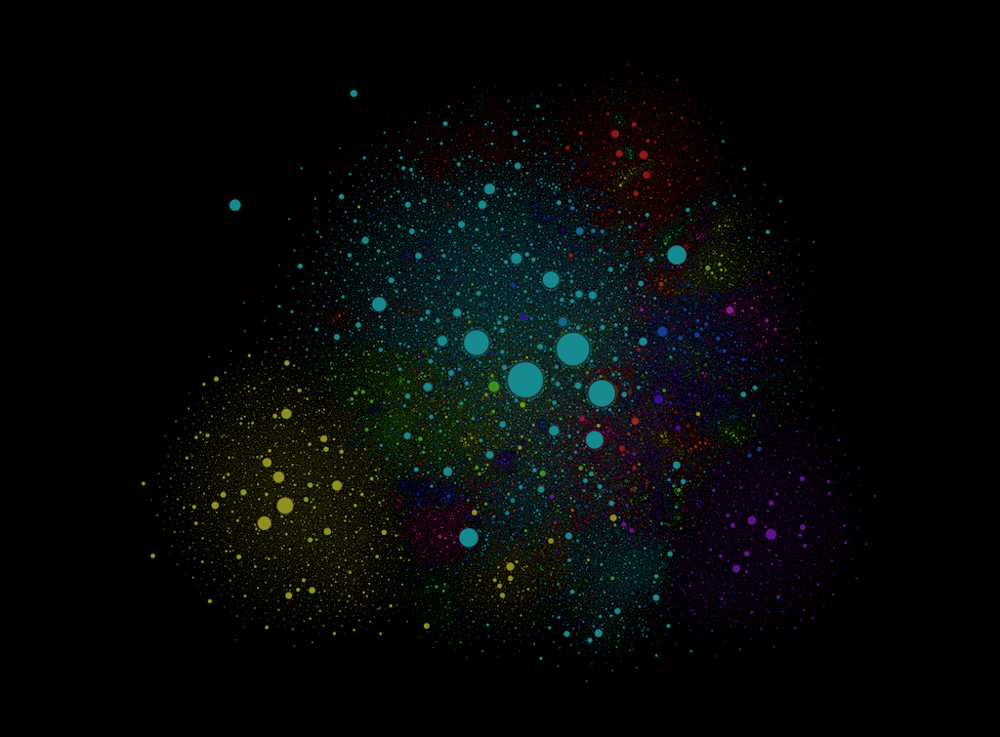
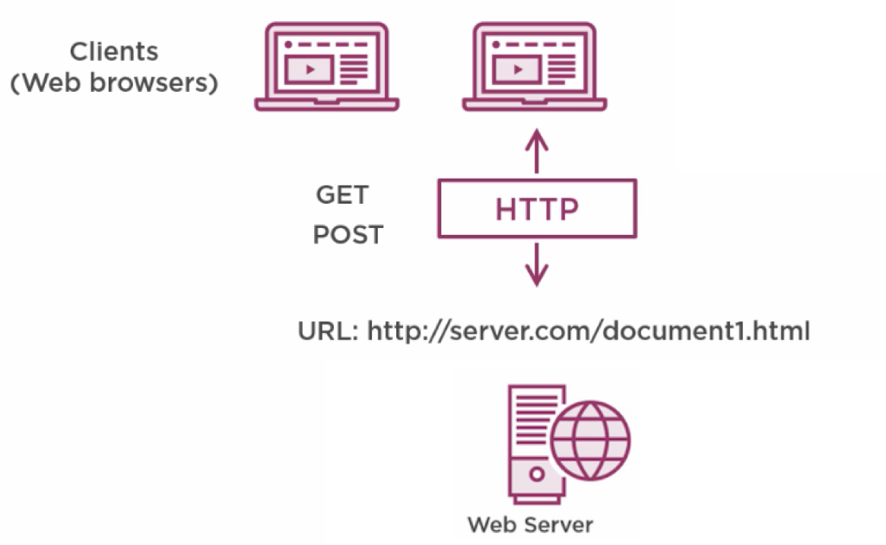
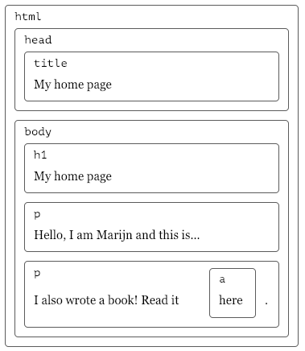
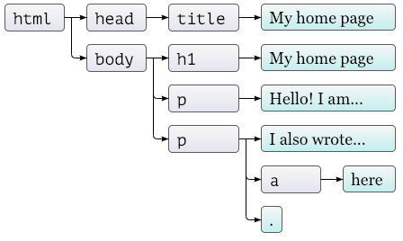
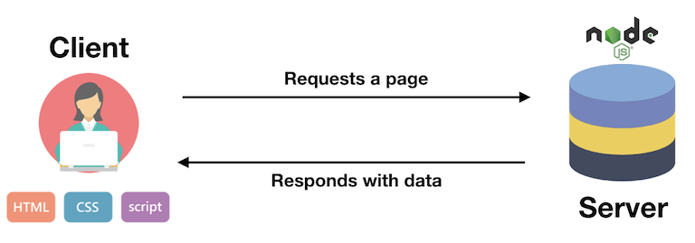

name: inverse
layout: true
class: center, middle, inverse
---


# Creative Coding I

### Prof. Dr. Lena Gieseke | l.gieseke@filmuniversitaet.de  

<br />
#### Film University Babelsberg KONRAD WOLF


---
layout: false


## Last Session 

---
.header[Last Session | Instruction]

## Instruction Art 


???
* or Event Scores
* La Monte Young wrote some of the earliest and most influential instruction pieces. 
* Each piece has a unique set of instructions to be followed by the performer. These instructions may include the setting up of the piece, and what to do during the piece.[2] Some of the pieces will even specify what the audience should do. 
  
Fluxus was an international, interdisciplinary community of artists, composers, designers, and poets during the 1960s and 1970s who engaged in experimental art performances which emphasized the artistic process over the finished product.[1][2] Fluxus is known for experimental contributions to different artistic media and disciplines and for generating new art forms. 

--

.center[  .imgref[[[whitney]]([link](https://whitney.org/collection/works/38288)]]


---
.header[Last Session | Instruction]

## Instruction Art 


*Composition 1960 #13* by La Monte Young are text-based musical pieces

> The performer should prepare any composition and then perform it as well as he can. 


.footnote[[Wikipedia: Compositions 1960](https://en.wikipedia.org/wiki/Compositions_1960)]

???
* I find particularly interesting how these artists used instructions to blur the line between art, everyday life, and audience participation. Many of these works challenge our notion of what constitutes an artwork - is it the instruction itself, the performance of it, or both?
  
.todo[TODO: Look at home work - creative instructions]


---
.header[Last Session]
##  Generative Art 


---
.header[Last Session | Generative Art]

## Vera Molnár

* 5 January 1924 – 7 December 2023
* Hungarian media artist 

Molnár created her first non-representational images in 1946. These were abstract geometrical and systematically determined paintings. 
  
--
  
> The Grande Dame of Generative Art. - [Sotheby's](https://www.sothebys.com/en/articles/vera-molnar-the-grande-dame-of-generative-art)


???
* https://en.wikipedia.org/wiki/Vera_Moln%C3%A1r

---
.header[Last Session | Instruction | Vera Molnár]

.left-quarter[
  
.footnote[[[sudio international]](https://www.studiointernational.com/index.php/vera-molnar-interview-computer-art-paris-mayor-gallery)]
] 
.right-quarter[
*Vera Molnár. Trapèzes inscrits 1/5, 1974. Computer drawing, 55 x 36 cm (21¾ x 14¼ in). Courtesy The Mayor Gallery, London.*


] 


---
.header[Last Session | Instruction | Vera Molnár]

.left-quarter[  
.footnote[[[sudio international]](https://www.studiointernational.com/index.php/vera-molnar-interview-computer-art-paris-mayor-gallery)]
] 
.right-quarter[
*Vera Molnár. Trapèzes inscrits 1/5, 1974. Computer drawing, 55 x 36 cm (21¾ x 14¼ in). Courtesy The Mayor Gallery, London.*

<br />

[Generative Art Exploration Chapter V: The Life and Work of Vera Molnár ⬀](https://www.youtube.com/watch?v=8tNESHtfkr0)

] 


???
* https://www.youtube.com/watch?v=y8q22EOILiw
  

.todo[TODO: Look at home work - coding]

---
template:inverse

### Quick Detour

# Debugging

---
.header[Last Session | p5]

## Debugging

???
  
What is debugging?

---

.center[ .imgref[[[dailymoss]](https://www.dailymoss.com/15-funny-programming-memes-real-computer-programmers-can-decode/)]]


---
.header[Last Session | p5]

## Debugging

Two types of errors:

--
1. Syntax Errors

--
2. Logical Errors

---
.header[Last Session | p5 | Debugging]

## Syntax Errors

--

**Look at the output of your program!**
  
**Read it!**
  
**Understand it!**


---
.header[Last Session | p5 | Debugging | Syntax Errors]

.center[]


---
.header[Last Session | p5]

## Debugging

Use print outs, e.g. in p5 with `print(value);`:

--
* Value of a variable

--
* Flow of a program

--
* Location of a problem

--
* ...


---
.header[Last Session | p5 | Debugging]

## Logical Errors

---
.header[Last Session | p5]

## Debugging

--

.left-even[
Identify the problem
]

---
.header[Last Session | p5]

## Debugging

.left-even[
Identify the problem
* Find the problematic code area
]

---
.header[Last Session | p5]

## Debugging

.left-even[
Identify the problem
* Find the problematic code area
* Review differences from the desired
]


---
.header[Last Session | p5]

## Debugging

.left-even[
Identify the problem
* Find the problematic code area
* Review differences from the desired
* Examine behavior
]

---
.header[Last Session | p5]

## Debugging

.left-even[
Identify the problem
* Find the problematic code area
* Review differences from the desired
* Examine behavior
    * Console logging
]

---
.header[Last Session | p5]

## Debugging

.left-even[
Identify the problem
* Find the problematic code area
* Review differences from the desired
* Examine behavior
    * Console logging
    * Breakpoints
]


---
.header[Last Session | p5]

## Debugging

.left-even[
Identify the problem
* Find the problematic code area
* Review differences from the desired
* Examine behavior
    * Console logging
    * Breakpoints
    * Custom debug environment
]


---
.header[Last Session | p5]

## Debugging

.left-even[
Identify the problem
* Find the problematic code area
* Review differences from the desired
* Examine behavior
    * Console logging
    * Breakpoints
    * Custom debug environment
]
.right-even[
Solve the problem
]


---
.header[Last Session | p5]

## Debugging

.left-even[
Identify the problem
* Find the problematic code area
* Review differences from the desired
* Examine behavior
    * Console logging
    * Breakpoints
    * Custom debug environment
]
.right-even[
Solve the problem
* Develop a hypothesis
* Isolate and test (*step by step*)
]


---
.header[Last Session | p5]

## Debugging

.left-even[
Identify the problem
* Find the problematic code area
* Review differences from the desired
* Examine behavior
    * Console logging
    * Breakpoints
    * Custom debug environment
]
.right-even[
Solve the problem
* Develop a hypothesis
* **Isolate and test** (*step by step*)
]


---
.header[Last Session | p5]

## Debugging

.left-even[
Identify the problem
* Find the problematic code area
* Review differences from the desired
* Examine behavior
    * Console logging
    * Breakpoints
    * Custom debug environment
]
.right-even[
Solve the problem
* Develop a hypothesis
* **Isolate and test** (*step by step*)
  
> Slow down!
]


---
.header[Last Session | p5]

.center[ .imgref[[[dailymoss]](https://duckduckgo.com/?q=Poodle+moth&t=newext&atb=v247-1&iax=images&ia=images)]]


???
  
By the way, the above is a [Venezuelan Poodle Moth](https://duckduckgo.com/?q=Poodle+moth&t=newext&atb=v247-1&iax=images&ia=images), which was photographed for the first time only in 2009 and seems to be quite a [remarkable creature](https://factanimal.com/venezuelan-poodle-moth/)!

---
template:inverse

### Back To Last Week...


---
.header[Last Session]
## Connection


--

> What is the internet?

???

.task[ASK:]  

* How would you explain what the internet is?
* The “Web” part in the name refers to the fact that such pages can easily link to each other, thus connecting into a huge mesh that users can move through.
* Example of emergence
    * Based on this functionalities the www became a mysterious place, almost beyond our capabilities of comprehension.

--




---
.header[Last Week]

## Ingredients For The Web

--

.center[]  
[[Barry Luijbregts, Pluralsight]](https://www.pluralsight.com/courses/html-css-javascript-big-picture)


???


The World Wide Web is a set of protocols and formats...that allow us to visit web pages in a browser. 

* Resources, like HTML documents, images, or other files are the content that we want to use, websites that we want to browse, images to look at, files that we want to share.


---
.header[Last Week]

## Ingredients For A Webpage

### Document Types

--

* *Displaying* with HTML
* *Styling* with CSS
* *Interacting* with JavaScript

--

### Webserver

--

* This is special software that enables the serving up of requested documents.


???


* Hence documents, like HTML documents and other resources like images, are hosted by it.
* It provide the files that form web pages for users, in response to their requests.
* Each web server has a unique address on the internet, a URL.  


---
.header[Last Week]

## Ingredients For A Webpage


### Url

--

* URLs uniquely identify the resources so that your web browser can ultimately show them to you or download them.

--

### A Browser

--

* Software that renders the webpage


---
.header[Last Session | Ingredients For A Webpage]

## HTML

.left-even[
```html
<!doctype html>
<html>
    <head>
        <title>My home page</title>
    </head>
    <body>
        <h1>My home page</h1>
        <p>Hello, I am Marijn and this is my home page.</p>
        <p>I also wrote a book! Read it
            <a href="http://eloquentjavascript.net">here</a>.
        </p>
    </body>
</html>
```
<!-- .footnote[[B. Luijbregts. 2020. [*HTML, CSS, and JavaScript: The Big Picture*](https://www.pluralsight.com/courses/html-css-javascript-big-picture). Pluralsight] [M. Haverbeke. 2018. [*HTTP and Forms*](https://eloquentjavascript.net/18_http.html). Eloquent Javascript.]] -->
]


.right-even[

]

???

* The first element in any HTML document is the DOCTYPE element. This is strictly not an element that is part of the HTML standard, but it does tell the browser that this is an HTML document and tells it which version of HTML it is written in. The DOCTYPE element here is for HTML5.
* Next are the HTML elements. Every element has an open and a close element. This tells the browser that everything in here is HTML.
  * Then there is the head element. This can include a title for the document, scripts, styles, metainformation, and more.
  * And finally, there is the body element that contains everything that you want to be displayed on the screen.
  * These are all the elements that are necessary in an HTML document. All web browsers understand these elements and use them to display content on the screen.


---
.header[Last Session | Ingredients For A Webpage | HTML]

## Document Object Model

--




???
When a web page is loaded, the browser creates a ***Document Object Model*** of the page, or DOM for short:  
  
For each box, there is an object, which we can interact with. 

The underlying data structure is a tree:  


* What is a tree structure

* We call this data structure a tree as it has a branching structure, has no cycles (a node may not contain itself, directly or indirectly), and has a single, well-defined root. 
* Yes, moving through the tree and finding elements can be cumbersome...
* The global binding `document` gives us access to these objects through `documentElement` properties. This means that `document.documentElement` is the root of the above tree. Its `documentElement` property refers to the object representing the `<html>` tag.  
* The nodes have properties such as parentNode and childNodes, which can be used to navigate through this tree.

---
.header[Last Session | Ingredients For A Webpage]

## CSS

--

E.g., `style.css`:

```css
html, body {
    margin: 0; 
    padding: 0; 
}
canvas {
    display: block; 
}
```


???


*  margin: the space around elements
*  padding: the space around an element's content, inside of any defined borders
*  display: how is the element displayed 
    *  block: full width available
    *  inline element does not start on a new line and only takes up as much width 


* https://www.w3schools.com/Css/css_margin.asp
* https://www.w3schools.com/Css/css_padding.asp
* https://www.w3schools.com/Css/css_display_visibility.asp


---
.header[Last Session | Ingredients For A Webpage]

## JavaScript

--

```js
// sketch.js

function setup() {
  createCanvas(400, 400);
  background(255);
  fill(255, 0, 255, 40);
  noStroke();
}

function draw() {
        let randX = random(0, windowWidth);
        let randY = random(0, windowHeight);
     
        circle(randX, randY, 40);
}
```


---
.header[Last Session | Ingredients For A Webpage]

## Local Setup

For imitating the www locally you need:
  

* `.html`, `.css` and `.js` file(s), and
* the JavaScript library files you want to use (p5, three.js, etc.), 
* a webserver.


???


* Create html, css, js

```html
<!DOCTYPE html>
<html>
    <head>
        <meta charset="UTF-8">
        <title>Hello World!</title>
    </head>

    <body>
        <!-- Html Elements... -->

        <script src="./sketch.js"></script>
    </body>

</html>
```

```css
body {
    background-color: blue;
}

h1 {
    color: aquamarine;
}
```

<link rel="stylesheet" type="text/css" href="style.css">

```js
// sketch.js

function setup() {
  createCanvas(400, 400);
  background(255);
  fill(255, 0, 255, 40);
  noStroke();
}


function draw() {
        
        let randX = random(0, windowWidth);
        let randY = random(0, windowHeight);
     
        circle(randX, randY, 40);

}
```

<script src="./sketch.js"></script>


---
.header[Last Session | Ingredients For A Webpage | Local Setup]

## Library Files

--

* Local
* Online

--
  
<br />  
*...to be continued.*

---
.header[Last Session]

## Paths to Resources

You can link to a resource such as a library or images with *absolute* or *relative* paths.

---
.header[Last Session]

## Paths to Resources

In `/Users/legie/projects/myproject/index.html`:

--

```html
`
```
  
```html
`
```

```html

```
  
```html

```
--
* `/Users/legie/projects/img/kitten.png`


???

* `../` means to go up one folder
* The image file is inside an 'img' folder one folder higher than the file containing this line of code.
* `/Users/legie/projects/myproject/index.html`


With a webserver you can never go higher or out of the root of your webserver.

Also, it is important to understand that whenever you use a webserver, the server will be the root of a webpage and you can never go further up than where you started the local webserver.
  

---
.header[Local Setup | Online Library Files]

## Minified Library Files

--
Most JavaScript libraries have a minified version `.min.js`.

* Same functionally but the file size is smaller and make it faster to load
* All unnecessary characters are removed


???


* For javascript libraries you usually also have a minified version `.min.js`. For p5 it is `p5.min.js`. It has absolutely the same functionality as `p5.js` but it is minified, meaning it is made smaller. Minified versions have all unnecessary characters removed in order to reduce the file size and make it faster to load. It is recommended to use this compressed version in a production environment.
  
If you are still developing your site, work with the non-minified version, as you can read the source code when necessary.


    
```html
<!DOCTYPE html>
<html>
    <head>
        <meta charset="UTF-8">
        <link rel="stylesheet" type="text/css" href="style.css">
        <title>Hello World!</title>
    </head>

    <body>
        <!-- Html Elements... -->
        
        <script src="../lib/p5.js"></script>
        <script src="../lib/p5.sound.min.js"></script>

        <script src="./sketch.js"></script>
    </body>

</html>
```
You can link to the library files with a relative path to any location of your liking.

*On a Side Note:* It is best practice to load JavaScript script files after the html content in the body. The script files might take longer to load and if you put them below the html, the html elements will be displayed first and the user sees already a website even if the scripts are still loading. In my examples I might forget about this order once in a while though, and might have the scripts in the header. Also "on the internet" you will see the lading of the script files in the header a lot.


---
.header[Last Session | Ingredients For A Webpage | Local Setup]

## Webservers

VSCode's extension [Live Server](https://github.com/ritwickdey/vscode-live-server) or [Live Server (Five Server)](https://marketplace.visualstudio.com/items?itemName=yandeu.five-server).

???


* Luckily, VSCode make this super simple for us. We can just install a suitable extension and that's it. The extension let's us run a webserver locally. For that install the [Live Server](https://github.com/ritwickdey/vscode-live-server) extension.

???

* Adds a "Go Live" button to your VSCode interface
* Hitting that button opens automatically a live server at the root of your workspace
* Navigate to your project folder
* The sketch is automatically displayed


* Show p5 example

* Please read through the package's documentation for more explanations.
* Once you know about node and npm, there are more options to start a local webserver, see [More On Webservers](#more-on-webservers).

[[whatis]](https://whatis.techtarget.com/definition/Web-server) [maketecheasier](https://www.maketecheasier.com/setup-local-web-server-all-platforms/)


* The main job of a web server is to display website content through storing, processing and delivering webpages to users. A web server is a computer with special web server software. This software controls how a user accesses files that the web server hosts. All computers that host websites must have web server software. 

When developing a website, we want to be able to see dynamic content of a webpage the same way the end user would, while still working on it locally without hosting it online. For that we must imitate the behavior of a web server on our computer. This is called a local webserver.  


Pushing the button will open a browser, navigated to the folder that is the root of your VSCode workspace. From there navigate to the `helloworld` folder (containing the `index.html`) and your sktech should be displayed automatically.


#### Terminal

Now you can start the `live-server`, with the terminal navigated to the `p5` folder. This will open a browser window with the root as the `p5` folder in which you can navigate to you `helloworld` folder. The `index.html` will be automatically loaded in your default browser at port 8080 (some form of address, not that relevant for us at this point).

---
.header[Local Setup | JavaScript | p5.js | Run a Local Server]

## Localhost


The URL that is started locally is set to the `localhost`, which is `http://127.0.0.1` usually.


???


* when the app is not hosted with, e.g., an external service,
`localhost` is the name given to the local machine that you are working on. Usually its Internet protocol (IP) address is `127.0.0.1`. However you can define your IP to be anything, so it might be a different address. The address is used to establish an connection to the same machine or computer being used by the client.  

--
  
<br >

`127.0.0.1` and `localhost` are the same thing. You can imagine these addresses as meaning *this computer*.  

--
  
<br >

You add a port number by adding a `:` followed by the number, e.g., `localhost:3000`.

???

Ports are communication endpoints on a particular IP address (in the case of localhost - 127.0.0.1).   

* The :3000 part is the [TCP](https://en.wikipedia.org/wiki/Transmission_Control_Protocol) port. 
* Ports enable you to run several servers from the same machine (one single IP address).
    * Ports enable you to run several servers (for example for different purposes such as file sharing, web serving, printing, etc) from the same machine (one single IP address).

> You can imagine it as the following: In an apartment building, there is one address for multiple apartments. The address is a host, e.g. the localhost. Each apartment has its own mailbox, hence each mailbox is a port.

[[5]](#5-stackoverflow-whats-the-whole-point-of-localhost-hosts-and-ports-at-all)


## Workflow

* Work on the source code, e.g., in the `sketch.js` file, in VSCode

With the above setup in place you can now work on the source code, e.g. in the `sketch.js` file, in VSCode, which is much more comfortable. To see your results make sure that your webserver is running and take a look at the open page in the browser (you might need to refresh the page, but usually that is done automatically).

* Make sure the webserver is running
* See the result in the browser

---
.header[Last Session | Ingredients For A Webpage | Local Setup]

## Static vs. Interactive Mode

--

* Do not use the `Open File...` command in your browser
* It might look the same but it is not! 
* No data is going back and forth between server and browser

???

If you would open the `index.html` file with the `Open File...` command in your browser, you will see exactly the same page for this example as there is no complex interaction (the files are static). However this file loading is very different from working with an actual web server (which is ultimately the goal), which enables sending data back and forth between server and browser. This will become apparent in more sophisticated examples. In general, for best results, ensure that your development environment matches your deployment environment. That means doing your development using a web server process rather than simply opening static files.

[[Steck Overflow: Difference between Localhost and opening html file]](https://stackoverflow.com/questions/40204913/difference-between-localhost-and-opening-html-file)


* When you retrieve a file from a web server, the process of determine what encoding the data is in is different from opening a local file.
* Cross-Origin Resource Sharing (CORS), deutsch: "Ursprungsübergreifende Ressourcenfreigabe", ist ein Mechanismus, der Webbrowsern oder auch anderen Webclients Cross-Origin-Requests ermöglicht.[1] Zugriffe dieser Art sind normalerweise durch die Same-Origin-Policy (SOP) untersagt. CORS ist ein Kompromiss zugunsten größerer Flexibilität im Internet unter Berücksichtigung möglichst hoher Sicherheitsmaßnahmen. 
* Die Same-Origin-Policy (SOP; deutsch „Gleiche-Herkunft-Richtlinie“) ist ein Sicherheitskonzept, das clientseitigen Skriptsprachen wie JavaScript und ActionScript, aber auch Cascading Style Sheets untersagt, auf Objekte (zum Beispiel Grafiken) zuzugreifen, die von einer anderen Webseite stammen oder deren Speicherort nicht der Origin entspricht. Sie stellt ein wesentliches Sicherheitselement in allen modernen Browsern und Webanwendungen zum Schutz vor Angriffen dar. 


---
template:inverse

# Space


???
* Visualize "space"
---


.center[]
.footnote[ChatGPT 4o, "Visualize space"]


???
  
  Dall-E: *Space*


---
## What is Space?

--
* [Merriam-Webster: Space](https://www.merriam-webster.com/dictionary/space)

--
* ChatGPT 4o (*What is space?*):
    * Physical Space (Cosmological Perspective)
    * Philosophical Space
    * Mathematical Space
    * Human Perspective
    *  Space in Everyday Life


???

2024:
Space, in its most general sense, refers to the vast, seemingly boundless expanse in which all matter and energy exist. It encompasses everything in the universe, including galaxies, stars, planets, and the vacuum in between. Below are some perspectives on what space is, depending on the context:

1. Physical Space (Cosmological Perspective)
	•	Definition: Space is the three-dimensional continuum that allows objects to exist and interact. It is part of the larger fabric of spacetime, which combines space and time as interconnected dimensions.
	•	Characteristics:
	•	Vastness: The observable universe spans about 93 billion light-years across.
	•	Vacuum: Space is mostly a vacuum with very low density, though not entirely empty—it contains particles, radiation, and dark matter/energy.
	•	Structures: Includes galaxies, stars, black holes, nebulae, and other celestial objects.

2. Philosophical Space
	•	Philosophically, space has been debated for centuries. Thinkers like Aristotle viewed space as the region occupied by objects, while Newton saw it as an absolute framework independent of material objects. In contrast, Einstein’s theory of relativity links space with time, describing it as dynamic and influenced by gravity.

3. Mathematical Space
	•	In mathematics, space refers to an abstract concept used to describe sets of points with certain properties (e.g., Euclidean space, vector space, metric space).

4. Human Perspective
	•	From a human viewpoint, “space” often refers to outer space, the area beyond Earth’s atmosphere, where human exploration and observation take place. It is the frontier for scientific discovery, technological advancement, and philosophical reflection.

5. Space in Everyday Life
	•	The term “space” can also refer to physical or conceptual room—like personal space, architectural space, or mental space.


2023:

* ChatGPT
    * Outer Space: This is the vast, seemingly infinite expanse that exists beyond Earth's atmosphere. It is where stars, planets, galaxies, and other celestial bodies are located. Space is characterized by a near-vacuum environment, microgravity, and extreme conditions.
    * Physical Space: In a broader sense, "space" can also refer to the three-dimensional expanse in which all physical objects exist. It is the container in which everything in the universe is located and can be measured in terms of length, width, and height.
    * Cosmos: Space is often used synonymously with the term "cosmos," representing the entirety of the universe, including all matter, energy, planets, stars, galaxies, and the voids between them.
    * Space as a Concept: In a more abstract sense, "space" can also refer to an interval or gap between objects, or a conceptual framework. For example, the space between two buildings, or the conceptual space in an art piece or a design.


---
template: inverse


### *What are the Spatial Properties of the Virtual Spaces We Use?*  


???


* Dimensionality
    * Virtual spaces can exist in two, three, or even higher dimensions. Most commonly, virtual environments aim to replicate three-dimensional space to provide a more immersive experience.
* Scale
    * Virtual spaces can simulate various scales, from microscopic to cosmic. For example, a virtual environment might represent the interior of a building, an entire city, or an imaginary world.
* Interactivity
    * Users often have the ability to interact with objects and elements within virtual space. This can include manipulation of virtual objects, navigation through the environment, and engagement with other users (in the case of social virtual spaces).
* Perspective
    * Virtual space can be experienced from different perspectives. In virtual reality, for instance, users can look around in all directions and interact with the environment based on their head and body movements.
* Physics
    * Virtual spaces often simulate some aspects of physics, including gravity, collision detection, and object behavior. This contributes to a more realistic and immersive experience.
* Navigation
    * Users can navigate through virtual space using various means, such as walking, flying, teleporting, or using controllers. The navigation mechanisms depend on the type of virtual environment and the technology used (e.g., VR headsets, computer screens).
* Immersiveness
    * The goal of many virtual spaces is to create a sense of immersion, making users feel like they are present in the simulated environment. This is achieved through realistic graphics, sound, and interactive elements.
* Connectivity
    * Virtual spaces can be connected, allowing users to move seamlessly between different environments. This is common in virtual worlds, games, and collaborative virtual environments.

---

.center[]
.footnote[ChatGPT 4o, "Visualize space"]


---

.center[]
.footnote[Dall-E, 2023, "Space Virtual"]

---

  .imgref[[[ignitingbusiness]](https://www.ignitingbusiness.com/blog/deciding-on-a-device-tablet-vs-laptop-vs-desktop)]


???
* What do we actually have??

---
template: inverse


### *How Do Analog and Virtual Spatial Spaces Relate to Each Other?*  


???


Analog and virtual spatial spaces are distinct concepts, but they can be related in various ways, especially when considering the representation and interaction with physical and digital environments. Here are some ways in which analog and virtual spatial spaces relate to each other:

* Representation of Physical Space:
    * Analog Space: Refers to the physical space we experience in the real world. It includes the three-dimensional environment around us, encompassing everything from our immediate surroundings to vast landscapes.
    * Virtual Space: A digital representation of space created through computer technology. Virtual spaces can aim to simulate and replicate aspects of analog space, providing a digital counterpart.
* Simulation and Modeling:
    * Analog Space: Represents the actual, tangible world with real physical objects and natural laws governing their behavior.
    * Virtual Space: Involves the creation of a simulated or modeled environment. Virtual spaces often attempt to emulate the properties of analog space, including visual appearance, physics, and interactivity.
* Interaction and Engagement:
    * Analog Space: Involves direct, physical interaction with the environment. Our interactions in the real world are governed by the laws of physics and the properties of tangible objects.
    * Virtual Space: Provides opportunities for interaction through digital interfaces. Users can manipulate virtual objects, navigate through environments, and engage with the digital space using input devices or even through immersive technologies like virtual reality.
* Extension of Reality:
    * Analog Space: The physical world we inhabit and perceive through our senses.
    * Virtual Space: Extends the possibilities of reality by introducing elements that may not exist in the physical world. This could include fantastical landscapes, fictional scenarios, or simulations of environments that are difficult to access in reality.
* Spatial Design and Architecture:
    * Analog Space: The field of physical architecture and spatial design involves creating structures and environments in the real world.
    * Virtual Space: Architects and designers use virtual spaces to visualize and plan structures before they are built. Virtual environments allow for experimentation with designs and concepts.
* Communication and Collaboration:
    * Analog Space: Involves face-to-face communication and collaboration in physical settings.
    * Virtual Space: Facilitates online communication, collaboration, and social interaction. Virtual spaces, including virtual worlds and meeting platforms, allow people to connect in a digital environment.

While analog and virtual spatial spaces have their unique characteristics, the relationship between them is often complementary. Virtual spaces can draw inspiration from, simulate, or enhance aspects of analog space, providing new opportunities for exploration, creativity, and interaction. Additionally, technologies like augmented reality seek to blend analog and virtual elements, creating mixed or augmented spatial experiences.


---

.center[]
.footnote[ChatGPT 4o, "Analog Virtual Space"]


---

.center[]
.footnote[ Dall-E, 2023, "Analog Virtual Space"]


---

.center[]
.footnote[ChatGPT 4o, "Connection Analog Virtual Space"]

---

.center[]  
.footnote[ Dall-E, 2023, "Connection Analog Virtual Space"]

---
template: inverse


### *What Makes Analog Space Unique?*


???


1. **Tangibility:** Analog space consists of tangible, physical entities. Objects in the analog world have mass, occupy space, and can be directly perceived through our senses. This tangible nature distinguishes analog space from the abstract and digital representations found in virtual environments.

2. **Physical Laws:** Analog space is governed by the laws of physics, including gravity, motion, and thermodynamics. Objects in the real world interact with each other based on these fundamental principles, contributing to the predictability and stability of the analog environment.

3. **Sensory Experience:** In analog space, individuals experience the environment through their senses, including sight, sound, touch, taste, and smell. The richness and complexity of sensory experiences contribute to the uniqueness of the analog world.

4. **Spontaneity:** Analog interactions often involve spontaneity and unpredictability. In face-to-face conversations, for example, people respond to each other in real-time, and the flow of communication is dynamic and unscripted. This spontaneity adds a layer of complexity and authenticity to analog interactions.

5. **Social and Cultural Context:** Analog space is deeply embedded in social and cultural contexts. Physical spaces, such as homes, neighborhoods, and cities, carry cultural significance, and human interactions in analog space are shaped by social norms, traditions, and shared experiences.

6. **Limitations and Constraints:** Analog space has inherent limitations and constraints. Physical distances, the constraints of time and resources, and the laws of physics impose boundaries on what is possible in the real world. Overcoming these limitations often requires practical solutions and compromises.

7. **Biological Presence:** Analog space is intimately tied to the presence of living organisms, including humans, animals, and plants. Biological entities contribute to the diversity, complexity, and dynamism of the analog environment.

8. **Ephemeral Nature:** Analog space is characterized by its impermanence and ephemerality. Seasons change, landscapes evolve, and the physical world undergoes constant transformation. This transience contributes to the uniqueness of analog space at different points in time.

9. **Multisensory Integration:** Analog space provides a multisensory experience, where information is processed through a combination of sensory inputs. This integration of sensory information contributes to a holistic understanding of the environment.

10. **Causal Relationships:** Events and interactions in analog space often have clear cause-and-effect relationships. Actions result in tangible consequences, and the interconnectedness of elements in the physical world is a fundamental aspect of analog space.

These characteristics collectively make analog space a rich, dynamic, and diverse environment that serves as the foundation for human existence, interaction, and experience. While virtual and digital spaces offer unique opportunities, analog space remains irreplaceable in its authenticity and complexity.


---
.header[Space]

## Today & Tomorrow

--

* Development Environment

--

* An Introduction to three.js

--

* Exemplary Scene Setup


---
.header[Space]

## Learning Objectives

* Further understanding of 3D space

--

* Have a professional local web development environment

--

* Have a working understanding of Three.js

--

* Advance your coding skills


---
.header[Space]

## Today

.center[]

---
.header[Space]

## Tomorrow

.center[]


???
* Show running example: basic_scene/...
* 30-animated-galaxy-final


---
template:inverse

### three.js

## Installation


---
.header[three.js]

## Installation

--
  
For a complex library such as three.js the local installation is the preferred but is a bit more complicated.


???


* Online is possible but not common
* As with all libraries, we can access local or online versions of the library. For a proper local installation there are steps involved, we don't know yet. We will have a look at that next week.
  


---
## Local Installation

--

* Have a configuration file with which the installation can be re-created

--
* Share source files and configuration file

--
* Each environment does a new installation

???

.todo[TODO: show installation steps as preview] 

---
.header[Local Installation]


## Why Should We Care?

--

CDN
* No installation / manager software (needed)
* Files may be pre-cached
* Always use the latest version

--

Local Installation 

--
* Closed ecosystem, all the files are stored on your server

--
* More control over dependencies, versions, requirements

--
* Might include services for bundling

--
* Server-side libraries do not work with CDN 


???


*  Content Delivery Network (CDN)
*  https://stackoverflow.com/questions/43605215/using-cdn-vs-installing-library-by-npm

Files may be pre-cached
jQuery is ubiquitous on the web. There’s a high probability that someone visiting your pages has already visited a site using the Google CDN. Therefore, the file has already been cached by your browser and won’t need to be downloaded again.

---

## Local Installation

We need to know about


--
* Packages

--
* Package management

--
* Build tools

--

> The following works for all web development projects (almost) the same.


???

* Modules


---
.header[Local Installation]
## Packages


.footnote[[[Eloquent JavaScript - Modules]](https://eloquentjavascript.net/10_modules.html#h_zWTXAU93DC)]

--
* Contains code
    * Usually separated into modules

--
* Contains all information about dependencies
    * Any relationships between packages are called **dependencies**.

--
* Documented

--
* Can be distributed, meaning copied and installed

--
* Versioned

---
.header[Local Installation]
## Packages


> Packages require special infrastructure.

--
  
* Store, find, install, upgrade, etc.

---
.header[Local Installation]

## Node.js & npm

.footnote[[[Eloquent JavaScript - Modules]](https://eloquentjavascript.net/10_modules.html#h_zWTXAU93DC)]

--


* Online repository for JavaScript packages
* An installation and management program
* Comes with useful command line tools, e.g. to run your app
* npm is part of Node.js

---
.header[Local Installation]

## Node.js & npm


* An open-source, cross-platform JavaScript runtime environment

---
## Node.js

--

  

--

* The back-end, meaning the 'engine' of an application in contrast to its front-end interface and interactions.  

--
* Powerful for scalable, data-intensive and real-time apps

???

* As homework you have to install node. This might lead to problems, do it early.
* https://nodejs.org/en/download/

---
## Node.js

The *Hello World* of Node.js is a web server:

```js
const http = require('node:http');

const hostname = '127.0.0.1';
const port = 3000;

const server = http.createServer((req, res) => {
  res.statusCode = 200;
  res.setHeader('Content-Type', 'text/plain');
  res.end('Hello World\n');
});

server.listen(port, hostname, () => {
  console.log(`Server running at http://${hostname}:${port}/`);
});
```

.footnote[[[nodejs.org]](https://nodejs.org/en/learn/getting-started/introduction-to-nodejs)]


???
.todo[TODO: show and execute 2425/code/node/server.js]  


---
.header[Node.js]

## Version Managing Node.js

The node.js version you are using matters a lot! 

--

* Different projects may require different versions of Node.js

--
* Node.js needs its own package manger

--

> Yes, we need a package manager for installing an environment that gives us then a package manger...


--

There are [several package manager](https://nodejs.org/en/download/package-manager/) that help you with organizing node versions.
  

???

  
I personally like nvm as it is simple and straight-forward to use (it is actually just a bash script).


.footnote[[freecodecamp](https://www.freecodecamp.org/news/node-version-manager-nvm-install-guide/)]


---
.header[Node.js]

## NVM

[NVM](https://github.com/nvm-sh/nvm/blob/master/README.md) allows you to **install different versions** of Node, **and switch** between these versions depending on the project that you're working on via the command line.

--

<br >

### Hence, when getting [Node.js](https://nodejs.org/en/download), 

1. Chose the download option with NVM and npm
2. Follow the installation steps


???

nvm install --lts

For now, we are just going to work with the latest Node.js version. But keep in mind that if you are ever running into version issues with Node.js, you can switch versions with nvm.
  
https://heynode.com/tutorial/install-nodejs-locally-nvm/


---
## Node.js

You can use node to run JavaScript code. 

--

<br >

To execute the JavaScript file, run in a terminal for example:

```bash
node cc1_ws2425_test_01.js
```

???

* For programming a server in JavaScript we need now the web specific functionality of JavaScript, which I introduce in the following.


---
.header[Node.js] 

## npm

--

* The *node package manager* for JavaScript

--
* Comes with node

--
* The world’s largest software registry with more than two million packages


???


* https://www.npmjs.com/

--
### npm CLI

* Command-line interface
* Toolkit for building apps

--

```
npm run X
```

---
.header[Local Installation]

## Node.js & npm

You can check a proper installation with the flag `-v`, which should return the installed version:

```
node -v         // v22.13.0
```

  
```
npm -v          // 10.9.2
```

---
.header[Node.js | npm] 

## Package Installations

For using packages and frameworks, for each project you start from scratch, you have 

--
1. to initialize the npm environment and 

--
2. install the packages you want to use.

---
.header[Node.js | npm] 

## 1. Initializing the Node Environment

--


```node
npm init
```

--

* Configure the development environment in the current folder

???

.task[TASK:]  

* Show
* mkdir moo
* cd moo
* npm init


rm -r testing

--

* Creates a `package.json` file

--
    * Dependencies: tracks which packages we install 

--
    * Execution commands: how to run the code in different states, e.g. development vs. deployment

--
    * Description, license, etc.

---
.header[Node.js | npm] 

## 1. Initializing the Node Environment


If you know that you are going with a standard setup (which is usually the case for now), you can also set default values with:

```node
npm init -y
```

???
  

* The `-y` flag means that npm will use default values instead of going through the interactive process asking questions in regard to the configuration settings.


---
.header[Node.js | npm] 

## 2. Install Packages

--

`npm install packagename` 

* Installs a package locally (inside of your project folder)

???
  


--

E.g., we need the three.js module:

```
npm install three
```


???
  

* Show package.json 

---
.header[Node.js | npm] 

## 2. Packages

After installing a package, we track in

--
* `package.json`: name and version with tolerance

--
* `package-lock.json`: the exact name and version

--

The actual code is in the folder

* `node_modules/`
    * Do not touch this folder
    * Do not commit this folder

--

To re-install you project you can use `npm install package.json`!


???

* npm install cowsay
* Add index.js
*  Run with node index.js 

```js
const cowsay = require("cowsay");

console.log(cowsay.say({
    text : "I'm a moooo",
    e : "oO",
    T : "U "
}));
```


* No need for the `node_modules/` files.
To use a package within node use `require` and the package name, e.g.

```js
const cowsay = require('cowsay');
```

* `require` is the node version of `import`


```js
let cowsay = require("cowsay");

console.log(cowsay.say({
    text : "Hello, my name is Henry. I am cow. Love me!",
    e : "oo",
    T : "u"
}));
```


---
.header[Local Installation]

## Summary

--

Install **once** as global environment:

* Node.js
* npm

--
  
**Each project** initialize with:

```
npm init -y
```

--
  
Within a project, install **each package** with:

```
npm install packagename
```

---
.header[Local Installation]

## three.js

```
npm install three
```

--

We want also [vite](https://vite.dev/):

```
npm install vite
```


???

Nowadays, the most popular build tool is Webpack. It’s widely used, it has a great community and you can do a lot with it. But while Webpack is the most popular, it’s not the most appreciated.

In fact, the most appreciated build tool these days is Vite (French word for "quick", pronounced /vit/, like "veet”). It’s faster to install, faster to run, and less prone to bugs. Ultimately, the developer experience is much better.


--
* Recommended by three.js as development environment


???
* Vite will build the final website. It’ll also do a bunch of things like optimizations, cache breaking, source mapping, running a local server, etc.
* Vite was created by Evan You, the creator of Vue.js, is highly maintained by hundreds of developers, and is getting a lot of hype.

--
* Optimizes the development experience (quick server updates, etc.)

--
* Helps us later to bundle and employ a project (vite is a **build tool**)

---
.header[Local Installation]

## three.js

  
You could also install multiple packages at once:

```
npm install three vite
```


???


* https://gsap.com/


---
.header[Local Installation | three.js]

## How To Run

--
  
In `package.json` we define how to run our app:

```js
{
  // ...
  "scripts": {
    "dev": "vite",
    "build": "vite build"
  },
  // ...
}
```

--
* **`npm run dev`** to start the development server

.footnote[[[three.js Journey]](https://threejs-journey.com/lessons/first-threejs-project#basic-website)]

???


We are using the vite package to run our code.
* `dev` executes `vite`, and `build` executes `vite build` by using the vite/ dependency from the node_modules/ folder.

---
.header[Local Installation | three.js]

## How To Run

* **`npm run X`** runs the command under the key X inside scripts object

---
.header[Local Installation | three.js]

## How To Run

`npm run dev`

* You are now running a web server
    * If the page doesn’t open, the terminal should display a local URL such as http://localhost:5173/
    * Open that URL manually

--
* Detects file changes

--
* `CTRL + C` to stop the server


---
template: inverse

## The End  

💻 💫 🔺


