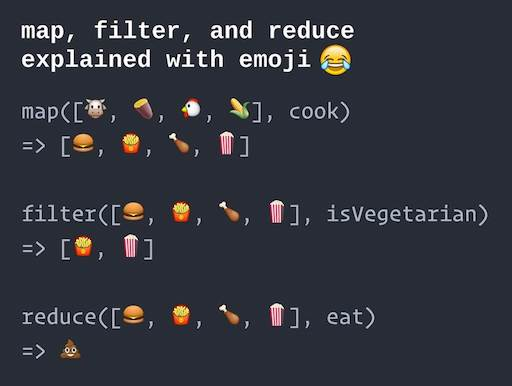

name: inverse
layout: true
class: center, middle, inverse
---


# Creative Coding I


### Prof. Dr. Lena Gieseke | l.gieseke@filmuniversitaet.de  

#### Film University Babelsberg KONRAD WOLF


---
layout:false

## Today

--

Higher Order Functions  

--
* Callback Functions

--
* Notation

--
* Asynchronism
  
--
  
<br/>

three.js  

* Homework

--
* Gui Controls

--
* Loading models


???
* Environment map
* https://threejs-journey.com/lessons/realistic-render#


---

## Higher Order Functions

With this chapter you will

--
* understand and be be able to work with JavaScript functions
    * higher order functions 
    * modern (> ECMAScript 2015) syntax
    * asynchronous functionality
--
* and with that **practice your algorithmic thinking**!


---
template:inverse


# Callback Functions
Higher Order Functions  
Asynchronism  
Homework  
Gui Controls  
Loading Models  

---
.header[Higher Order Functions]

## Callback Functions

--

```js
// RENDER LOOP
function renderLoop() {
    
    renderer.render(scene, camera);

    requestAnimationFrame(renderLoop);
}

renderLoop();
```


JavaScript's [`requestAnimationFrame`](https://developer.mozilla.org/en-US/docs/Web/API/window/requestAnimationFrame) function requests a refresh from the browser window. 


---
.header[Higher Order Functions]

## Callback Functions

--
Give functions as argument the next function that should be executed.  
<br >
  
Such a function as argument is called a *callback* function. 


???
  


--

<br >

```js
function myCallbackFunc() {
    //...
}

myFunc(arg1, arg2, myCallbackFunc);
```


???

For example: An action is started, and when it finishes, the callback function is called *with the result* from the action.


---
.header[Higher Order Functions]

## Callback Functions

```js
//https://editor.p5js.org/legie/sketches/Gy0G4ZHLq

function setup() {
    background(240);
    
    let canvas = createCanvas(512, 512);
    canvas.doubleClicked(changeColor);
}

function changeColor() {

    background(random(255), random(255), random(255));
}
```

---
.header[Higher Order Functions]

## Callback Functions

Callback functions enable the creation of **dependencies** and **follow-up functionality** if a certain event happened.  
  
--
<br />
Example p5.js:

[`loadImage(path, [successCallback], [failureCallback])`](https://p5js.org/reference/p5/loadImage/)


???
.todo[TODO: Go to reference]


---
.header[Higher Order Functions]

## Callback Functions

The callback functionality and the option to pass a function as an argument is based on the principle of *higher order functions*.

---
template:inverse


Callback Functions ✓
# Higher Order Functions  
Asynchronism  
Homework  
Gui Controls  
Loading Models  


???
  

* What are higher order functions?
* Higher-order functions allow us to abstract over *actions*, not just *values*. They come in several forms. For example, we can have functions that create new functions.
* We have already used higher order function by adding a function as callback to an event listeners.  

---

## Higher Order Functions

In mathematics and computer science, a higher-order function is a function that does at least one of the following:

--
* It takes one or more functions as arguments

--
* It returns a function as its result

--

Functions are regular objects in JavaScript and they can be handled almost the same as objects.  


???

This means that functions operate on other functions, either by taking them as arguments or by returning them. 

Higher-order functions allow us to abstract over *actions*, not just *values*. They come in several forms. For example, we can have functions that create new functions.

We have already used higher order function by adding a function as callback to an event listeners.  

[[Wikipedia: Higher-order function]](https://en.wikipedia.org/wiki/Higher-order_function)

---

## Higher Order Functions

Three exemplary higher-order functions, taking another function as argument, are `map`, `filter`, and `reduce` for working with arrays. 


???

Each programming language supporting programming in the functional style supports at least the three functions map, filter, and reduce. The names of the three functions have variations in the different programming languages. 

---
.header[Higher Order Functions]

## `map`

`map` applies a function to each element of its list.

--

```js
let lengths = ["Bilbo", "Gandalf", "Nazgul"].map(getLength);

function getLength(item)
{
    return item.length;
}
console.log(lengths); 
```

--

```
// 5,7,6
```

---
.header[Higher Order Functions]

## `filter`


`filter` removes all elements of a list not satisfying a condition.

--

```js
let numbers = [1, 2, 3, 4, 5, 6, 7, 8, 9, 10].filter(evenNumbers);

function evenNumbers(num) {

    if ( num % 2 === 0) return true;
    else false;
}

console.log("Array:", numbers);
```
--
```js
// Array: [ 2, 4, 6, 8, 10 ]
```

---
.header[Higher Order Functions]

## `reduce`

`reduce` successively applies a binary operation to pairs of the list and therefore reduces the list to a value.

--

<br />
`array.reduce(function(total, currentValue, currentIndex, arr), initialValue)`


---
.header[Higher Order Functions]

## `reduce`

`array.reduce(function(total, currentValue))`

--

```js
let sum = [15.6, 2.3, 1.1, 4.7].reduce(getSum, 0);

function getSum(total, num) 
{
    return total + Math.round(num);
}
console.log(sum); 
```


???
* `reduce` successively applies a binary operation to pairs of the list and therefore reduces the list to a value.

--

```
// 24
```


---

.center[.imgref[[[Modernes Cpp]](https://www.modernescpp.com/index.php/higher-order-functions)]]


---

## Higher Order Functions

JavaScript offers two ways to write the code for higher order functions more compactly:

--

* ***Anonymous*** functions

--
* ***Arrow*** functions 
  
--
    * The modern and preferred way

---
template:inverse

### Higher Order Functions

# Anonymous Functions

???

TASK: Does anyone know what these are?

* anonymous functions are functions that are dynamically declared at runtime.

---
.header[Higher Order Functions]

## Anonymous Functions


They are called *anonymous* functions because they aren’t given a name in the same way as normal functions.  

--

```js
function() {
    // Function Body
}
```

--

*An anonymous function is a function without a name.*

--

Hence, anonymous functions are 

--
* directly placed, where they are needed, or 

--
* stored in a variable.

---
.header[Higher Order Functions | Anonymous Functions]

## Separate Function Definition

```js
function setup() {
    let canvas = createCanvas(512, 512);
    canvas.doubleClicked(changeColor);

    background(240);
}

function changeColor() {
    background(random(255), random(255), random(255));
}
```

---
.header[Higher Order Functions | Anonymous Functions]

## Directly Placed

```js
function setup() {
    let canvas = createCanvas(512, 512);

    // The callback as anonymous function
    canvas.doubleClicked(function() {

        background(random(255), random(255), random(255));
    });

    background(240);
}
```

--
  
The value of the first argument of the `.doubleClicked()` event is a function without a name.


???
  

* The above makes use of the principle of higher order functions. 

---
.header[Higher Order Functions | Anonymous Functions]

## Directly Placed


```js
let lengths = ["Bilbo", "Gandalf", "Nazgul"].map(getLength);

function getLength(item) {

    return item.length;
}

console.log(lengths); // 5,7,6
```
  
--

```js
let lengths = ["Bilbo", "Gandalf", "Nazgul"].map(function (item) {
    return item.length;
});

console.log(lengths); // 5,7,6
```

---
.header[Higher Order Functions | Anonymous Functions]

## Stored In a Variable

Anonymous function can also be stored in and invoked (called) using a variable name.

```js
const greatMath = function (a, b) {return a * b};

let result = greatMath(4, 3);

console.log(result);
```

--

This is also called a *function expression*. 

--

Function expressions stored in variables do not need function names. They are always invoked using the variable name.


???
  

* What is the difference between a functions declaration and a function expression?
* https://stackoverflow.com/questions/1013385/what-is-the-difference-between-a-function-expression-vs-declaration-in-javascrip
    * Function declarations load before any code is executed.
    * Function expressions load only when the interpreter reaches that line of code.


---
.header[Higher Order Functions]

## Function Expressions

The subtle difference between a functions declaration and a function expression is *when* a function is created by the JavaScript engine:

--

* A function expression is created when the execution reaches it and is usable only from that moment on.

--

* A function declaration can be called earlier than it is defined.

???

For example, a global Function Declaration is visible in the whole script, no matter where it is.  

That’s due to internal algorithms. When JavaScript prepares to run the script, it first looks for global Function Declarations in it and creates the functions. We can think of it as an “initialization stage”.  

And after all Function Declarations are processed, the code is executed. So it has access to these functions.


---
.header[Higher Order Functions]

## Function Expressions

For example, this works:

```js
//Function Declaration

sayHi("Hans"); // Hello, Hans

function sayHi(name)
{
    console.log("Hello " + name);
}
```
--

The function declaration `sayHi` is created when JavaScript is preparing to start the script and is visible everywhere in it.

---
.header[Higher Order Functions]

## Function Expressions

If it were a function expression, then it wouldn’t work:

```js
//Function Expression

sayHi("Hans"); // error!

const sayHi = function(name)
{
    console.log("Hello " + name);
};
```

---
.header[Higher Order Functions]

## Anonymous Functions

All this is possible because functions in Javascript are just a special type of object. 

--

<br >

This means they can be used in the same way as any other object. 

--
* Stored in variables
* Passed to other functions
* Be returned from functions

.footnote[[[javaScript.info]](../02_scripts/https6//www.w3schools.com/js/js_function_definition.asp)]

???
  

* text
They can be stored in variables, passed to other functions as parameters or be returned from a function using the return statement. Functions are always objects, no matter how they are created.


---
template: inverse

### Higher Order Functions

# Arrow Functions

--
## *(this is only different syntax)*


???
  

Arrow functions were added in 2015, mostly to make it possible to write function expressions more compactly.

[[javaScript.info]](../02_scripts/https6//www.w3schools.com/js/js_function_definition.asp) [[Eloquent JavaScript]](../02_scripts/https6//eloquentjavascript.net/03_functions.html)


---
.header[Higher Order Functions]

## Arrow Functions

Arrow functions allow an even shorter syntax for writing function expressions (starting with ECMAScript 2015).

???

* In certain cases you don't need the function keyword, the return keyword, nor the curly brackets.

--

```js
// ES5
const myFunction = function (param1, param2) {

    // do something
}
```

--

```js
// ECMAScript 2015
const myFunction = (param1, param2) => {

    // do something
}
```

---
.header[Higher Order Functions]

## Arrow Functions

```js
const myFunction = (param1, param2) => {

    // do something
}
```

An arrow comes after the list of parameters and is followed by the function’s body. It expresses something like  

--

> This input (the parameters) produces this result (the body).
  

--

`this input => this result`


---
.header[Higher Order Functions]

## Arrow Functions


If there are no parameters, the `()` just stay empty:

--

```js
// ES5
const myFunction = function () {

    // do something
}

--

// ECMAScript 2015
const myFunction = () => {

    // do something
}
```

---
.header[Higher Order Functions]

## Arrow Functions


With this, we can make the anonymous function for changing the canvas color in a p5 sketch even more compact:

```js
// ES5 Anonymous syntax
canvas.doubleClicked(function () {

    background(random(255), random(255), random(255));
});
```

--

```js
// ECMAScript 2015 Arrow syntax
canvas.doubleClicked(() => background(random(255), random(255), random(255)));
```


---
.header[Higher Order Functions]

## Arrow Functions

```js
function setup() {
    let canvas = createCanvas(512, 512);

    // The callback as arrow function
    canvas.doubleClicked(() => 
                    background(random(255), random(255), random(255)));

    background(240);
}
```


---
.header[Higher Order Functions]

## Arrow Functions


If there is only one parameter, we can omit the `()`.

```js
// ES5
const myFunction = function (param1) {

    // do something
}

// ECMAScript 2015
const myFunction = param1 => {

    // do something
}
```

---
.header[Higher Order Functions ]

## Arrow Functions


```js
let lengths = ["Bilbo", "Gandalf", "Nazgul"].map(getLength);

function getLength(item) {
    return item.length;
}

console.log(lengths); // 5,7,6
```
  
--

```js
let lengths = ["Bilbo", "Gandalf", "Nazgul"].map(function (item) {

    return item.length;
});

console.log(lengths); // 5,7,6
```

---
.header[Higher Order Functions ]

## Arrow Functions


```js
let lengths = ["Bilbo", "Gandalf", "Nazgul"].map(getLength);

function getLength(item) {
    return item.length;
}

console.log(lengths); // 5,7,6
```
  

```js
let lengths = ["Bilbo", "Gandalf", "Nazgul"].map(item => {
    return item.length;
});

console.log(lengths); // 5,7,6
```

---
.header[Higher Order Functions]

## Arrow Functions


Also, when there is only one line of code, you can omit the return and the {}.

```js
// ES5
const result = function(x, y) {
    return x * y;
}

// ECMAScript 2015
const result = (x, y) => x * y;
```
---
.header[Higher Order Functions]

## Arrow Functions


Once again, when there is only one parameter, you can also omit the parentheses around the parameter list.

```js
// ES5
const result = function(x)  {
    return x * x;
}

// ECMAScript 2015
const result = x => x * x;
```


---
.header[Higher Order Functions ]

## Arrow Functions


```js
let lengths = ["Bilbo", "Gandalf", "Nazgul"].map(getLength);

function getLength(item) {
    return item.length;
}

console.log(lengths); // 5,7,6
```
  

```js
let lengths = ["Bilbo", "Gandalf", "Nazgul"].map(item => item.length);

console.log(lengths); // 5,7,6
```


---
.header[Higher Order Functions]

## Arrow Functions


For now you can remember that functions, anonymous functions, function expression and arrow functions do the same thing.  

--
  
  <br >
They do have slight differences but nothing we need to be bothered about at this point.


???
  


When Is The Arrow Function Helpful?

Arrow functions do not have their own this. They are not well suited for defining object methods.

Arrow functions are not hoisted. They must be defined before they are used.

Using `const` is safer than using `let`, because a function expression is always constant value.

You can only omit the return keyword and the curly brackets if the function is a *single statement*. Because of this, it might be a good habit to always keep them: 

---
.header[Higher Order Functions]

## Arrow Functions

No matter what your programming level is, you **must understand higher order functions**, meaning that functions can be input and return arguments.  

--

<br >

With that we can build functionality chains with callbacks in order to enable asynchron execution.

--

<br >

The best syntax for higher order functions is the **arrow syntax**.


---
template:inverse


Callback Functions ✓  
Higher Order Functions ✓  
# Asynchronism  
Homework  
Gui Controls  
Loading Models  


???
  

* What does it mean?
    * Occurring at different times
    * Allowing the client to continue during processing
    * Having many actions occurring at a time, in any order, without waiting for each other.
* Do you have examples for asynchronity in every day life?
    * Recorded communication
    * Personal plans alla "when I have done this, I will..."
    * Promises
    * Thinking in general?
* How does the digital transformation re-shape time for us?
* Which role does asynchronism play in regard to web development?


---
.header[Asynchronism]

## Synchronism

--

In a *synchronous* programming model, things happen one at a time.  
  
--
<br >
  
A **single thread** of control:

```
1 thread ->   |<---A---->||<----B---------->||<------C----->|
```

.footnote[[[Eloquent Javascript]](https://eloquentjavascript.net/11_async.html), [[stackoverflow]](https://stackoverflow.com/questions/748175/asynchronous-vs-synchronous-execution-what-is-the-difference)]

???

Tasks are executed sequentially, one after the other. In this model:
* A task must complete before the next one starts.
* The program “waits” for each operation to finish before moving forward.
* This is straightforward to understand but can lead to inefficiency if tasks involve waiting (e.g., I/O operations) since the CPU remains idle during those waiting periods.

When you call a function that performs a long-running action, it returns only when the action has finished and it can return the result. This stops your program for the time the action takes.

Synchronous or Synchronized means "connected", or "dependent" in some way. 


--

> You are in a queue to get a movie ticket. You cannot get one until everybody in front of you gets one, and the same applies to the people queued behind you.
  

???

https://stackoverflow.com/questions/748175/asynchronous-vs-synchronous-execution-what-is-the-difference

---
.header[Asynchronism]

## Synchronism

In a *synchronous* programming model, things happen one at a time.  
  
<br />

  
Threads can be **parallel**:

```
thread A -> |<---A---->|   
                        \  
thread B ------------>   ->|<----B---------->|   
                                              \   
thread C ---------------------------------->   ->|<------C----->| 
```


???
Parallel threads involve running multiple tasks simultaneously on different CPU cores or processors. Here’s how they relate:
* A thread is the smallest unit of a program that can execute independently.
* Parallelism leverages multiple threads to perform tasks at the same time, speeding up execution for CPU-bound or large workloads.
  
In a synchronous model, even if threads exist, they often wait for one another because execution order is linear. Conversely, an asynchronous model or a multi-threaded parallel approach can allow different tasks to run independently, using the system’s resources more efficiently.
  


---

## Asynchronism

An *asynchronous* model allows multiple things to happen at the same time.  

???


An asynchronous programming model allows tasks to execute independently without blocking the flow of the program. In this model:
* Tasks that take time (e.g., file I/O, network requests) don’t stop the execution of other tasks.
* Instead of waiting, the program moves on to the next task while the original task runs in the background.
* When the background task is completed, it signals the program (using callbacks, promises, or events) to handle the result.

This model improves efficiency, especially for applications with many I/O operations, as it avoids wasting time waiting for tasks to complete. Unlike synchronous programming, where tasks are executed one after another, asynchronous programming enables concurrency, allowing the system to manage multiple operations at the same time.
    
Asynchronous means they are totally independent and neither one must consider the other in any way, either in the initiation or in execution.

**Another way to describe the difference is that waiting for actions to finish is **implicit** in the synchronous model, while it is **explicit**, under our control, in the asynchronous one.**


--
<br >
  
**Async threads** of control:  
  
```
         A-Start ------------------------------------------ A-End   
           | B-Start -----------------------------------------|--- B-End   
           |    |      C-Start ------------------- C-End      |      |   
           |    |       |                           |         |      |
           V    V       V                           V         V      V      
1 thread->|<-A-|<--B---|<-C-|-A-|-C-|--A--|-B-|--C-->|---A---->|--B-->| 
```

.footnote[[[Eloquent Javascript]](https://eloquentjavascript.net/11_async.html), [[stackoverflow]](https://stackoverflow.com/questions/748175/asynchronous-vs-synchronous-execution-what-is-the-difference)]


---

## Asynchronism

An *asynchronous* model allows multiple things to happen at the same time.  

> You are in a restaurant with many other people. You order your food. Other people can also order their food, they don't have to wait for your food to be cooked and served to you before they can order. In the kitchen restaurant workers are continuously cooking, serving, and taking orders. People will get their food served as soon as it is cooked.


.footnote[[[Eloquent Javascript]](https://eloquentjavascript.net/11_async.html), [[stackoverflow]](https://stackoverflow.com/questions/748175/asynchronous-vs-synchronous-execution-what-is-the-difference)]

???


An asynchronous programming model allows tasks to execute independently without blocking the flow of the program. In this model:
* Tasks that take time (e.g., file I/O, network requests) don’t stop the execution of other tasks.
* Instead of waiting, the program moves on to the next task while the original task runs in the background.
* When the background task is completed, it signals the program (using callbacks, promises, or events) to handle the result.

This model improves efficiency, especially for applications with many I/O operations, as it avoids wasting time waiting for tasks to complete. Unlike synchronous programming, where tasks are executed one after another, asynchronous programming enables concurrency, allowing the system to manage multiple operations at the same time.
    
Asynchronous means they are totally independent and neither one must consider the other in any way, either in the initiation or in execution.

**Another way to describe the difference is that waiting for actions to finish is **implicit** in the synchronous model, while it is **explicit**, under our control, in the asynchronous one.**

---

## Asynchronism
  
Example image loading in p5:

* [The preload function ⬀](https://editor.p5js.org/legie/sketches/nP0QN8GKy)
* [A custom callback function ⬀](https://editor.p5js.org/legie/sketches/OL1uYHlfF)


---
.header[Asynchronism]

## Callback Functions

A callback function in JavaScript can be either synchronous or asynchronous, depending on how and when it is invoked. 

---
.header[Asynchronism]

## Callback Functions

A synchronous callback is executed immediately during the execution of the function it is passed to:

--

```js
function printing(str) {
    console.log(str);
}

function greet(name, callback) {
    callback(name); // Callback executed immediately
}

greet("Hello Alice", printing);
// Output: Hello Alice!

```

---
.header[Asynchronism]

## Callback Functions

An asynchronous callback is executed later, after the main function has completed, often in response to an event or after some delay:

```js
function printing(str) {
    console.log(str);
}

setTimeout(printing, 500, "Time is up!!"); 
// -> printing is called after 500 milliseconds
```


???
The key is when the callback is executed in the program’s flow.

The `setTimeout` function, available both in Node.js and in browsers, waits a given number of milliseconds (a second is a thousand milliseconds) and then calls a function.
.todo[TODO: Go to] https://developer.mozilla.org/en-US/docs/Web/API/setTimeout


---
.header[Asynchronism]

## Callback Functions

> Callbacks are the veins of a web application. They enable a balanced, non-blocking flow of asynchronous control going back and forth between parts of the application.

.footnote[[[Fred Schott]](../02_scripts/http:6/fredkschott.com/post/2014/03/understanding-error-first-callbacks-in-node-js/)]


---

## Asynchronism

We just saw the tip of the iceberg!  

<br />
The most relevant asynchron functionality syntax:

* Promises
* then..catch
* Async / Await

--

For proper web development you would need to understand the above concepts.


???
  

You must **understand promises** but not necessarily write them from scratch yourself.


---
template:inverse


Callback Functions ✓  
Higher Order Functions ✓  
Asynchronism ✓  
# Homework  
Gui Controls  
Loading Models  

---
template:inverse


Callback Functions ✓  
Higher Order Functions ✓  
Asynchronism ✓  
Homework ✓  
# Gui Controls  
Loading Models  


---
template:inverse

# GUIs

---
## GUIs

While you can create your own debug UI using HTML / CSS / JS, there are already multiple libraries:

.footnote[[[three.js Journey]](https://threejs-journey.com/lessons/debug-ui#introduction)]

.left-even[
* [lil-gui](https://lil-gui.georgealways.com/)
* [dat.GUI](https://github.com/dataarts/dat.gui)
* [control-panel](https://github.com/freeman-lab/control-panel)
* [ControlKit](https://github.com/automat/controlkit.js)
* [Uil](https://github.com/lo-th/uil)
* [Tweakpane](https://cocopon.github.io/tweakpane/)
* [Guify](https://github.com/colejd/guify)
* [Oui](https://github.com/wearekuva/oui)
]


--
.right-even[
* Not three.js specific
* Possibly *debug UIs*
]


???
  

* https://bruno-simon.com/#debug

---
.header[GUIs]

## `lil-gui`

--
* Mostly used with three.js

--
* Replacement for dat.GUI

--
* [Various of features and styles](https://lil-gui.georgealways.com/examples/kitchen-sink/)
    * Numbers and Sliders
    * Dropdowns
    * Color
    * Text
    * Checkbox
    * Select
    * Button


???
  

* https://threejs.org/examples/#webgl_animation_skinning_morph
* https://filters.pixijs.download/main/demo/index.html

    * Range —for numbers with minimum and maximum value
    * Color —for colors with various formats
    * Text —for simple texts
    * Checkbox —for booleans (true or false)
    * Select —for a choice from a list of values
    * Button —to trigger functions

---
.header[GUIs]

## `lil-gui`


???
* What do we do to install it?

--

Install with npm:

`npm install lil-gui`  
  
--

<br />
Import the module:

```js
import { GUI } from 'lil-gui';
```
  
--

Create an instance:

```js
const gui = new GUI();
```

---
.header[GUIs]

## `lil-gui`

> ...an interface for changing the properties of any JavaScript object at runtime.

---
.header[GUIs | `lil-gui`]

## Adding Controllers


We always need to **modify an object's property**:  
  
<br />
`gui.add(object, property)`

--

```
gui.add(mesh.position, 'y')
```

--

> lil-gui will choose an appropriate controller based on the property's data type.

.footnote[[[lil-gui]](https://lil-gui.georgealways.com/#Guide#Numbers-and-Sliders)]

---
.header[GUIs | `lil-gui`]

## Adding Controllers

```
gui.add(mesh.position, 'y')
```

--
.center[ ]


---
.header[GUIs | `lil-gui`]

## Adding Controllers

You can specify the minimum value, the maximum value, the precision and give a name:

```
gui.add(mesh.position, 'y', -1, 1, 0.001, 'Elevation');
```
--
.center[ ]


.footnote[[[three.js Journey]](https://threejs-journey.com/lessons/debug-ui#introduction)]


---
.header[GUIs | `lil-gui`]

## Adding Controllers

Alternatively, you can spell out and chain the parameter properties:

```
gui.add(mesh.position, 'y').min(- 10).max(10).step(0.01).name('Elevation');
```

.footnote[[[three.js Journey]](https://threejs-journey.com/lessons/debug-ui#introduction)]

--

```
gui
    .add(mesh.position, 'y')
    .min(-1)
    .max(1)
    .step(0.001)
    .name('Elevation');
```


???

[https://lil-gui.georgealways.com/#Guide#Numbers-and-Sliders](https://lil-gui.georgealways.com/#Guide#Numbers-and-Sliders)

---
.header[GUIs | `lil-gui` | Adding Controllers]

## Property Types

```
gui.add(material, 'wireframe')
```

--

**lil-gui will choose an appropriate controller based on the property's data type.** 

.footnote[[[lil-gui Documentation]](https://lil-gui.georgealways.com/#Guide)]

--

<br >

Since 'wireframe' is a boolean, a checkbox is created:

.center[ ]

---
.header[GUIs | `lil-gui` | Adding Controllers]

## Property Types

```
gui.add( obj, 'boolean property' );      // checkbox
gui.add( obj, 'string property' );       // text field
gui.add( obj, 'number property' );       // number field
gui.add( obj, 'function property' );     // button
```


---
.header[GUIs | `lil-gui`]

## Non-Property Controls

--

```js
let myValue = 24;
gui.add(myValue, ?);
```

--

For adjusting your own variable, wrap them in a JavaScript object:

--

```js
const myObject = { myValue: 24 };
gui.add(myObject, 'myValue');
```

--

.center[ ]


---
.header[GUIs | `lil-gui`]

## Non-Property Controls

Create one common GUI-object, e.g.:
```js
const guiParameter;
```

--
Add values to it:

```js
guiParameter.newKey = 5;
```
--
```js
guiParameter.spinRotation = 100;
```


---
.header[GUIs | `lil-gui` | Non-Property Controls]

## Functions

By default, if we pass a function as property, a button is created.

--

```
function spin() {
    cube.rotation.x += 100;
    cube.rotation.y += 180;
}
```

--

```
const guiParameter = {rotate: spin};
gui.add(guiParameter, 'rotate');
```


---
.header[GUIs | `lil-gui`]

## Change Events

--
You can further control what should happen upon a GUI change

--
* Define a function that should be called every time a controller is changed
* Pass that function to the controller's `onChange` method
* `onChange` passes the new GUI value to your function
  
--
  


.footnote[[[lil-gui Documentation]](https://lil-gui.georgealways.com/#Guide)]


???
  

* So long as it originates from that controller and not from code elsewhere


---
.header[GUIs | `lil-gui`]

## Change Events


```js
const myObject = { myValue: 24 };

gui.add(myObject, 'myValue')
   .onChange(myValueChange => console.log(myObject.myValue));
```


---
.header[GUIs | `lil-gui` | Change Events]

## Different Notation

```js
const guiParams = { elevate: 3 };

gui
    .add(guiParams, 'elevate')
    .min(-10)
    .max(10)
    .step(0.1)
    .onChange(value => {

        mesh1.position.y = value;
        mesh2.position.y = value;
    });
```


---
.header[Higher Order Functions | three.js]

## Window Resizing

--

```
window.addEventListener('resize', () =>  {

    renderer.setSize(window.innerWidth, window.innerHeight);

    camera.aspect = window.innerWidth / window.innerHeight;
    camera.updateProjectionMatrix();
});
```


???
  

* .updateProjectionMatrix () : undefined

Updates the camera projection matrix. Must be called after any change of parameters. 

---
template:inverse


Callback Functions ✓  
Higher Order Functions ✓  
Asynchronism ✓  
Homework ✓  
Gui Controls ✓  
# Loading Models  


???

Three.js lets you create many primitive geometries, but when it comes to more complex shapes, we better use a dedicated 3D software.


* OBJ
* FBX
* STL
* PLY
* COLLADA
* 3DS
* GLTF


Through times, many 3D model formats have been used. Each one responded to a problem, such as what data is embedded in the model, the weight, its compression, compatibility, copyrights, etc.

That is why, today, we have access to hundreds of model formats: https://en.wikipedia.org/wiki/List_of_file_formats#3D_graphics.

Some formats are dedicated to one software. Some are known to be very light but sometimes lack specific data. Some are known to have almost all data you could need in them but are heavy. Some formats are open source, some formats are not, some are binary, some are ASCII, and it goes on and on.

If you need precise data and can't find the adequate format supported by your software, you can even create your own quite easily.


We won't cover all of these formats. It would be boring, and we don't need to because one format is becoming a standard and should cover most of your needs.

---
.header[Loading Models]

## glTF

--

* Graphics Library Transmission Format 

--
* Khronos Group (OpenGL, WebGL, Vulkan, etc.)

--
* Standard for real-time

--
* Supported by most environments
* Many exporters

--
* [glTF Sample Models](https://github.com/KhronosGroup/glTF-Sample-Assets)

???

GLTF stands for GL Transmission Format. It's made by the Khronos Group (the guys behind OpenGL, WebGL, Vulkan, Collada and with many members like AMD / ATI, Nvidia, Apple, id Software, Google, Nintendo, etc.)

GLTF has become very popular these past few years.

It supports very different sets of data. You can obviously have data like the geometries and the materials but you can also have data like cameras, lights, scene graph, animations, skeletons, morphing and even multiple scene.

It also supports various file formats like json, binary, embed textures.

* Blender by the Blender Foundation
* Substance Painter by Allegorithmic
* Modo by Foundry
* Toolbag by Marmoset
* Houdini by SideFX
* Cinema 4D by MAXON
* COLLADA2GLTF by the Khronos Group
* FBX2GLTF by Facebook
* OBJ2GLTF by Analytical Graphics Inc
* …and many more

GLTF has become the standard when it comes to real-time. And because it's becoming a standard, most 3D softwares, game engines, and libraries support it. That means that you can easily have a similar result in different environments.

That doesn't mean that you have to use GLTF in all cases. If you merely need a geometry, you better use another format like OBJ, FBX, STL, or PLY. You should test different formats on every project to see if you have all the data you need, if the file isn't too heavy, how long it takes to uncompress the information if it's compressed, etc.
Find a model


First, we need a model. As we said earlier, we will learn how to create our own model in a 3D software later, but for now, let's use a pre-made one.

The GLTF team also provides various models from a simple triangle to realistic models and things like animations, morphings, clearcoat materials, etc.

You can find them in this repository: https://github.com/KhronosGroup/glTF-Sample-Assets

If you want to test those models, you'll have to download or clone the whole repository and take the files you need. But we will start with a simple duck that you can already find in the /static/models/ folder in the starter.
GLTF formats

--

Documentation:

> Where possible, we recommend using glTF.   
  

???

Where possible, we recommend using glTF (GL Transmission Format). Both .GLB and .GLTF versions of the format are well supported. Because glTF is focused on runtime asset delivery, it is compact to transmit and fast to load. Features include meshes, materials, textures, skins, skeletons, morph targets, animations, lights, and cameras. 

 Public-domain glTF files are available on sites like Sketchfab, or various tools include glTF export:


https://threejs.org/docs/index.html#manual/en/introduction/Loading-3D-models

---
.header[Loading Models]

## GLTF Formats


???
While GLTF is a format itself, it can have different file formats too. It's a little complex but for good reasons.

If you open the /static/models/Duck/ folder, you'll see 4 different folders. Each one contains the duck but in different GLTF formats:

--

* glTF
* glTF-Binary
* glTF-Draco
* glTF-Embedded


???

You can even find other formats, but those 4 are the most important and cover what we need to learn.

Be careful; your OS might hide the extension of some of these files. Refer to the file names from your code editor that should show the extension.

**glTF**

This format is kind of the default format. The Duck.gltf file is a JSON that you can open in your editor. It contains various information like cameras, lights, scenes, materials, objects transformations, but neither the geometries nor the textures. The Duck0.bin file is a binary that you can't read like this. It usually contains data like the geometries and all information associated with the vertices like UV coordinates, normals, vertex colors, etc. The DuckCM.png is simply the texture of the duck.

When we load this format, we only load the Duck.gltf that contains references to the other files that will then be loaded automatically.

**glTF-Binary**

This format is composed of only one file. It contains all the data we talked about in the glTF default format. That is a binary file, and you can't just open it in your code editor to see what's inside.

This format can be a little lighter and more comfortable to load because there is only one file, but you won't be able to easily alter its data. For example, if you want to resize or compress the textures, you just can't because it's inside that binary file, merge with the rest.

**glTF-Draco**

This format is like the glTF default format, but the buffer data (typically the geometry) is compressed using the Draco algorithm. If you compare the .bin file size, you'll see that it's much lighter.

While there is a separate folder for this format, you can apply the Draco compression to the other formats.

Let's put this one on the side, and we will talk more about it later.

**glTF-Embedded**

This format is like the glTF-Binary format because it's only one file, but this file is actually a JSON that you can open in your editor.

The only benefit of this format is to have only one easily editable file.

--

Beyond performance, choosing the right format is a matter of how you want to handle the assets.

--

* Make changes: glTF-default
* One file per model, no modifications: glTF-Binary


???

If you want to be able to alter the textures or the coordinates of the lights after exporting, you better go for the glTF-default. It also presents the advantage of loading the different files separately, resulting in a load speed improvement.

If you want only one file per model and don't care about modifying the assets, you better go for glTF-Binary.

In both cases, you must decide if you want to use the Draco compression or not, but we will cover this part later.
Setup


The starter is composed of one empty plane.

Because GLTF is a standard, it clearly supports lights. Usually, when you import a GLTF into your Three.js project, you'll end up with Meshes that have MeshStandardMaterial and, as you probably remember, if you don't have lights in your scene, you won't see much of those materials.

There is already an AmbientLight and a DirectionalLight in the starter.

Load the model in Three.js


---
.header[Loading Models]

## GLTF Loader

```js
import { GLTFLoader } from 'three/examples/jsm/loaders/GLTFLoader.js';
```


???
To load GLTF files in Three.js, we must use the GLTFLoader. This class isn't available by default in the THREE variable. We need to import it from the examples/ folder located in the three dependency:

then we can instantiate it like we did for the TextureLoader:

--


```js
const gltfLoader = new GLTFLoader();
```


???

And if we need it, we can also use a LoadingManager as we did in the Textures lesson.

To load models, great news, it's almost as easy as loading a texture. We call the load(...) method and use the right parameters:

    The path to the file
    The success callback function
    The progress callback function
    The error callback function

gltfLoader.load(
    '/models/Duck/glTF/Duck.gltf',
    (gltf) =>
    {
        console.log('success')
        console.log(gltf)
    },
    (progress) =>
    {
        console.log('progress')
        console.log(progress)
    },
    (error) =>
    {
        console.log('error')
        console.log(error)
    }
)

You should see the progress and the success function being called. If the file couldn't be loaded, the error functions might be called. Check the path, and don't forget that we must not add the /static part.

Let's pretend we know what we are doing and remove the progress and error callback:

--


```js
gltfLoader.load(
    '/models/Duck/glTF/Duck.gltf',
    (gltf) => { 
        console.log(gltf); 
    }
)
```


???
If you look at the object logged in the console, you'll find a lot of elements. The most important part is the scene property because we have only one scene in the exported model.

This scene contains everything we need. But it also includes more. Always start by studying what is available in it and watch the scale property of the different Groups, Object3D, and Mesh.

We get something like this:

---
.header[Loading Models | GLTF]

## Adding The Model


```
THREE.Group: scene
└───Array: children
    └───THREE.Object3D
        └───Array: children
            ├───THREE.PerspectiveCamera
            └───THREE.Mesh
```


???

The Mesh should be our duck. We don't really care about the PerspectiveCamera. Both the camera and the duck seem to be in the first and only Object3D in the scene's children array. Even worst, that Object3D has a scale set to a minimal value.

As you can see, it's a little complex even to get our duck, and it's where most beginners get lost.

All we want is to get our duck in the scene. We have multiples ways of doing it:

* Add the whole scene in our scene. We can do that because even if its name is scene, it's in fact a Group.
* Add the children of the scene to our scene and ignore the unused PerspectiveCamera.
* Filter the children before adding to the scene to remove the unwanted objects like the PerspectiveCamera.
* Add only the Mesh but end up with a duck that could be wrongly scaled, positioned or rotated.
* Open the file in a 3D software and remove the PerspectiveCamera then export it again.

Because our model structure is simple, we will add the Object3D to our scene, and ignore the unused PerspectiveCamera inside. In future lessons, we will add the whole scene as one object:

--

```js
gltfLoader.load(
    '/models/Duck/glTF/Duck.gltf',
    (gltf) => {

        scene.add(gltf.scene.children[0]);
    }
)
```


???

You should see the duck.

You can try with other formats, but not the Draco that won't work yet:

gltfLoader.load(
    '/models/Duck/glTF/Duck.gltf', // Default glTF

// Or
gltfLoader.load(
    '/models/Duck/glTF-Binary/Duck.glb', // glTF-Binary

// Or
gltfLoader.load(
    '/models/Duck/glTF-Embedded/Duck.gltf', // glTF-Embedded

Another model named FlightHelmet (also taken from the glTF model samples) is available in the /static/models/ folder. This model comes in only one format, which is the default glTF.

Try to load this model:


---
.header[Loading Models | GLTF | Adding The Model]

## Multiple Model Parts

--

We have to iterate over and add all parts:

--

```
while(gltf.scene.children.length) {

    scene.add(gltf.scene.children[0]);
}
```


???

Instead of a beautiful helmet, we only get a few parts.

The problem is that we added only the first child of the loaded scene to our scene.

There are multiple solutions to this problem. The first solution is to take the first children of the loaded scene and add it to our scene until there is none left:

We now get the whole helmet.

Another solution would be to duplicate the children array in order to have an unaltered independent array. To do that, we can use the spread operator ... and put the result in a brand new array []:

--

```
const children = [...gltf.scene.children]
for(const child of children) {
    scene.add(child);
}
```


???

The JavaScript spread operator (...) expands an iterable (like an array) into more elements.

This is a native JavaScript technique to duplicate an array without touching the original one.

Finally, one good and simple solution we mentioned earlier is to add the scene property:

--

```
scene.add(gltf.scene);
```


???
Our helmet is too small, and we could just increase the scale, but instead, we'll get back to our Duck and try the Draco compressed version.

---
.header[Loading Models | GLTF | Adding The Model]

## Multiple Model Parts

*How to adjust the scale?*

--
```js
gltf.scene.scale.set(3, 3, 3);
scene.add(gltf.scene);
```


---
.header[Loading Models | GLTF]

## Animation

glTF also supports animations!

--

```js
gltfLoader.load(
    '/models/Fox/glTF/Fox.gltf',
    (gltf) => {
        gltf.scene.scale.set(3, 3, 3);
        scene.add(gltf.scene);
    }
)
```


???

As we said earlier, glTF also supports animations. And Three.js can handle those animations.
Load an animated model

First, we need an animated model. We can use the fox located in /static/models/Fox/ folder (also taken from the glTF model samples).

Change the path to load that fox:

gltfLoader.load(
    '/models/Fox/glTF/Fox.gltf',


We have a problem; the fox is way too big. If you can't see it, look above or zoom out.

Before handling the animation, let's fix the scale. If you look at the composition of the imported scene, the fox is composed of one Object3D, itself made of a Bone and a SkinnedMesh. We won't explain what those are, but the idea is that we shouldn't simply scale the Object3D. Even if it would work in this case, it would probably not work with more complex models.

What we can do here, is scale the loaded scene and add it directly to our scene:

gltfLoader.load(
    '/models/Fox/glTF/Fox.gltf',
    (gltf) =>
    {
        gltf.scene.scale.set(0.025, 0.025, 0.025)
        scene.add(gltf.scene)
    }
)

--

There is an `animations` property, containing multiple `AnimationClip` objects.

---
.header[Loading Models | GLTF | Animation]

## AnimationMixer

Create one `AnimationMixer` for each object that needs to be animated:

???


If you look at the loaded gltf object, you can see a property named animations containing multiple AnimationClip.

These AnimationClip cannot be used easily. We first need to create an AnimationMixer. An AnimationMixer is like a player associated with an object that can contain one or many AnimationClips. The idea is to create one for each object that needs to be animated.

Inside the success function, create a mixer and send the gltf.scene as parameter:

--
```js
gltfLoader.load(
    '/models/Fox/glTF/Fox.gltf',
    (gltf) => {
        // console.log(gltf);
        gltf.scene.scale.set(0.025, 0.025, 0.025);
        scene.add(gltf.scene);
        
        const mixer = new THREE.AnimationMixer(gltf.scene);
        const action = mixer.clipAction(gltf.animations[0]);
        action.play();
    }
)
```


???
const mixer = new THREE.AnimationMixer(gltf.scene)

We can now add the AnimationClips to the mixer with the clipAction(...) method. Let's start with the first animation:

const action = mixer.clipAction(gltf.animations[0])

This method returns a AnimationAction, and we can finally call the play() method on it:

action.play()

Regrettably, still no animation.

To play the animation, we must tell the mixer to update itself at each frame. The problem is that our mixer variable has been declared in the load callback function, and we don't have access to it in the tick function. To fix that, we can declare the mixer variable with a null value outside of the load callback function and update it when the model is loaded:


---
.header[Loading Models | GLTF | Animation]

## AnimationMixer

We must update the AnimationMixer object in our render loop and for that change its scope:

--

```js
let mixer = null;
gltfLoader.load(
    '/models/Fox/glTF/Fox.gltf',
    (gltf) => {
        gltf.scene.scale.set(0.025, 0.025, 0.025);
        scene.add(gltf.scene);
        
        mixer = new THREE.AnimationMixer(gltf.scene);
        const action = mixer.clipAction(gltf.animations[0]);
        action.play();
    }
)
```

???
And finally, we can update the mixer in the tick function with the already calculated deltaTime.

But before updating it, we must test if the mixer variable is different from null. This way, we update the mixer if the model is loaded, meaning that the animation is not ready:

---
.header[Loading Models | GLTF | Animation]

## AnimationMixer

```js
const renderLoop = () =>
{
    const elapsedTime = clock.getElapsedTime()
    const deltaTime = elapsedTime - previousTime
    previousTime = elapsedTime

    // AnimationMixer
    if(mixer) {
        mixer.update(deltaTime);
    }

}
```


???

The animation should be running. You can test the other animations by changing the value in the clipAction(...) method.

const action = mixer.clipAction(gltf.animations[2])

Three.js posses its own online editor. You can find it here: https://threejs.org/editor/

It's like a 3D software but online and with fewer features. You can create primitives, lights, materials, etc.

And because you can import models, it's a good way to test if your model is working fine. Though be careful; you can only test models composed of one file. You can try with the glTF-Binary or the glTF-Embedded duck.

Drag and drop the model into the editor.

You should see a black duck because there is no light. Add an AmbientLight and a DirectionalLight from the Add menu to see it more clearly.

Finally, you can export your scene in various formats that you can re-use in your code but we are getting out of the scope.

That's it for the moment but we're going to use loaded models multiple time in the following lessons.
  

https://github.com/mrdoob/three.js/blob/master/examples/webgl_lights_hemisphere.html
  
https://threejs.org/docs/index.html#manual/en/introduction/Animation-system


---
.header[Loading Models | GLTF]

## Draco Compression


???

Let's get back to our duck but this time, we are going to use the Draco version:

gltfLoader.load(
    '/models/Duck/glTF-Draco/Duck.gltf',

Sadly, we don't get any duck. If you look at the logs, you should see a warning looking like this No DRACOLoader instance provided. We need to provide a DRACOLoader instance to our GLTFLoader so it can load compressed files.

As we saw when browsing the files, the Draco version can be much lighter than the default version. Compression is applied to the buffer data (typically the geometry). It doesn't matter if you are using the default glTF, the binary glTF or the embedded glTF.

It's not even exclusive to glTF, and you can use it with other formats. But both glTF and Draco got popular simultaneously, so the implementation went faster with glTF exporters.

Google develops the algorithm under the open-source Apache License:

    Website: https://google.github.io/draco/
    Git repository: https://github.com/google/draco

--

Add the DRACOLoader:

```
import { DRACOLoader } from 'three/examples/jsm/loaders/DRACOLoader.js';
```


???
Three.js already supports Draco. We must start by importing the DRACOLoader:

--

Instantiate the loader (before the gltfLoader) and set its path:

```
const dracoLoader = new DRACOLoader();
dracoLoader.setDecoderPath('/draco/');
```


???
The decoder is available in native JavaScript but also Web Assembly (wasm), and it can run in a worker (another thread as we saw at the end of the Physics lesson). Those two features significantly improve performances, but they imply having a wholly separated code.

Three.js already provided this seperated code. To find it, we must browse into the Three.js dependency and copy the Draco decoder folder into our /static/ folder.

This Draco folder is located in /node_modules/three/examples/jsm/libs/. Take the whole /draco/ folder and copy it into your /static/ folder. We can now provide the path to this folder to our dracoLoader:
dracoLoader.setDecoderPath('/draco/')

Finally, we can provide the DRACOLoader instance to the GLTFLoader instance with the setDRACOLoader(...) method:

--
* **Copy `/node_modules/three/examples/jsm/libs/draco/` to `/static/draco/`**

---
.header[Loading Models | GLTF]

## Draco Compression

Lastly, add the dracoLoader instance to the GLTF Loader:

```
gltfLoader.setDRACOLoader(dracoLoader);
```


???

* https://threejs.org/docs/index.html?q=loader#examples/en/loaders/DRACOLoader

Your duck should be back but this time it's a Draco compressed version.

You can still load not compressed glTF file with the GLTFLoader and the Draco decoder is only loaded when needed.
When to use the Draco compression

While you might think that the Draco compression is a win-win situation, it is not. Yes, the geometries are lighter, but first, you have to load the DRACOLoader class and the decoder. Secondly, it takes time and resources for your computer to decode a compressed file that can result in a short freeze at the start of the experience, even if we are using a worker and Web Assembly code.

You'll have to adapt and decide what the best solution is. If you only have one model with a 100kB geometry, you probably don't need Draco. But if you have many MB of models to load and don't care about some freezes at the start of the experience, you might need the Draco compression.
Animations


---
template: inverse

## The End

# 💪🏼  🗓  🔎


???
  

* Show tasks

