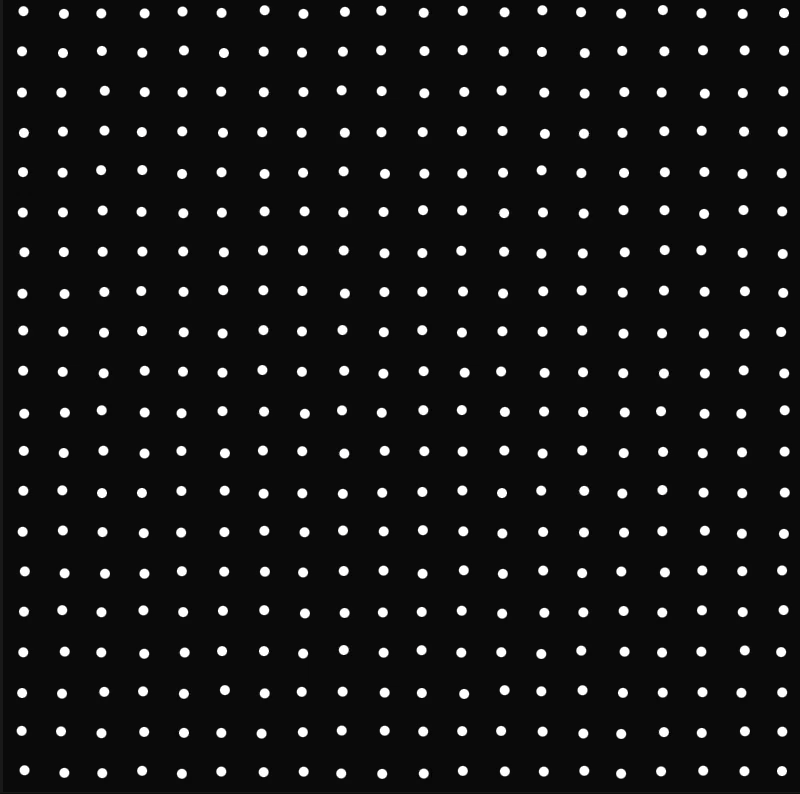

## Task 02 Instructions

### Task 02.01 Circles

<a href="[https://editor.p5js.org/sophiebunge/sketches/EvYXnyfrt](https://editor.p5js.org/sophiebunge/sketches/EDdOHWb83)">
  
</a>


[This is the link to the .p5 sketch](https://editor.p5js.org/sophiebunge/sketches/EDdOHWb83)

**Instructions** <br>
1. Create a dot. 
2. Create a circle with dots. 
3. Intereaction of mouse hover to change colors of the dots. 
4. make dots move slightly while hovering with mouse and come back to original position. 

## Task 02.01 Happiness *work in progress*




[This is the link to the .p5 sketch](https://editor.p5js.org/sophiebunge/sketches/EvYXnyfrt)

**Instructions** <br>
1. Create grid of points. Column by column, row by row. 
2. mouseIsPressed intereaction to change color. 
3. change the color of the selected dot. && and only the one whitin a range. ```if (mouseIsPressed && dist(mouseX, mouseY, x, y) < SPACING / 2)```
4. color dot around that one as well. 
```if (mouseIsPressed && dist(mouseX, mouseY, x, y) < 60)```
5. randomize
```if (mouseIsPressed && dist(mouseX, mouseY, x, y) < random(150))```
6. start coloring from center to the outside.

**Instruction Nr. 6 Failed**<br>
The idea was to simulate how happiness spreads. I wanted to create the interaction of pressing on one dot and the gradually it spreads from center to the outside, showing how a dot being "Happy" converts other dots to the same state and this also passing to other dots more far away. However, it didn't work out. <br>
**What else I tried:** I found a library to create connected particles, which would fit as a visualization in this case. I added the library to my project (which was also a new learning) and managed to have the particles in my canvas and also customize them. Nevertheless, I didn't figure out how to have the same behaviour like my dot grid. 

## Task 02.03 - Algorithmic Thinking

Yes, and it helped a lot indeed! See instructions of the sketches.


## Task 02.04 - Creative Instructions

> Create a life and hold it in your hand. Let it feel your warmth, your pulse, your intentions. Give it a name, a sound, a shape. Observe its movements, its stillness, its thoughts. Allow it to change in its own time. Let it grow and shrink, expand and resize. One day, let it go. See it leave and taste the color blue on your tongue.

## Learnings

I created the second task *Happiness* on Visual Studio code and live updated it through the simulation of a website which is a new learning for me. I also learned how to add libraries to my js file. 

