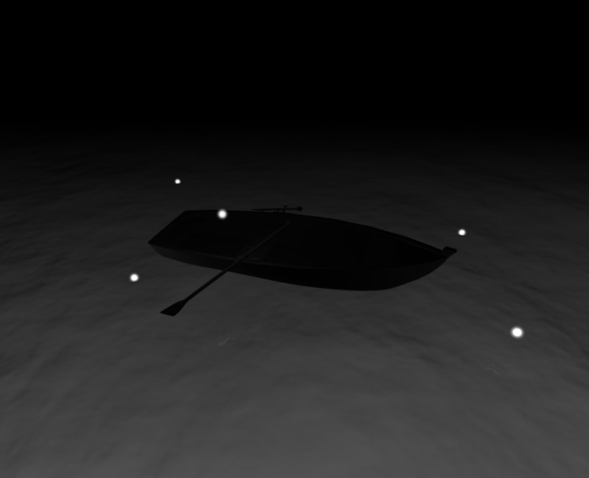

## Task 03 Space

### Task 03 - Lost Sailor

### Learning

As this was a completely new world for me, I learned everything from scratch. How to add new objects, style the meshes, import 3d models, user other libraries, create the scene setup, add bihaviours like OrbitControls, use the threejs documententation, and so on. Nevertheless, I really enjoyed this task and the workflow.
