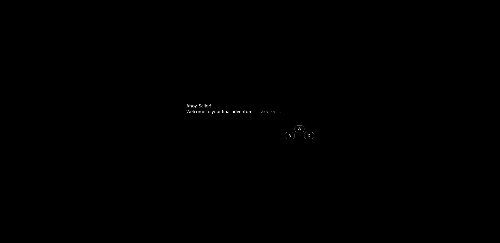
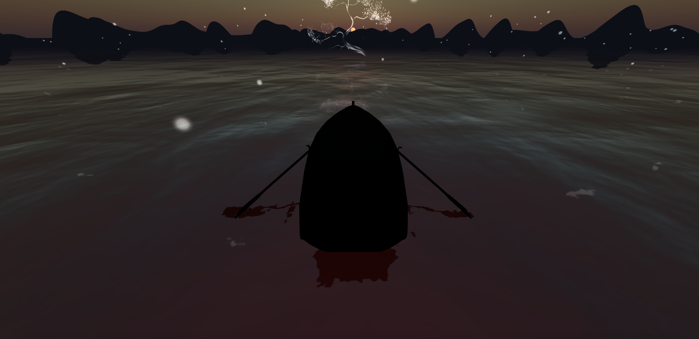

# Session 04 - Asynchronism

## Task 04.02 - Coding Practices

Reflect on your usage of resources and Machine Learning tools for coding.

* *What have you used and how has it served you?*
As the documentation of three js and its examples aren't as simple to find as initially thought, I used perplexity.ai to find the sources where I could find examples of what I wanted to do. (E.g. 
show me expamples of three.js projects that use third person character control). This was practical as it alsow summarized videos or threads for me to really only look into examples that would fit with my purpose. (although, i had the premium version which probably gives you better overviewo of the sources as its especialized for that)
Otherwise, I used ML to help me summarize my code
* *Do you actually understand the code an ML tool has given to you (in case you have used any)?*
Mostly not, I usually used it to explain it to me in other words. Usually I used code that was given from examples or forums (reddit) in the internet to explain it to me in other words and find the main source were it was coming from (which was usually from the three.js examples)
* *Would you be able to re-create it without any help?*
Probably not, most code that I searched for where codes that don't change much from project to project, so they were basic chunks of js which can easly just be imported to any other project, like for example HTML structure. 
* *What can you recommend?*
Hmm, so far none I guess. 
* *How do you want to proceed?*
I would like to look more into copilot as I haven't used it and just heard about it. 

## Task 04.03 - Your Own Scene

### Lost Sailor

> Leaving life behind, entering the realm of the lost. A paradise where sailors find their rest. 

This scene is an adaptation and continuation of my last scene done for the task 03. Here, you can control a boat and witness a beautiful scene that ends when you reach the tree at the center. I used the concept of asychronism to solve the problem of loading. As my scene got bigger and bigger, the window at the beginning was just static waiting until all the textures, models and the scene iself it's fully loaded. I integrated a "loading screen" to first, overcome this little wait at the beginning and also to explain the game controls. 

**Beginning Screen**

**The Scene**

***Death* Screen**

To install the scene use `npm install three vite` and then `npm run dev`

### Learnings

- Character Controls
- Loading screens / Screen showup intereaction (js and HTML)
- Skyboxes