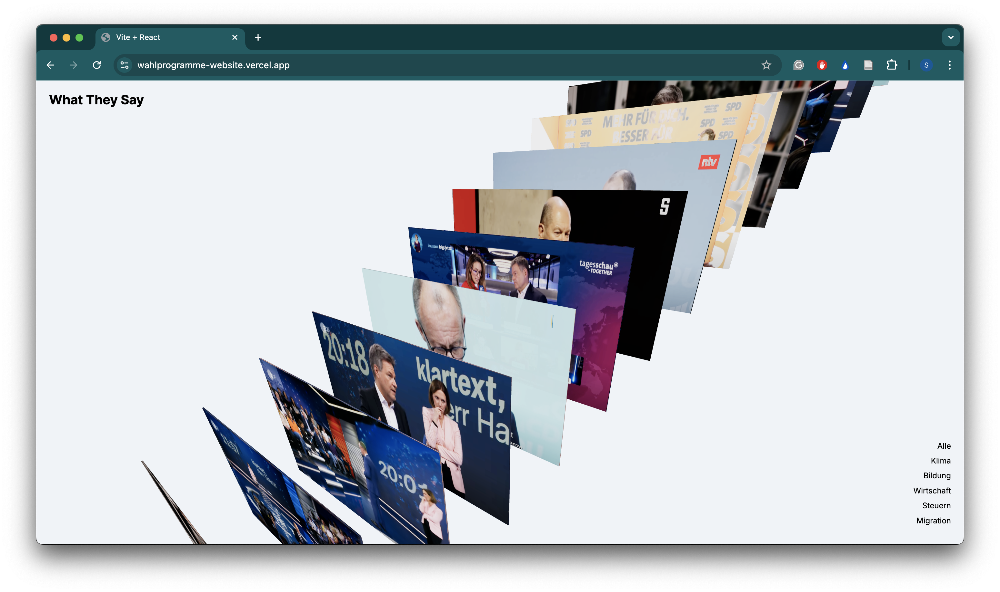

# Final Project

## About the website:

For my final project, I wanted to choose something that would help me learn and build websites using React. Over the past few months, nothing has captured my attention more than the political debates in Germany. As a creative (and maybe soon a creative coder!), I felt there must be a way for me to contribute to the conversation through my work.

I decided to create a repository of clips featuring the chancellor candidates from the largest democratic parties. Users can scroll through the (for now, just images), filter them, and experience a slight hover interaction.

## The Future Idea:

My main goal was to focus on clips where candidates discuss their promises as written in their Wahlprogramme (party manifestos). The idea was that visitors could browse through the repository of clips, click on one to watch the video, and simultaneously see a pop-up displaying the corresponding section of the Wahlprogramm from that party—allowing them to compare what is being said with what is actually written.

I imagined by using LLMs in a future case to implement the relation between what's being said in the clip and what's written in the Wahlprogramm in a way so the user is showed the exact page where that topic or 'promise' is written down. However, I don’t yet have the technical skills to implement this, so I focused on building a **data sheet** (DataCollection.js) and a **filtering system**, both of which were significant challenges in themselves.

---

You can see the source code in the folder "_code_" and visit the [webiste here](https://wahlprogramme-website.vercel.app/).

---

## Task 05.02 - Feedback

How would you rate the difficulty of this class from 1 (far too easy) to 5 (far too difficult)?

- The good middle of 2,5. I felt the pace for myself, a newbie with a small knowledge in coding in the backback was just exactly what's needed for this class.

How would you rate the amount of work you had to put into this class so far from 1 (no work at all) to 5 (far too much work)?

- A 4 out 5. I felt i did spend a lot of time working on the projects, usually 2 to 3 days. This time also included watching tutorials, refreshing the learnt, looking at other examples and tutorials and the creation of the homework.

How much did you learn in the class and expanded your skill set, from 1 (I am the same) to 5 (learned a lot)?

- A 5 out of 5.

How much did you enjoy working with p5, from 1 (hate it) to 5 (love it)?

- A 2 out of 5. P5 was easy and too comfy. I did started learnign js before the studies, however, using p5 confused me somehow at the beginning and I felt I had to start over again learning js. However, I liked to have instant output of my work. I would have it enjoyed it as well if we would have begun using VS Code from the beginning as well and maybe have two weeks for a homework instead of one at the beginnng.

How useful do you consider p5 for you, from 1 (don't need it) to 5 (will use it all the time)?

- 1,5 out of 5. I don't think I will use it again. I will try to create my projects in the "profesional" way.

How much did you enjoy working with tree.js, from 1 (hate it) to 5 (love it)?

- 5 out of 5. I loved it, as someone with a heart for 3D it's perfect.

How useful do you consider tree.js for you, from 1 (don't need it) to 5 (will use it all the time)?

- 5 out of 5. I will keep on using it.

How much did you enjoy working with React, from 1 (hate it) to 5 (love it)?

- 3 out of 5. Still very new to it, but it was better that initially thought.

How useful do you consider React for you, from 1 (don't need it) to 5 (will use it all the time)?

- 5 out of 5. I will keep on using and learning it.

How much did you enjoy working on the exercise tasks, from 1 (hated it) to 5 (loved it)?

- 5 out of 5. The exercise were very fun to work on, the topics very interesting. Quite broad but still with a clear line.

What do you think about the context expansions, e.g., the brief general discussions of certain topics?

- I don't really remeber a specific case. So can't really answer. I just would have enjoyed it more to have a bit more of React lessons.

Which one was your favorite topic, which one your least favorite?

- Fav: Algorithmic Thinking and threejs.
- least fav: Asynchronism.

## Learnings

A lot.
I already knew some HTML and CSS beforehand, which helped me get the project off to a good start. Learning React was a bit challenging, but overall manageable. Since this is my first website built with React, I’m really grateful for the large community and the abundance of great examples and tutorials available.

Through this project, I learned how to create a filter system, work with components, integrate a Three.js scene into my website, and handle data in a datasheet. While the result isn't exactly visually appealing yet, I’m proud of the progress and the skills I've gained along the way.
