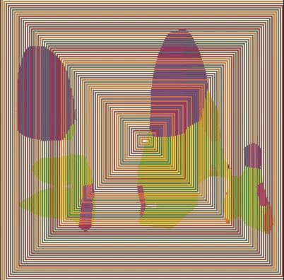

# Task 02.01: Circles

[p5.js Pattern](https://editor.p5js.org/imoleadrews/sketches/au5O2-hLC)

# Task 02.02: Happiness

[p5.js Pattern](https://editor.p5js.org/imoleadrews/sketches/ubLXsRiEo)

# Task 02.03 - Algorithmic Thinking

For the circles project I knew quite fast that I would like to do something with eyes. I then decided that I would like to add music to this project since I have been wanting to learn how to make shapes react to the different amplitudes of sound and felt that circles would be the ideal shape to do this. Upon further research, I found that it would actually make more sense to use P5’s getEnergy() which returns the amount of energy at a specific frequency ranges (bass, lowMid, mid , highMid and treble). I used algorithmic thinking to come up with the process of breaking down the eye into 5 different circles that each respond to one of the frequency ranges. I assigned the ‘treble’—representing the human voice in my song—to control the pupil of the eye, making it the central point that moves when the singer sings.

For Happiness, the first thing that came to mind was a holiday that I went on with my childhood best friend. I used the BodySegmentation library from ML5.js which I set to ‘parts’ which segments the human form into different parts and applied this to a short video of the two of us on holiday. Since that was not hard in itself, the algorithmic thinking came in when I wanted to create movement in the background to match the energy found in the video and the holiday in general. I decided to create multiple rectangles in the background using a for loop with the stroke of each rectangle changing randomly according to a set of colours which create a flashing background and depth giving the illusion of movement and energy. One thing that I did not figure out was how to get the ML5 model to play immediately uplon pushing run. I tried placing the loading of the model in the preload() function but this did not help so I am still a bit confused about that. 

# Task 02.04 - Creative Instructions

1. Look out behind the wall, stay back and wait tentatively. Take a few steps forward and then scurry back. Now that its dark, go back to the wall, step outside and make a run for it. Eat that piece of cheese happily while the cage door closes behind you. 

2. Get on, sit down and stare at the floor in front of you. People will come and go but at all points do not look up. See a window seat near the door  and swiftly move there before anyone notices. Sit down, with a sigh of relief, and listen to your podcast in peace while daydreaming about the season it should be. 

3. Imagine crying. See your tears filling up a large swimming pool. Put on your swimsuit and jump in.

# Learnings

What I found most challenging in this session was thinking algorithmically. When I approach creative projects, I usually have a flood of ideas that I experiment with, relying on intuition to see what works. However, for these projects, I tried to be more intentional with my actions, which was difficult and is something I definitely need to improve. I did notice that when I approached problems this way, my ideas were more practical and achievable, leading to results that I was satisfied with, rather than disappointed by.