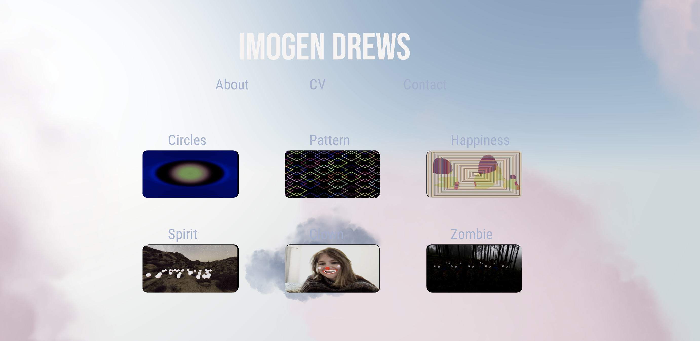

## Task 05.01 - The Final Project

For my final project, I decided to finally create a portfolio. After learning about React Three Fiber, I chose to use this library to make my portfolio more dynamic and visually engaging. I wanted to build something adaptable, allowing me to easily update it throughout my master’s program as I learn new skills. Below is an image of the home page: 

In terms of app architecture, I split each section of the application into its own component. As shown below, I have a public folder where I store all the data needed for my projects. I structured it this way so that future me can easily add new projects as I work on them.

Everything that is unlikely to change frequently is located in the pages folder within my src directory. This folder contains all the key components that make up the app, such as the HomePage, About page, Contact page, CV page, and ItemPage, which retrieves data from my projects.json file.

/portfolio-project  
│── /public  
│   ├── /data  
│   │   ├── projects.json  # Stores project information (titles, descriptions, image paths, etc.)  
│   ├── /assets  
│   │   ├── ... (All images referenced in projects.json)  
│   ├── /fonts  
│   │   ├── ... (All the fonts used)  
│  
│── /src  
│   ├── /assets  
│   │   ├──  # General app images (cv, profile pic)   
│   │  
│   ├── /pages  
│   │   ├── About.jsx       # About page  
│   │   ├── Contact.jsx     # Contact page  
│   │   ├── CV.jsx          # CV page  
│   │   ├── HomePage.jsx    # Main landing page  
│   │   ├── ItemPage.jsx    # Individual project page (renders data from projects.json)  
│   │  
│   ├── App.jsx             # Main React component rendering all pages  
│   ├── main.jsx            # Renders <App />  
│
│── index.html              # Entry point of app
│── package.json  
│── ...  

In terms of the visuals, I combined bits from React Three Fiber, Drei and Three.js itself. I decided to use the clouds from Drei as the main image for my portfilio since I really liked it and I feel that I can easily change it with something I make myself in the future. My goal was to keep everything straightforward, making it easy for visitors to find my projects and contact information while still ensuring a visually engaging experience. 

You can see my online deployment onto Netlify  [here](https://imogendrews.netlify.app/) link

## Task 05.02 - Feedback
- How would you rate the difficulty of this class from 1 (far too easy) to 5 (far too difficult)? 
3
- How would you rate the amount of work you had to put into this class so far from 1 (no work at all) to 5 (far too much work)? 
4
- How much did you learn in the class and expanded your skill set, from 1 (I am the same) to 5 (learned a lot)? 
5
- How much did you enjoy working with p5, from 1 (hate it) to 5 (love it)? 2
- How useful do you consider p5 for you, from 1 (don’t need it) to 5 (will use it all the time)? 
2
- How much did you enjoy working with tree.js, from 1 (hate it) to 5 (love it)? 5
- How useful do you consider tree.js for you, from 1 (don’t need it) to 5 (will use it all the time)? 
5
- How much did you enjoy working with React, from 1 (hate it) to 5 (love it)? 4
- How useful do you consider React for you, from 1 (don’t need it) to 5 (will use it all the time)? 
5
- How much did you enjoy working on the exercise tasks, from 1 (hated it) to 5 (loved it)?
 3
- What do you think about the context expansions, e.g., the brief general discussions of certain topics? 
4
- Which one was your favorite topic, which one your least favorite? 
My favorite topic was Three.js and my least favorite was p5
- Was there a topic missing and if so which one? 
No

## Learnings

I really enjoyed this course and revisiting the basics of coding. My previous coding experience came from a three-month bootcamp, followed by three years as a frontend developer. While my experience as a developer helped me a lot, my job primarily involved building apps for the Atlassian ecosystem, which was very specific and rigid. Because of that, I really appreciated the opportunity to explore new tools and revisit some of the fundamentals I hadn’t touched since my bootcamp.

Given my prior coding experience, my favorite part of this course was learning React Three Fiber, as it truly introduced me to something new. One of the main reasons I pursued this master’s degree was to learn how to create interesting, creative projects through coding, and I feel like this was my first real introduction to that.

For this project, I dove deep into React Three Fiber and Drei. I intentionally focused solely on these libraries, avoiding additional UI libraries in my code. In the future, I’ll likely incorporate at least one other UI library to improve the UX/UI experience, but overall, I think this was a great exercise. I also made a conscious effort to implement some of the code architecture principles we learned in class, ensuring my project was both well-structured and efficient. This is reflected in how I split my application into different pages and stored the project data in a JSON file within my public folder.

The biggest hurdle I faced was understanding how to use some of the Three.js components in my code, as I haven’t fully mastered Three.js yet. However, throughout this project, I feel I’ve gained a much better understanding, and I plan to expand on and improve what I’ve learned in the future. 
