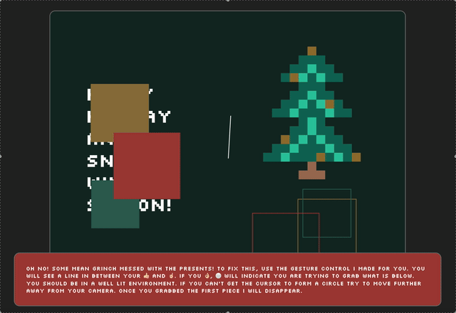

### Task 01.02

- Overall, how would you rate your skill level of programming?
  - [ ] Never done it
  - [ ] Novice
  - [ ] Intermediate
  - [x] Advanced
  - [ ] God-like
- Have you used object-oriented programming before?
  - [ ] I don't know what that is
  - [ ] I know the concept, but I have never implemented it
  - [x] Yes
- Overall, how would you rate your skill level of using web technologies, e.g., have you used a local server setup?
  - [ ] Never done it
  - [ ] Novice
  - [ ] Intermediate
  - [x] Advanced
  - [ ] God-like
- How would you rate your skill level of working with Git and GitHub?
  - [ ] Never done it
  - [ ] Novice
  - [ ] Intermediate
  - [x] Advanced
  - [ ] God-like
- Are there any specific topics that would interest you in the context of this lecture and that haven't been mentioned so far?
  - I would really like to take a first look into web based shader programming

### Task 01.02

Having worked with procedural algorithms in the past, I would like to learn more on how to realize more complex simulations. To accomplish that, web-based shaders are an interesting area I haven't touched yet and would like to get into. I am envisioning a simple project that allows me to get familiar with available libraries and tools while providing me with an idea of how these can be applied in more broad web context like traditional websites or web applications.

### Task 01.03

Despite not being web-based, I am quite fascinated by the works `Arsiliath` comes up with. Basically all of this artists works are based on compute shaders in Unity to procedurally generate all kinds of organic and self interacting structures that seem quite realistic despite running in real time.

- [Arsiliath on Instagram](https://www.instagram.com/arsiliath/)
- [One of my favorite works](https://www.instagram.com/reel/CGFyN2lnpZx/)

There were some other interesting works on Twitter but without an account I am not able to open the page anymore.

## p5

### Task 01.05 - The 10 PRINT pattern

Because it has been a long time since I used Processing, I first started to experiment with the 10 PRINT example. I wanted to come up with some animated version of that and started by changing the exposed parameters. My idea was to implement some kind of scrolling algorithm however it failed since storing the pattern in a way that I can procedurally generate new rows proved to be beyond the allowed time frame.

The [result](https://editor.p5js.org/gerdes.philip/sketches/m9ob2Iw6t) is a very simple (and unoptimized) scrolling implementation with patterns changing every frame and the probability oscillating using a frameCount based sine function.

Just for fun I prompted Claude to implement a [version](https://editor.p5js.org/gerdes.philip/sketches/wumSEhgw8) of what I had in mind and that worked really well in this case.

## Task 01.05 - Greeting Card

> Disclaimer:
> In `ml5`, since version 1.0 video / audio input is broken when using Firefox.
> I created an [issue](https://github.com/ml5js/ml5-next-gen/issues/245) for that.
> Because of this, all of my submissions containing any ml5 code are exclusively confirmed to be working using Chrome.

When looking over the `ml5` models that are available, I found the HandPose model was working quite well. After some experimentation, I thought that building some gesture control mechanism would be an interesting challenge. With some more trial and error, I eventually came up with something that is working reasonably well. Concept wise, right after the gesture control, I wanted to build some kind of puzzle like experience. The result is a card combining all the elements that make up the stereotypical Christmas: A tree, some presents, a bit of a struggle and eventually, when it is all over, a lot of snow.

## Learnings

Even though I already did some more extensive projects in Processing, the time passed in between really showed. In the end I spent way too much time without really reaching a point I am statsified with.

#### 10 PRINT

- Getting rusty even with familiar environment happens pretty quickly (misalignment of personal expectation and capability)
- thinking about and developing buffer mechanisms from scratch takes a lot of time

#### Greeting Card

- building a gesture control mechanism on top of ml5
- combining HTML context with "game logic" in p5
- firefox (maybe on intel only, I am lacking an ARM-based machine to test) can't handle ml5 anymore (since v1)
