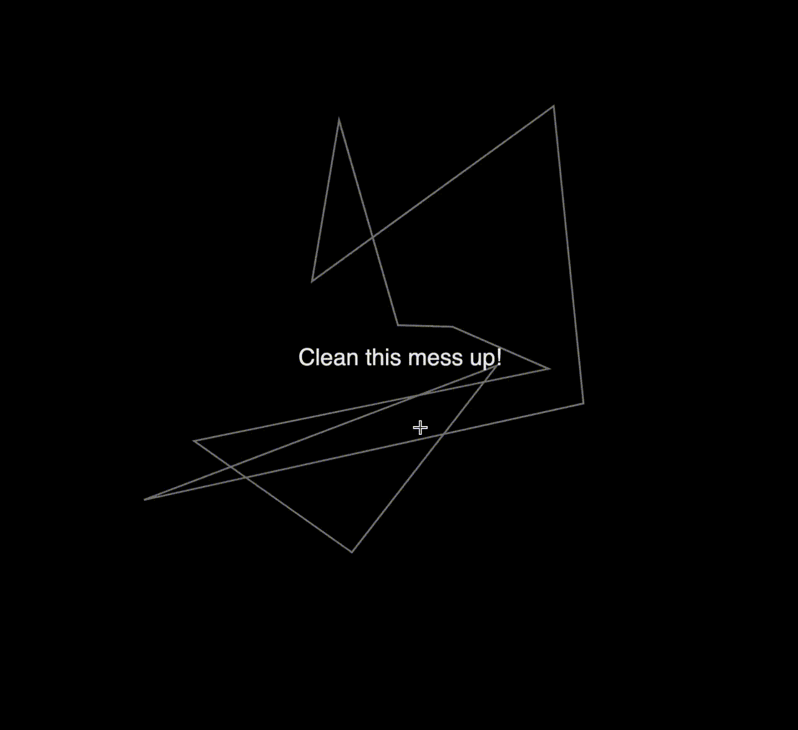

### Task 02.01

> Circles



For this task I thought it would be interesting to start out with a non-circle primitive which then gradually morphs into a circle.

In terms of interaction I tried to build a tool to detect some aspects of the user's mouse movement. I imagined the sketch to work like a scratch card but you have to scratch in a circle. Even though I came close I overlooked too long that going in a diagonal line tricks my naive approach to detecting circular movement and at that point the time budget was already spent.

The overall structure of the program is distributed across 3 files:

- `main.ts`
  - Entry point for p5
  - Handles `setup()` and `draw()`
  - Instantiates and manages the custom class `Circloid` and `MouseMeasurement`
- `MouseMeasurement.ts`
  - Provides a velocity measurement for the mouse
  - Provides a the distance moved in x and y direction
- `Circloid.ts`
  - Generates and manages the polygon
  - Provides a method to morph the polygon into a circle incrementally

With this structure I hoped to somewhat differentiate the concerns within the program (Divide and Conquer):

- p5 and the main program logic
- detailed logic for mouse measurement
- detailed logic for the polygon

### Task 02.02

> Happiness


> Disclaimer:
> In `ml5`, since version 1.0 video input is broken when using Firefox.
> I created an [issue](https://github.com/ml5js/ml5-next-gen/issues/245) for that.
> Because of this, all of my submissions containing any ml5 code are exclusively confirmed to be working using Chrome.

Follow the first instruction after 'loading...' :)

With this sketch I wanted to explore interesting interaction concepts a bit further. Since I haven't used with `ml5`with `p5` I came up with the idea to build a clap detector (close to the example and easy to train a custom model). I split up the lyrics from the song "Happy" by Pharrell Williams into roughly the parts that correlate to the claps you can hear in the original track. And trained my own `Teachable Machine` model with some claps and stock background noise.

### Task 02.03

With the first task I really focused on dividing my code using classes. This really helped to keep track of what is going on where. With the second exercise I tried to pack the steps that are necessary for the ml5 model to work into a class in such a way that it is reusable and also fuses multiple steps into one (the constructor in this case). This helps to avoid annoying issues that arise when restructure code in the `main.ts` file and then change the order in which functions are called.

#### Task 02.04

> Creative Instructions

##### Architectural Significance

Forwards you must go two steps, then rotate,<br>
ninety degrees to your right,<br>
now count the steps you go take,<br>
again at two you are right.<br>
Turn yourself by a hundred thirty-five,<br>
degrees to your left side.

Don't be confused by your next stride,<br>
it is indeed more complex;<br>
take now the square root of two steps.<br>
Afterward, again you rotate, ninety degrees to your left,<br>
once more, move forwards, the square root of two steps.

Even without any division,<br>
you conquered the first challenging part,<br>
what follows is another rotation,<br>
ninety degrees to the left - not hard.

Do you recall the square root of two?<br>
Now take twice that many steps, too.<br>
Rotate once more, by a hundred thirty-five,<br>
degrees to the left, if you're still alive.

Two steps later, another turn to the left,<br>
one hundred thirty-five degrees with some heft.<br>
Again you move forward, twice the square root of two,<br>
The last turn left is a hundred thirty-five degrees too.<br>

After all, two steps forward is all that's ahead,<br>
can you tell me who lives in this tiny little shed?

### Task 02.05

All of the sketches from assignment 01.05 onwards are created in a local environment using [Vite](https://vite.dev/) to run a development sever. To skip the boilerplate, I created a [template](https://github.com/whatphilipcodes/p5-init) based on Gorm's approach for assignment 01.04.

Usage:

```bash
cd root/where/your/sketch/should/be
```

Using `degit` (requires you to have `Node.js` installed, will ask to install degit once):

```bash
npx degit whatphilipcodes/p5-init name-your-sketch
```

Or using `git` (remember to remove the `.git` folder manually to avoid conflicts with the creative coding repository BUT keep the `.gitignore` file):

```bash
git clone https://github.com/whatphilipcodes/p5-init.git name-your-sketch
```

```bash
cd name-your-sketch
rm -rf .git
```

## Learnings

- Getting ml5 to work in a local server env is a bit tricky but you can use `declare var ml5: any; ` and put the script tag in the `index.html` file
- Passing callback functions between classes sometimes requires to bind the instances to be able to access the context (`ClapDec.ts`)
- I need to scale down my ideas even further to actually stay within the allocated time budget
- Writing poems is kind of fun
