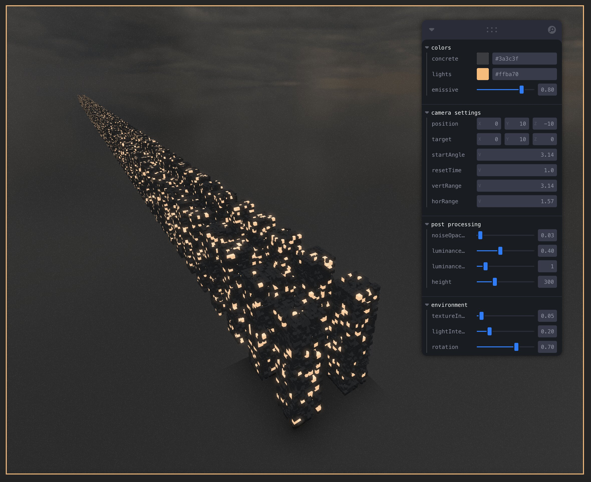

### Task 04.02

> Coding Practices

Even though I have used generative machine learning models for _code completion_ and _explanatory tasks_ extensively, as well as occasionally generating _entire scripts_ or _preplanning implementations_, I am beginning to observe two major issues:

- My capabilities to `remember precise syntax details` upon writing code is vanishing rapidly (even for basic elements I used thousands of times)
- I feel an `increasing distance` or rather lack of ownership that hinders motivation and endurance

I conclude that most prominently the availability of auto-complete is responsible for my deteriorating capability to write functioning code on my own. While asking a model and getting an immediate answer lowers the bar compared to being forced to go through hundreds of Stackoverflow articles before arriving at a satisfactory result, this process for me at least has mostly changed in efficiency and not the nature of the task itself. Better tooling like direct IDE integration (eg. GitHub Copilot Chat) are further improvements that rationalize away mundane steps like copy and paste.

Nevertheless `any` reliance still comes with risks:

- Mostly companies but also governments have control over behavior and sentiment these models might exhibit
- As long as these algorithms are run by profit-seeking companies there will come a time where any dependence on that will be exploited.

### Task 04.03

> Micropolis

For this task I wanted to tackle city generation a bit more. Because last time I focused on a component-driven approach, the rendering performance was not my focus. This led to every mesh being its own draw call which is less than ideal when trying to scale up. This meant I had to rewrite the building generation from scratch. The new and improved version `./code/04-03/src/city/Single.tsx` merges everything into two draw calls (one for concrete material and the other for lights). This allowed me to display a little cityscape (`./code/04-03/src/city/Block.tsx`) compared to last time only one building. Even though this approach works there are still significant issues:

- during the generation the window freezes for several seconds
- while this is a huge improvement compared to last week, in order to generate huge cityscapes I would have to find a way to make use of `instancing`

The vision for this is still to have a flyover above an endless city skyline (the camera for that is already build; see commented out sections in `./code/04-03/src/ControlledCam.tsx`). To make that work however, I would need to have some dynamic instance buffer replacement alongside moving everything towards the camera.

> while this rendered eventually it took about 3 mins to get there

### Learnings

- Using [Leva](https://github.com/pmndrs/leva) for UI elements
- Mesh-merging on runtime
