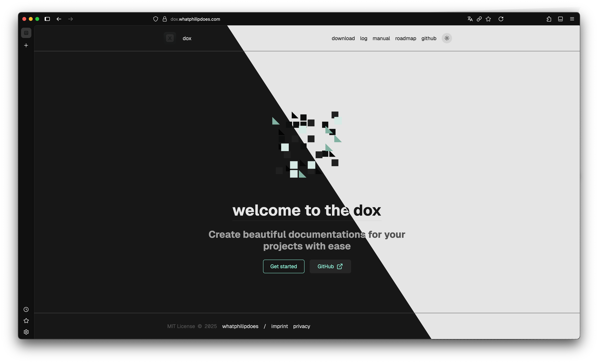

## Task 05.01: dox

### description

As the semester started out and it became clear that having documentations for our projects is an essential part of submissions now and in following semesters, I started to look for a solution that would fit the following criteria:

- fully customizable, preferably using `Tailwindcss`
- based on `Markdown` for simple content management
- support for `static deployment`
- interactivity capabilities, preferably through `React`
- not more than I need, in that sense minimal or modular

For me, the last point was the most important. With simplicity in mind my first approach was to take a look at [`jekyll`](https://jekyllrb.com/docs/) as a `./docs` subdirectory in the actual project repository. Even though I got it to work, customization was not really straight-forward and I was unhappy with most of the available theming options. At this point, I decided to move towards more familiar web technologies and tried out [`Docusaurus`](https://docusaurus.io/) and [`vuepress`](https://vuepress.vuejs.org/). Even though both come with a lot of nice features, there is a lot of stuff I don't want to have in my documentations adn would have to spend time taking out of those solutions. Instead I opted for building on top of a web framework. I also considered [`Nextjs`](https://nextjs.org/), but as I was hardset on static deployment [`Astro`](https://astro.build/) was my final choice.

What I ended up building is `dox`, a freely available template that offers an ideal origin point for the first-term project documentation and any other documentation for future projects with the following features:

- `homepage` with basic information about the project
- `roadmap` providing an easy to maintain overview about the project timeline
- `log section` for incremental in-development updates on what I have been working on
- `download section` that can be connected to an accompanying GitHub repository and will automatically fetch the current release as well as an archive of prior releases
- `ftp static deployment` implemented both as local script and continuous deployment via Github Actions
- `cross-repository template sync` to keep all of my documentations up to date from one source

### design

Besides using `Tailwindcss` utility classes instead of vanilla CSS, all of the styling (except for code blocks that are rendered using [`Expressive Code`](https://expressive-code.com/)) is done manually from scratch. I really like the [vesper theme](https://marketplace.visualstudio.com/items?itemName=Obstinate.vesper-pp) for `Visual Studio Code` and tried to carry some aspects of it (primary color selection) over into the documentation design. On top of that, I never explored implementing a dark mode. Although as it turns out this is pretty straight-forward with `Tailwindcss`, configuring `Expressive Code` to respond took quite some trial and error.

Another key design-aspect (desktop only) is the `landing page artifact`. Inspired by the web presences for other tools like [`vite`](https://vite.dev/) or sometimes companies like [`vercel`](https://vercel.com/fluid), I wanted to add more visual interest to the entry point. To achieve this in a modular, non-convoluting way, I created a reusable React component that automatically generates an abstract visualization based on the favicon that is used for the page (or another user-defined svg file). Thanks to the usage of the SVG string as a seed initializer for a pseudo random number generator, for the same favicon, there will always be the same visualization created. This subtle recognition aspect makes every documentation page based on this template in some sense visually unique.

### code

As this project is developed open-source, all the code alongside instructions can be found in my public GitHub repository:

- [dox repository](https://github.com/whatphilipcodes/dox)

> Due to an issue with Expressive Code and Tailwindcss v4, there could be an error message coming up in dev mode (only!). Simply reloading the page has worked so far until EC fixes their CSS processing.

### deployment

In order to see the template in action there is also an active continuous deployment available:

- [live demo](https://dox.whatphilipdoes.com/)

## Task 05.02 - Feedback

### Numerics

- **a)** How would you rate the difficulty of this class from 1 (far too easy) to 5 (far too difficult)?
  - 3
- **b)** How would you rate the amount of work you had to put into this class so far from 1 (no work at all) to 5 (far too much work)?
  - 4
- **c)** How much did you learn in the class and expanded your skill set, from 1 (I am the same) to 5 (learned a lot)?
  - 3
- **d)** How much did you enjoy working with p5, from 1 (hate it) to 5 (love it)?
  - 2
- **e)** How useful do you consider p5 for you, from 1 (don't need it) to 5 (will use it all the time)?
  - 2
- **f)** How much did you enjoy working with tree.js, from 1 (hate it) to 5 (love it)?
  - 4
- **g)** How useful do you consider tree.js for you, from 1 (don't need it) to 5 (will use it all the time)?
  - 3
- **h)** How much did you enjoy working with React, from 1 (hate it) to 5 (love it)?
  - 3
- **i)** How useful do you consider React for you, from 1 (don't need it) to 5 (will use it all the time)?
  - 4
- **j)** How much did you enjoy working on the exercise tasks, from 1 (hated it) to 5 (loved it)?
  - 3

### Textual

- What do you think about the context expansions, e.g., the brief general discussions of certain topics?
  - I really appreciated the discussion aspect of it. Talking about concepts that I applied but never actually reflected on prior to the class revealed some knowledge gaps for me.
- Which one was your favorite topic, which one your least favorite?
  - I really enjoy thinking about generative algorithms and that combined with toying around with `Threejs` was a lot of fun.
  - While I understand why p5 might be interesting for beginners, for me a least I cannot really see the application of it in the project I have worked on. There are better alternatives like [`Pixie.js`](https://pixijs.com/) for 2D content or [`D3`](https://d3js.org/) if data visualization is the priority
- As the workload for this class was really high, I did not feel like there was a topic missing (Also, shaders are probably coming in CC02 right?)

## Learnings

### dox

- even configuration (of libraries and frameworks) can take forever
- using `react-spring` for more fluid animations within `r3f`
- repeatable procedural scene creation based on `seedrandom`

### overall

- I challenged myself by always trying out new libraries and packages ()
- more high-level theoretical insights into JS concepts (for example looking at the different types of JS functions next to each other instead of inside of some codebase)
- during the threejs exercises I familiarized myself deeper with `React` in general and good a lot more comfortable using hooks and thinking more in terms of components as composable logic
- `react-three-fiber` as a very nice way to integrate 3D graphics into real 'out-of-dev-mode' deployments
