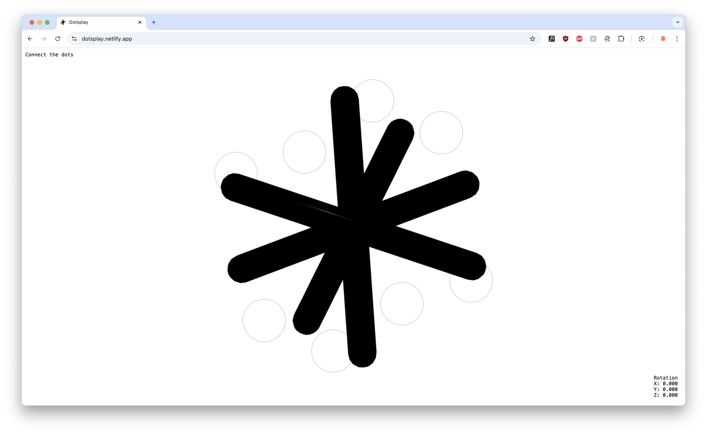

### Task 03.03

## Dotsplay

I developed Dotsplay, a 3D puzzle game. Players must rotate a mesh to connect dots in the correct rotation. A level is completed once all dots are connected. My goal was to create something that is only possible in three-dimensional space. You can fin the hosted version here: [Dotsplay](https://dotsplay.netlify.app/).

### Learnings

- Quaternions
