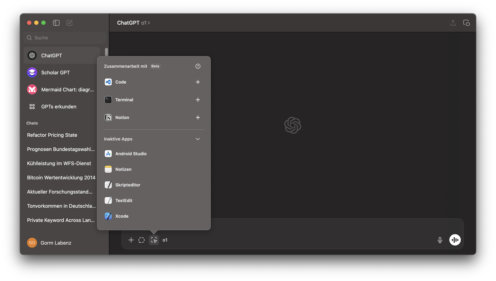

## Task 04.02 - Coding Practices

Reflect on your usage of resources and Machine Learning tools for coding.

### What have you used and how has it served you?

- _Copilot_ primarily for autocompletion
- _Claude 3.5/ChatGPT 4o_ for coding questions and ChatGPT's quick data conversion using its built-in code execution (e.g., converting CSV to JSON and performing calculations)
- _DeepSeek R1/ChatGPT o1_ for understanding complex topics, such as refactoring larger code sections while maintaining functionality

I used Cursor as an IDE for a while due to its integrated AI functionality, but Copilot now performs better.

### Do you actually understand the code an ML tool has given to you (in case you have used any)?

I believe I usually do. However, when I don't understand it, it invariably leads to problems later, as I'm then unable to implement features that LLMs can't handle. Additionally, LLMs aren't necessarily forward-thinking, as they don't implement certain patterns that only make sense in the future.

### Would you be able to re-create it without any help?

No, because I don't know all the helper functions in ThreeJS or the exact syntax in C#, for example. However, I always try to maintain an overview, as this is something the LLM cannot do for me.

### What can you recommend?

I find Claude significantly better for creative writing and creating interactive coding tutorials rendered by react. For data cleaning and restructuring, ChatGPT's code execution is excellent, and for complex tasks, DeepSeek R1 or ChatGPT O1 work well. Additionally, function calling can be easily implemented in the OpenAI Playground, allowing ChatGPT to be used as an interface for many applications.

You can also connect the ChatGPT app directly to your code editor.

### How do you want to proceed?

I think we should consistently question what LLMs can and cannot do. Currently, they excel at syntax, know helper functions, and can handle small code segments. What they cannot do is look into the future, recognize broader connections, and maintain an overview. These aspects should still be handled by humans to ensure quality, maintainability and efficiency.

## Task 04.03 - Sealing vs Cooling

I wanted to find a simple way to visualize complex data in 3D. Since mapping libraries like Mapbox or Leaflet don't provide straightforward options to directly manipulate the 3D space, so I implement the visualization directly in Three.js. The map now displays two data layers: soil sealing and soil cooling capacity. When switching between these layers, the data appears to be inverted, demonstrating the high correlation between soil sealing and the soil's heat absorption capacity.

### Learnings

- Instances
- Matrices
