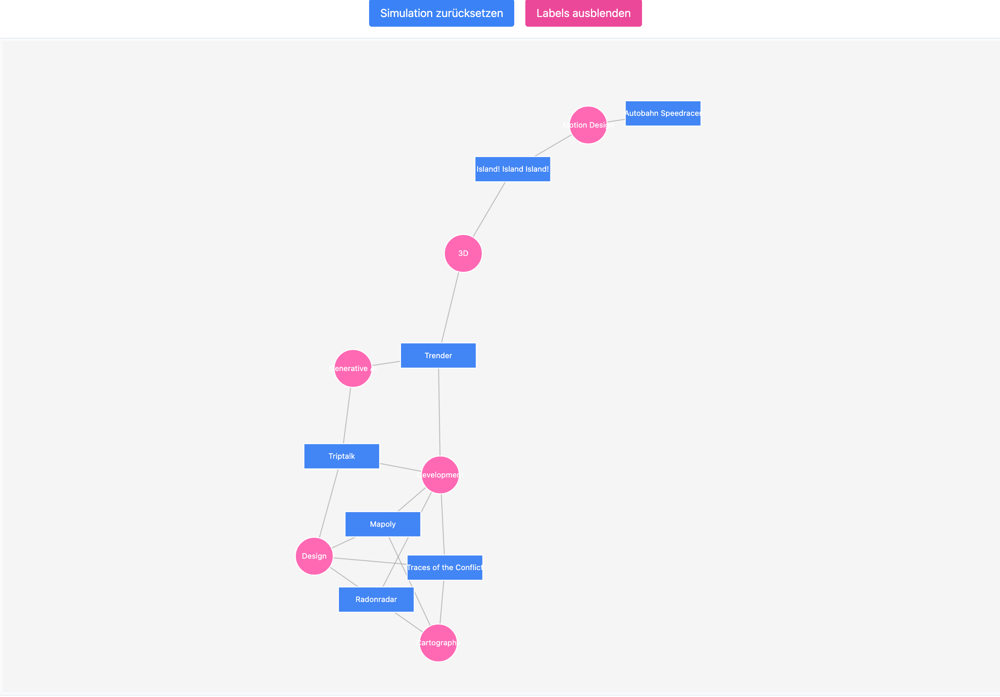
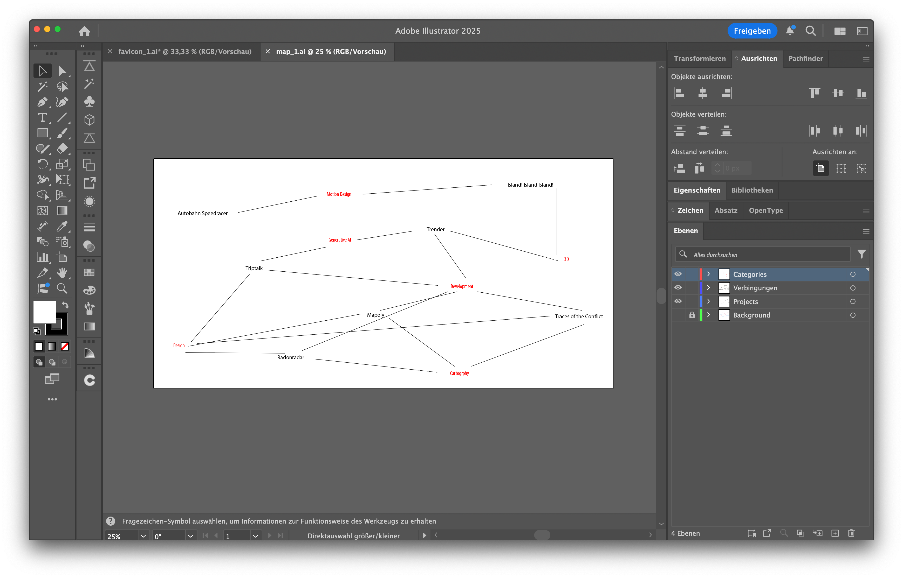
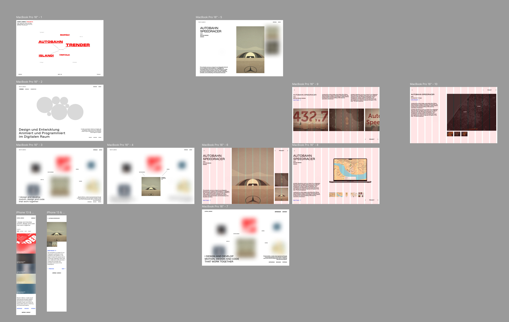
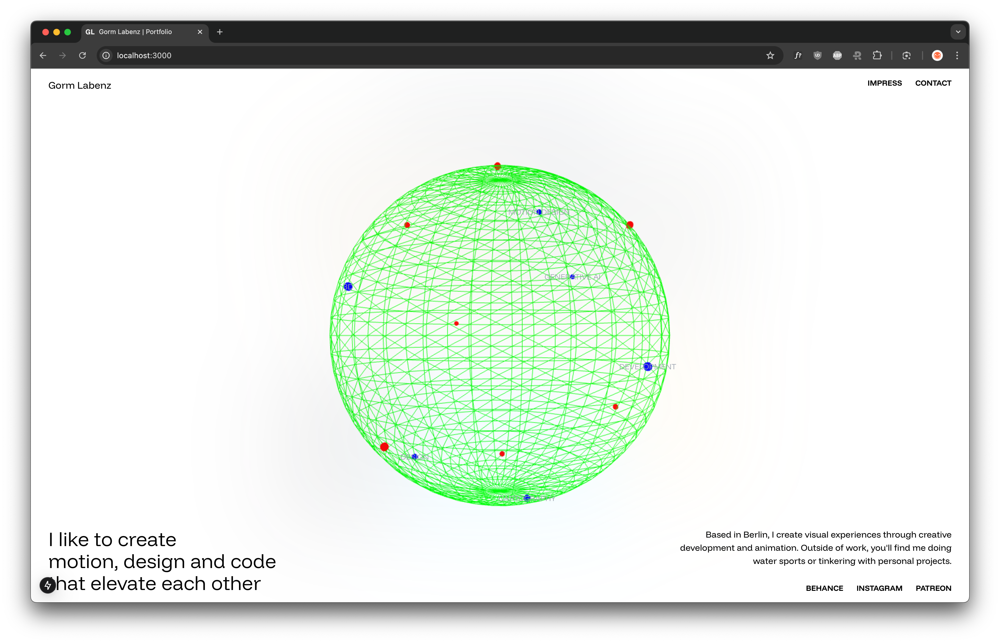
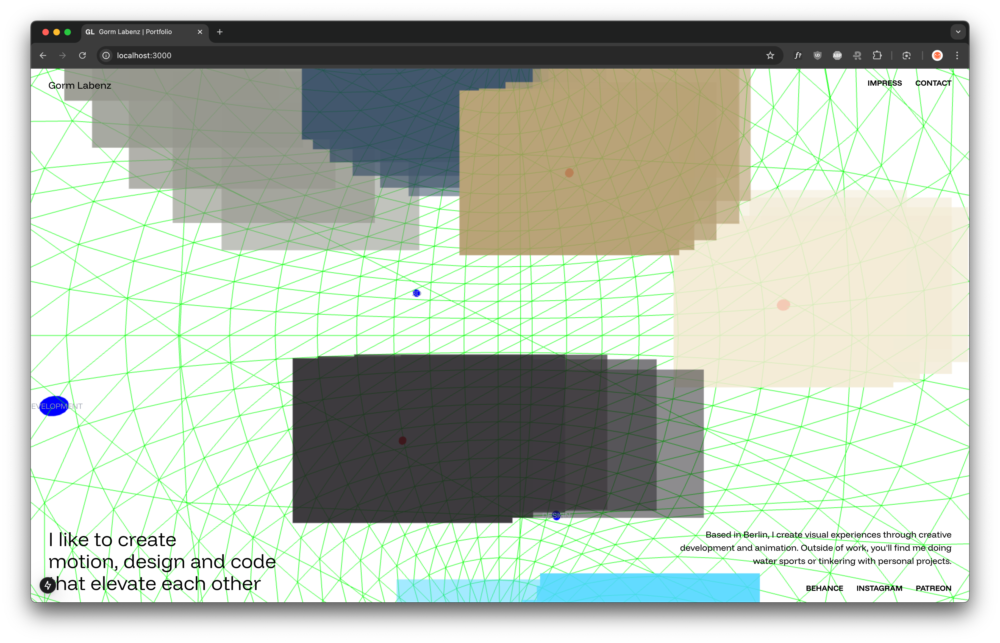
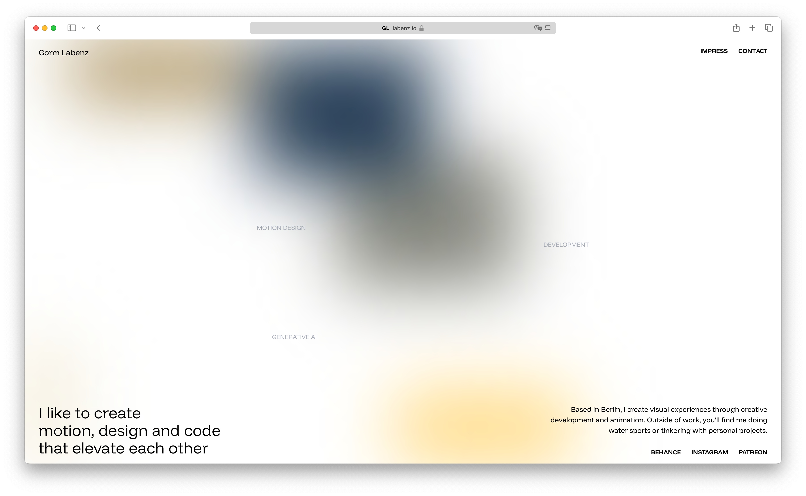
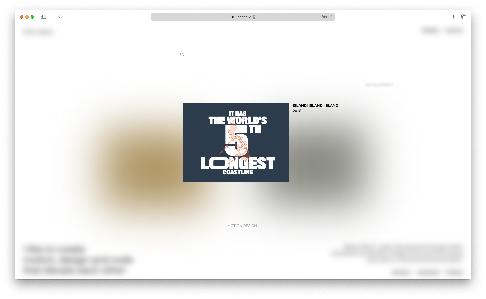
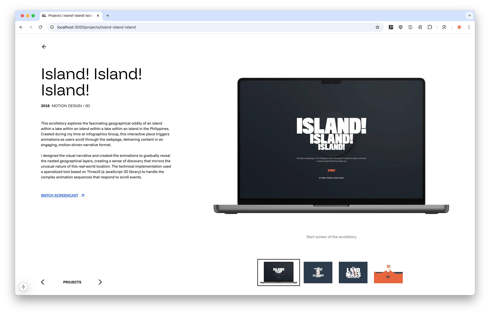
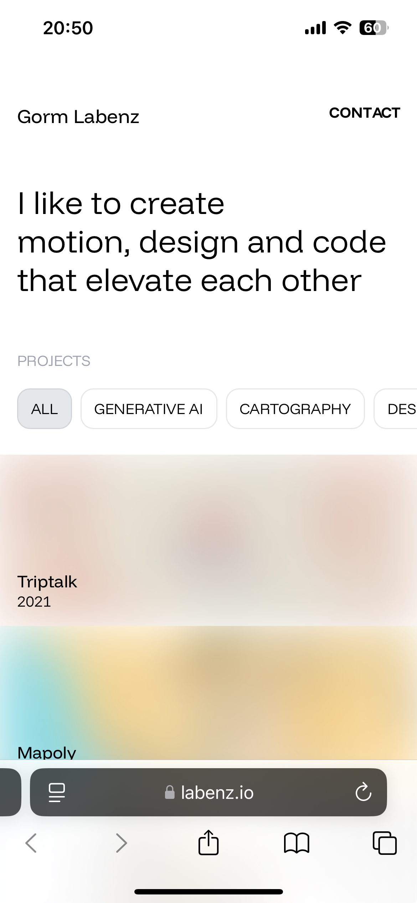
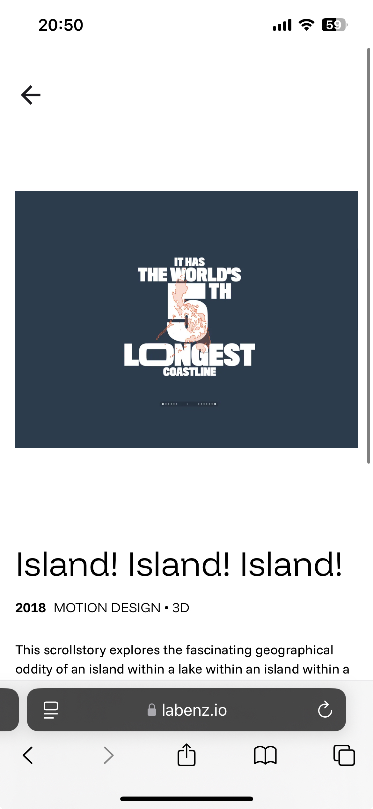

# Final Exercise

## Concept

For my final submission, I set out to create my online portfolio. The goal was to showcase my interests (coding, cartography, data visualization, etc.) and related projects. I representing this as an interactive map where projects and interests would be spatially related — the closer a project is positioned to a particular interest, the stronger its thematic connection.

## Implementation Process

### Initial Mapping

I began by compiling a comprehensive list of my interests and projects. I fed this data into a D3 script that generated an initial visualization using a force-directed layout, which minimized overlaps while preserving relational positioning.



I then imported this layout into Adobe Illustrator for refinement, maintaining a lat-lon projection (2:1 aspect ratio) as the underlying structure.



Using a custom Illustrator script, I exported the coordinates of each project and interest node into a JSON format:

```json
{
  "title": "Triptalk",
  "coordinates": {
    "lat": 6.094775390625,
    "lon": -107.879150390625
  }, ...
}
```

### 3D Globe Projection

To enhance the visual engagement, I decided to project the map onto a 3D globe that users could interactively rotate and interact with. I developed a prototype in Figma:



The interactive globe was implemented using ThreeJS with quaternion-based rotation for smooth navigation.



### Visual Cohesion Through Blurring

Given the visual heterogeneity of my projects, I implemented a strategic blurring effect. Projects remain blurred until users hover over them, allowing focused examination of individual projects while maintaining a cohesive color gradient across the globe.

Additionally, I wanted to create a dynamic "trailing" effect during camera movement. I achieved this by placing multiple instances of each project at the same coordinates but with staggered easing functions, creating the illusion of motion trails as the globe rotates.



### Performance Optimization

For performance reasons, I shifted from HTML elements to a 2D canvas implementation. Instead of rendering preview images directly, I used colored rectangles representing each project's dominant color. While I could have utilized the ThreeJS canvas, my preference was to render images as HTML tags, necessitating a 2D approach regardless.

ThreeJS now only calculates positioning, while visual rendering occurs on the separate 2D canvas. I maintained a minimal 1×1 pixel ThreeJS renderer to prevent projection errors, resulting in performance improvements.

The blur effect is efficiently implemented using CSS, further optimizing performance.

I added an initial animation sequence to demonstrate the visual effects immediately upon page load.




Finally, I designed individual project subpages and a responsive mobile version.



<div style="display: flex; gap: 20px;">
  
  
</div>

## Challenges

The integration of multiple canvas elements presented significant performance challenges initially. By implementing the secondary 2D canvas and optimizing rendering processes, I achieved fluid performance, even on mobile devices (though with an adapted view).

Another challenge was implementing animations within Next.js, which isn't primarily designed for this purpose. For example, creating page transitions where two pages render simultaneously required complex workarounds.

## Next Steps

Some layout issues remain, particularly with images on the project pages. There are also rendering inconsistencies between Safari and Chrome-based browsers that need to be addressed. Also I want to redo some of the texts.

The portfolio is accessible at [https://labenz.io](https://labenz.io).
